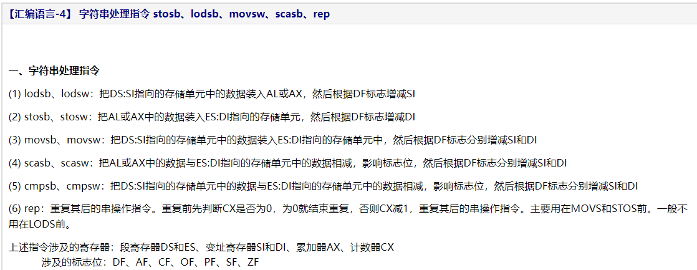
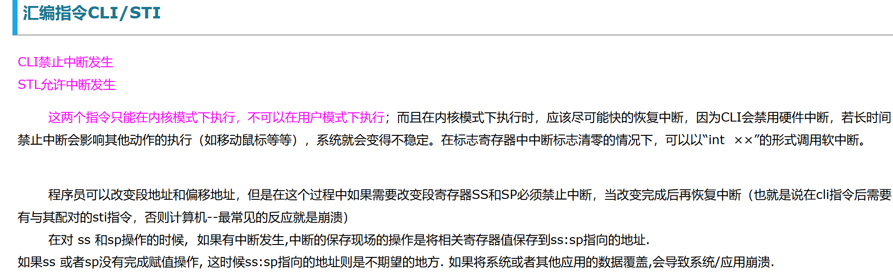
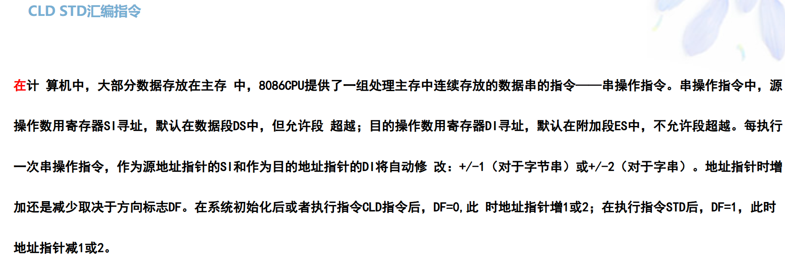
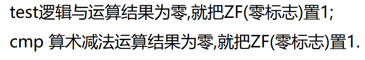
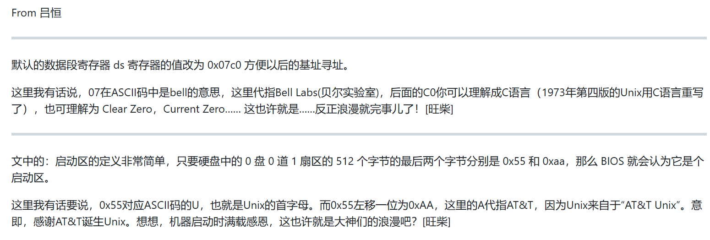

# 8086汇编指令

- [intel 80x86 instruction set reference -- github/dibingfa](https://github.com/dibingfa/flash-linux0.11-talk/blob/main/)  

- [ASCII码表](https://c.biancheng.net/c/ascii/)  

## 1.字符串处理指令 stosb、lodsb、movsw、scasb、rep

[博客园--【汇编语言-4】 字符串处理指令 stosb、lodsb、movsw、scasb、rep](https://www.cnblogs.com/JCSU/articles/2137802.html)

## 2.汇编指令CLI/STI
  

[博客园--汇编指令CLI/STI](https://www.cnblogs.com/kuangke/p/5524405.html)

## 3.CLD STD汇编指令
  

[博客园--CLD STD汇编指令](https://www.cnblogs.com/baozou/articles/4581507.html)

## 4.汇编中的test和cmp指令

  

[博客园--汇编中的test和cmp指令](https://www.cnblogs.com/laohaozi/p/12537620.html)

## 5.IA-32架构软件开发人员指南

[intel 8086--IA-32架构软件开发人员指南](https://github.com/dibingfa/flash-linux0.11-talk/blob/main/%E4%B8%80%E4%BA%9B%E9%9D%9E%E5%BF%85%E8%A6%81%E7%9A%84%E8%B5%84%E6%96%99/Intel%E6%89%8B%E5%86%8C/IA-32%E6%9E%B6%E6%9E%84%E8%BD%AF%E4%BB%B6%E5%BC%80%E5%8F%91%E4%BA%BA%E5%91%98%E6%8C%87%E5%8D%97%EF%BC%9A%E5%8D%B73%20%EF%BC%88%E4%B8%AD%E6%96%87%E7%89%88-%E9%83%A8%E5%88%86%EF%BC%89.pdf)

## 6.那些浪漫
  

[github--BIOS与linux引导程序--那些浪漫](https://github.com/dibingfa/flash-linux0.11-talk/blob/main/%E8%AF%BB%E8%80%85%E5%88%86%E4%BA%AB/%E9%82%A3%E4%BA%9B%E6%B5%AA%E6%BC%AB.md)
