## 3.3 C语言程序

GNU gcc 对 ISO 标准 C89 描述的 C语言进行了一些扩展。

### 3.3.1 C程序编译和链接

使用gcc汇编器编译C语言程序时通常会经过四个处理阶段，即**预处理阶段、编译阶段、汇编阶段和链接阶段**，如下图所示。

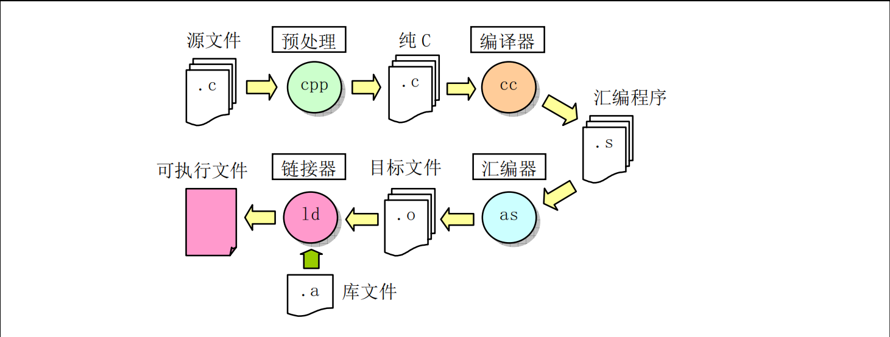

- 在前处理阶段中，gcc 会把C程序传递给 C 前处理器CPP，对 C语言程序中**指示符和宏**进行替换处理，
输出纯C语言代码；

- 在编译阶段，gcc把C语言程序编译生成对应的与机器相关的as汇编语言代码；

- 在汇编阶段，as汇编器会把汇编代码转换成机器指令，并以特定二进制格式输出保存在标文件中；最后GNU ld链接器把程序的相关目标文件组合链接在一起，生成程序的可执行映像文件。调用gcc的命令行格式与编译汇编语言的格式类似：

`gcc [选项] [-o outfile] infile ...`

其中 infile 是输入的 C 语言文件；outfile 是编译产生的输出文件。对于某次编译过程，并非一定要全部执行这四个阶段，使用命令行选项可以令gcc 编译过程在某个处理阶段后就停止执行。例如，使用`-S` 选项可以让 gcc 在输出了 程序对应的汇编语言程序之后就停止运行；使用`-c`选项可以让 gcc 只生成目标文件而不执行链接处理，见如下所示。

- `gcc -o hello hello.c ` //编译 hello.c 程序，生成执行文件 hello。

- `gcc -S -o hello.s hello.c` /／编译 hello.c 程序，生成对应汇编程序 hello.s。 

-  `gcc -c -o hello.o hello.c`　/／编译hello.c 程序，生成对应目标文件hello.o而不链接。

---

在编译象Linux 内核这样的包含很多源程序文件的大型程序时，通常使用 make 工具软件对整个程序的编译过程进行自动管理，详见后面说明。

### 3.3.2 嵌入汇编

本节介绍内核C语言程序中接触到的嵌入式汇编（内联汇编）语句。由于我们通常编制C程序过程中一般很少用到嵌入式汇编代码，因此这里有必以要对其基本格式和使用方法进行说明。具有输入和输出参数的嵌入汇编语句的基本格式为：  

> asm（“汇编语句”  
> ：输出寄存器  
> ：输入寄存器  
> ：会被修改的寄存器）；  

- 除第1行以外，后面带冒号的行若不使用就都可以省略。其中，”asm”是内联汇编语句关键词；”汇编语句”是你写汇编指令的地方；“输出寄存器”表示当这段嵌入汇编执行完之后，哪些寄存器用于存放输出数据。此地，这些寄存器会分别对应一C语言表达式值或一个内存地址；“输入寄存器”表示在开始执行汇编代码时，这里指定的一些寄存器中应存放的输入值，它们也分别对应着一C变量或常数值。“会被修改的寄存器”表示你已对其中列出的寄存器中的值进行了改动，gcc编译器不能再依赖于它原先对这些寄存器加载的值。如果必要的话，gcc 需要重新加载这些寄存器。因此我们需要把那些没有在输出/输入寄存器部分列出，但是在汇编语句中明确使用到或隐含使用到的寄存器名列在这个部分中。

下面我们用例子来说明嵌入汇编语句的使用方法。这里列出了kernel/traps.c 文件中第 22 行开始的　段代码作为例子来详细解说。为了能看得更清楚一些，我们对这段代码进行了重新排列和编号。

> #define get_seg_byte(seg,addr) \  
> ({ \    
> register char __res;  \  
> __asm__ ("push %%fs; \  
>   mov %%ax, %%fs; \  
>    movb %%fs :%2, %%al ; \  
>   pop %%fs" \  
>   :"=a" (__res) \  
>   :"0"(seg),"m" (*(addr)));\    
> __res;})

- 这段10行代码定义了一个嵌入汇编语言宏函数。通常使用汇编语句最方便的方式是把它们放在一个宏内。用圆括号括住的组合语句（花括号中的语句）：“({})”可以作为表达式使用，其中最后一行上的变量 __res（第10行）是该表达式的输出值，见下一节说明。

- 因为宏语句需要定义在一行上，因此这里使用反斜杠将这些语句连成一行。这条宏定义将被替换到程序中引用该宏名称的地方。第 1 行定义了宏的名称，也即是宏函数名称 get_seg_byte(seg,addr)。第 3 行定义了一个寄存器变量res。该变量将被保存在一个寄存器中，以便于快速访问和操作。如果想指定寄存器（例如 eax），那么我们可以把该句写成`register char __res asm ("ax");`，其中"asm"也可以写成"__asm__"。第 4 行上的"asm"表示嵌入汇编语句的开始。从第 4 行到第 7 行的 4 条语句是 AT＆T格式　的汇编语句。另外，**为了让gcc编译产生的汇编语言程序中寄存器名称前有一个百分号"%”，在嵌入汇编语句寄存器名称前就必须写上两个百分号“%%”**。

- 第8行即是输出寄存器，这句的含义是在这段代码运行结束后将 eax 所代表的寄存器的值放入，__res　变量中，作为本函数的输出值，"=a"中的"a"称为加载代码，"="表示这是输出寄存器，并且其中的值将被输出值替代。第9行表示在这段代码开始运行时将 seg放到eax 寄存器中，**"0"表示使用与上面同个位置的输出相同的寄存器。**而`(*(addr))`表示一个内存偏移地址值。
- **为了在上面汇编语句中使用该地址值，嵌入汇编程序规定把输出和输入寄存器统一按顺序编号，顺序是从输出寄存器序列从左到右从上到下以"%0"升始，分别记为%0、%1、...%9。因此，输出寄存器的编号是%0（这里只有一个输出寄存器），输入寄存器前一部分("0"(seg))的编号是%1，而后部分的编号是%2。上面第6行上的%2即代表`(*(addr))`这个内存偏移量。**

- 现在我们来研究4--7行上的代码的作用。第一句将fs 段寄存器的内容入栈；第二句将eax中的段值赋给 fs 段寄存器；第三句是把 `fs:(*(addr))`所指定的字节放入al 寄存器中。当执行完汇编语句后，输出寄存器eax 的值将被放入__res，作为该宏函数（块结构表达式）的返回值。

- 通过上面分析，我们知道，宏名称中的 seg 代表一指定的内存段值，而 addr表示一内存偏移地址量。到现在为止，我们应该很清楚这段程序的功能了吧！该宏函数的功能是从指定段和偏移值的内存地址处取一个字节。

-----

表3-4 常用寄存器加载代码说明（**重要！！**）（见原文50页表格）

------

...

### 3.3.3 圆括号中的组合语句

花括号对”{…}”用于把变量声明和语句组合成一个复合语句（组合语句）或一个语句块，这样**在语义上这些语句就等同于一条语句**。组合语句的右花括号后面不需要使用分号。圆括号中的组合语句，即形　如"({...})"的语句，可以在 GNU C 中用作一个表达式使用。这样就可以在表达式中使用 loop、switch语句和局部变量，因此这种形式的语句通常称为语句表达式。语句表达式具有如下示例的形式：

> ({int y = foo(); int z;   
> if (y > 0) z = y;  
> else z = -y;   
> 3 + z；})

其中组合语句中最后一条语句必须是后面跟随一个分号的表达式。这个表达式（”3十z”）的值即用作整个圆括号括住语句的值。如果最后一条语句不是表达式，那么整个语句表达式就具有void类型，因此没有值。另外，这种表达式中语句声明的任何局部变量都会在整块语句结束后失效。这个示例语句可以象如下形式的赋值语句来使用：

> res = x + ({略...}) + b;

当然，人们通常不会象上面这样写语句，这种语句表达式通常者都用来定义宏。例如内核源代码init/main.c 程序中读取CMOS时钟信息的宏定义：

> 69 #define CMOS_READ(addr)({\  //最后反斜杠起连接两行语句的作用。  
> 70 outb_p(0x80|addr,0x70); \  //首先向I/0端口0x70输出欲读取的位置addr。  
> 71 inb_p(0x71);\  //然后从端口0x71读入该位置处的值作为返回值。  
> 72 })

---
示例二

> #define inb(port)({\  
> unsigned char _v;\  
> __asm__ volatile ("inb %%dx,%%al":"=a" (_v):"d"(port));\   
> _v;\  
>  })

----

### 3.3.4 寄存器变量

如果想在嵌入汇编语句中把汇编指令的输出首接写到指定的寄存器中，那么此时使用局部寄存器变量，就很方便。由于linux内核中通常只使用局部奇存器变量，因此这里我只对局部奇存器变量的使用方法进行讨论。在GNU C程序中我们可以在函数中用如下形式定义一个局部寄存器变量：

`register int res _asm("ax");`

这单ax是变量 res所希望使用的寄存器。定义这样一个寄存器变量并不会专保留这个寄存器不派其他用途。在程序编译过程中，当gcc 数据流控制确定变量的值已经个用时就可能将该寄存器派作其他用途，而且对它的引用可能会被删除、移动或被简化。另外，gcc并个保证所编译出的代码会把变量一直放在指定的寄存器中。因此在嵌入汇编的指令部分最好不要明确地引用该寄存器并且假设该寄存器肯定引用的是该变量值。然而把该变量用作为asm的操作数还是能够保证指定的寄存器被用作该操作数。

### 3.3.5 内联函数（**没看懂**）

- 在程序中，通过把一个函数声明为内联（inline）函数，就可以让gcc 把函数的代码集成到调用该函数的代码中去。这样处理可以去掉函数调用时进入/退出时间开销，从而肯定能够加快执行速度。

- 内联函数嵌入调用者代码中的操作是一种优化操作，因此只有进行优化编译时才会执行代码嵌入处理。若编译过程中没有使用优化选项"-0"，那么内联函数的代码就不会被真止地嵌入到调用者代码中，而是只作为普通函数调用来处理。把一个函数声明为内联函数的方法是在函数声明中使用关键词”inine”。

- **详细说明见原书P53**

## 3.4 C与汇编程序的相互调用

### 3.4.1 C函数调用机制

- 在Linux内核程序boot/head.s执行完基本初始化操作之后，就会跳转去执行 init/main.c 程序。那么head.s 程序是如何把执行控制转交给init/main.c 程序的呢？汇编程序是如何调用执行C语言程序的？这里我们首先描述一下C函数的调用机制、控制权传递方式，然后说明head.s 程序跳转到C程序的方法。

- 函数调用操作包括从一块代码到另一块代码之间的双向数据传递和执行控制转移。数据传递通过函数参数和返回值来进行。另外，我们还需要在进入函数时为函数的局部变量分配存诸空间，并且在退出函数时收这部分空间。Intel80x86 CPU为控制传递提供了简单的指令，而数据的传递和局部变量存诸空间的分配与回收则通过栈操作来实现。

#### 3.4.1.1 栈帧结构和控制转移权方式

大多数CPU上的程序实现使用栈来支持函数调用操作。栈被用来传递函数参数、存储返回信息、临时保存寄存器原有值以备恢复以及用来存储局部数据。单个函数调用操作所使用的栈部分被称为**栈帧（Stack frame）**结构。栈帧结构的两端由两个指针来指定。**寄存器 ebp 通常用作帧指针（frame pointer）**，而**esp则用作栈指针（stack pointer）**。在函数执行过程中，栈指针esp 会随着数据的入栈和出栈而移动，因此函数中对大部分数据的访问都基于帧指针ebp进行。如下图所示：

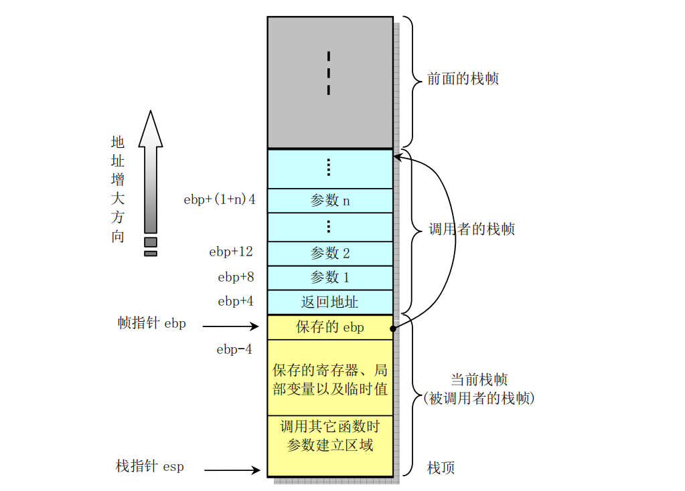

- 对于函数A调用函数B的情况，传递给B的参数包含在A的栈帧中。当A调用B时，函数A的返回地址（**调用返回后继续执行的指令地址**）被压入栈中，栈中该位置也明确指明了A栈帧的结束处。而B的栈帧则从随后的栈部分开始，即图中保存帧指针（ebp）的地方开始。再随后则用于存放任何保存的寄存器值以及函数的临时值。

- B 函数同样也使用栈来保存不能放在寄存器中的局部变量值。例如由于通常CPU的寄存器数量有限而不能够存放函数的所有局部数据，或者有些局部变量是数组或结构，因此必须使用数组或结构引用来访问。

- 还有就是C语言的地址操作符&被应用到一个局部变量上时，我们就需要为该变量生成一个地址，即为变
量的地址指针分配一空间。最后，B函数会使用栈来保存调用任何其它函数的参数。
**栈是往低（小）地址方向扩展的，而 esp 指向当前栈顶处的元素**。通过使用 push 和 pop 指令我们可以把数据压入栈中或从栈中弹出。对于没有指定初始值的数据所需要的存储空间，我们可以通过把栈指针递减适当的值来做到。类似地，通过增加栈指针值我们可以回收栈中已分配的空间。

- 指令CALL和RET用于处理函数调用和返回操作。调用指令CALL的作用是把返回地址压入栈中并且跳转到被调用函数开始处执行。返回地址是程序中紧随调用指令CALL后面一条指令的地址。因此当被调函数返回时就会从该位置继续执行。返回指令RET用于弹出栈顶处的地址并跳转到该地址处。在使用该指令之前，应该先正确处理栈中内容，使得当前栈指针所指位置内容正是先前CALL指令保存的返回地址。

- 另外，**若返回值是一个整数或一个指针，那么寄存器eax将被默认用来传递返回值**。

- 尽管某一时刻只有一个函数在执行，但我们还是需要确定在一个函数（调用者）调用其他函数（被调
用者）时，被调用者不会修改或覆盖掉调用者今后要用到的寄存器内容。因此Intel CPU采用了所有函数
必须遵守的寄存器用法统一惯例。**该惯例指明，寄存器eax、edx和ecx的内容必须由调用者自己负责保存**。当函数B被A调用时，函数B可以在不用保存这些寄存器内容的情况下任意使用它们而不会毁坏函数A所需要的任何数据。**另外，寄存器 ebx、esi和 edi 的内容则必须由*被调用者B* 来保护**。当被调用者需要使
用这些寄存器中的任意一个时，必须首先在栈中保存其内容，并在退出时恢复这些寄存器的内容。因为调
用者A（或者一些更高层的函数）并不负责保存这些寄存器内容，但可能在以后的操作中还需要用到原先的值。还有寄存器 ebp 和 esp 也必须遵守第二个惯例用法（由被调用者B来维护）。

#### 3.4.1.2 函数调用举例

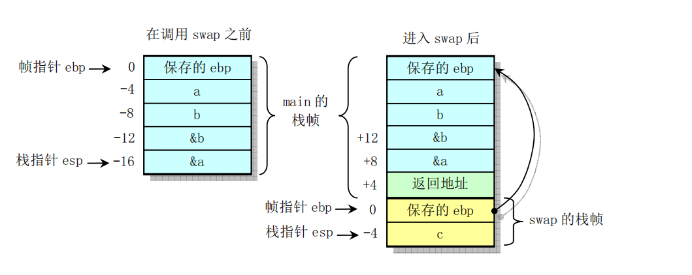

gcc汇编后的汇编代码：
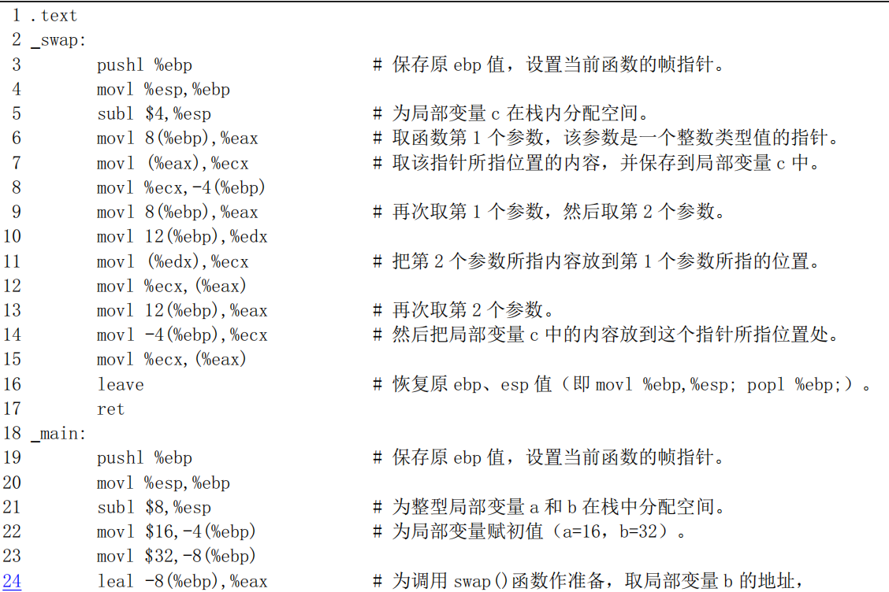

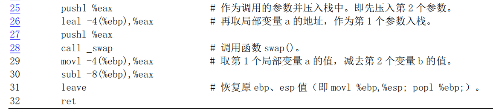

***其余请参考原书***

#### 3.4.1.3 main()也是一个函数

- 上面这段汇编程序是使用 gcc 1.40 编译产生的，可以看出其中有几行多余的代码。可见当时的 gcc 编译器还不能产生最高效率的代码，这也是为什么某些关键代码需要直接使用汇编语言编制的原因之一。另外，上面提到C程序的主程序 main()也是一个函数。这是因为在编译链接时它将会作为 **crtO.s** 汇编程序的函数被调用。crtO.s 是一个桩（stub）程序，名称中的“crt”是“C run-time”的缩写。该程序的目标文件将被链接在每个用户执行程序的开始部分，主要用于设置一些初始化全局变量等。

- Linux 0.11中crtO.s汇编
程序见如下所示。其中建立并初始化全局变量_environ供程序中其它模块使用。

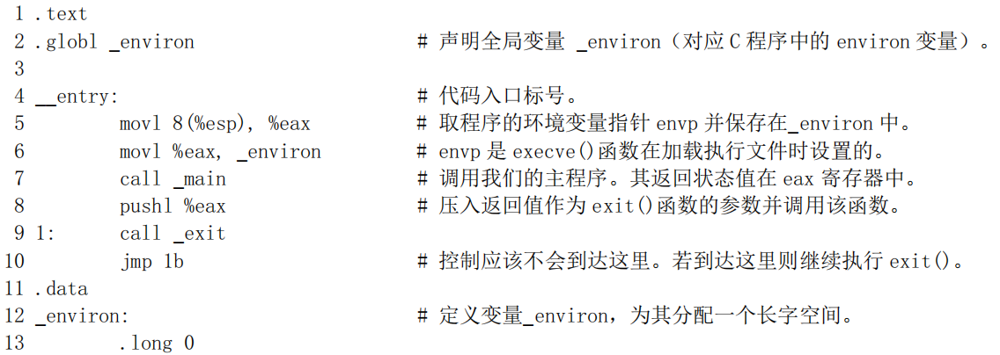

- 通常使用gcc 编译链接生成执行文件时，gcc 会自动把该文件的代码作为第一个模块链接在可执行程序中。在编译时使用显示详细信息选项-v就可以明显地看出这个链接操作过程：

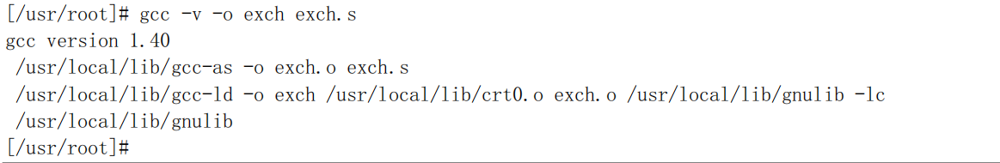

- 因此在通常的编译过程中我们无需特别指定 stub 模块 crtO.o，但是若想从上面给出的汇编程序手工使用 ld
（gld）从 exch.o 模块链接产生可执行文件 exch，那么我们就需要在命令行上特别指明 crtO.o 这个模块，并
且链接的顺序应该是“crtO.o、所有程序模块、库文件”。
为了使用 ELF 格式的目标文件以及建立共享库模块文件，现在的 gcc 编译器（2.x）已经把这个 crtO
扩展成几个模块：crtl.o、crti.o、crtbegin.o、crtend.o和 crtn.o。这些模块的链接顺序为“crtl.o、crti.o、crtbegin.0
（crtbeginS.o）、所有程序模块、crtend.o（crtendS.o）、crtn.o、库模块文件”。gcc 的配置文件 specfile 指定了这种链接顺序。其中 ctrl.o、crti.o和 crtn.o 由C库提供，是C程序的“启动”模块；crtbegin.o和 crtend.o
是 C++语言的启动模块，由编译器 gcc 提供；而 crtl.o则与 crto.o 的作用类似，主要用于在调用 main()之
前做一些初始化工作，全局符号_start 就定义在这个模块中。

- crtbegin.o 和 crtend.o主要用于C++语言在.ctors 和.dtors 区中执行全局构造器（constructor）和析构
器（destructor）函数。crtbeginS.o和crtendS.o的作用与前两者类似，但用于创建共享模块中。crti.o用于
在.init区中执行初始化函数init()。.init区中包含进程的初始化代码，即当程序开始执行时，系统会在调用 main()之前先执行.init 中的代码。crtn.o 则用于在.fini 区中执行进程终止退出处理函数 fini()函数，即当程序正常退出时（main()返回之后），系统会安排执行.fini 中的代码。

- boot/head.s程序中第136--140行就是用于为跳转到init/main.c中的main()函数作准备工作。第139行上的指令在栈中压入了返回地址，而第 140 行则压入了 main()函数代码的地址。当head.s最后在第218行
上执行 ret指令时就会弹出 main()的地址，并把控制权转移到 init/main.c 程序中。

### 3.4.2 在汇编程序中调用C函数

- 在汇编程序调用一个C函数时，程序需要首先按照**逆向顺序把函数参数压入栈中**，即函数最后（最右边的）一个参数先入栈，而最左边的第1个参数在最后调用指令之前入栈，见下图所示。然后执行CALL指令去执行被调用的函数。在调用函数返回后，程序需要再把先前压入栈中的函数参数清除掉。

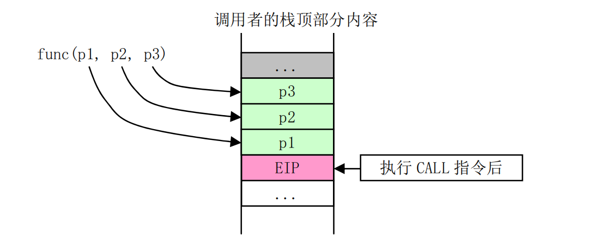

- 在执行CALL指令时，CPU会把CALL指令下一条指令的地址压入栈中（见图中EIP）。如果调用还
涉及到代码特权级变化，那么CPU还会进行堆栈切换，并且把当前堆栈指针、段描述符和调用参数压入新堆栈中。由于Linux 内核中只使用中断门和陷阱门方式处理特权级变化时的调用情况，并没有使用CALL 指令来处理特权级变化的情况，因此这里对特权级变化时的CALL指令使用方式不再进行说明。

- 汇编中调用C函数比较“自由”。只要是在栈中适当位置的内容就都可以作为参数供C函数使用。这
单仍然以上图中具有3个参数的函数调用为例，如果我们没有专门为调用函数func()压入参数就首接调用它的话，那么func()函数仍然会把存放EIP位置以上的栈中其他内容作为自己的参数使用。如果我们为调用 func()而仅仅明确地压入了第 1、第 2 个参数，那么 func()函数的第 3个参数 p3 就会直接使用 p2 前的栈中内容。在 Linux 0.1x 内核代码中就有几处使用了这种方式。例如在 kernel/system_call.s 汇编程序中第 217行上调用 copy_process()函数（kernel/fork.c 中第68行）的情况。在汇编程序函数_sys_fork 中虽然只把5个参数压入了栈中，但是 copy_process()却共带有多达 17 个参数，见下面所示：

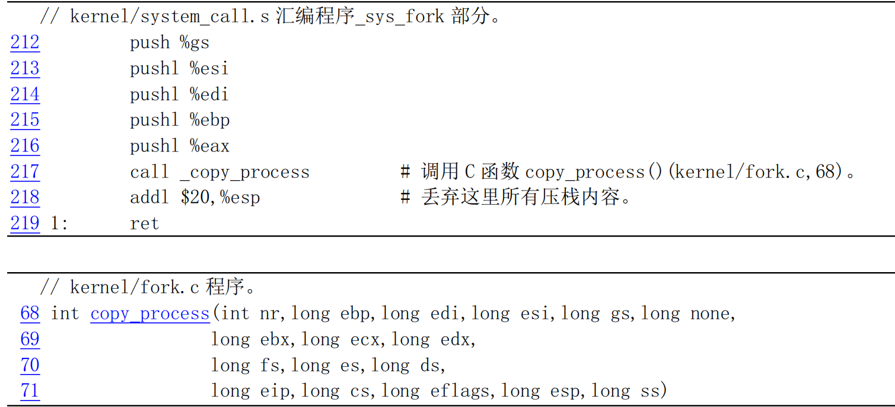

- 我们知道参数越是最后入栈，它越是靠近 C 函数参数左侧。因此实际上调用 copy_process()函数之前入栈 5 个寄存器值就是 copy_process()函数的最左面的 5 个参数。按顺序它们分别对应为入栈的 eax（nr）、 ebp、edi、esi 和寄存器 gs 的值。而随后的其余参数实际上直接对应堆栈上已有的内容。这些内容是进入系统调用中断处理过程开始，直到调用本系统调用处理过程时逐步入栈的各寄存器的值。

- 参数 none 是 system_call.s 程序第 94 行上利用地址跳转表sys_call_table[]（定义在
include/linux/sys.h，74行）调用_sys_fork时的下一条指令的返回地址值。随后的参数是刚进入 system_call 时在 83--88 行压入栈的寄存器 ebx、ecx、edx 和段寄存器 fs、es、ds。最后 5 个参数是 CPU 执行中断指令压入返回地址 eip 和 cs、标志寄存器eflags、用户栈地址 esp 和 ss。因为系统调用涉及到程序特权级变化，所以 CPU 会把标志寄存器值和用户栈地址也压入了堆栈。在调用 C 函数 copy_process()返回后，_sys_fork 也只把自已压入的 5个参数丢弃掉，栈中其他还均保存着。其他采用上述用法的函数还有 kernel/signal.c 中的 do_signal()、fs/exec.c 中的 do_execve()等，请自己加以分析。

- 另外，我们说汇编程序调用C函数比较自由的另一个原因是我们可以根本不用CALL指令而采用JMP
指令来同样达到调用函数的目的。方法是在参数入栈后人工把下一条要执行的指令地址压入栈中，然后首接使用JMP指令跳转到被调用函数开始地址处去执行函数。此后当函数执行完成时就会执行RET指令把我们人工压入栈中的下一条指令地址弹出，作为函数返回的地址。Linux内核中也有多处用到了这种函数调用方法，例如 kernel/asm.s 程序第 62 行调用执行 traps.c 中的do_int3()函数的情况。

### 3.4.3 在C程序中调用汇编函数

重要性不高，略。

***参考原书***

## 3.5 Linux 0.11 目标文件格式 （3.5这一大节看不太懂！！）

- 这里给出了Linux 0.11 内核所支持的 a.out 目标文件格式的信息。as86 和　 ld86生成的是MINIX专门的标文件格式，我们将在涉及这种格式的内核创建工具一章中给出。因为 MINIX目标文件结构与a.out目标文件格式类似，所以这里不对其进行说明。有关目标文件和链接程序的基本工作原理可参见John R.Levine 著的《Linkers ＆ Loaders》一书。

- 为便于描述，这里把编译器生成的目标文件称为目标模块文件（简称模块文件），而把链接程序输出产生的可执行目标文件称为可执行文件。并且把它们都统称为目标文件。

### 3.5.1 目标文件格式

- 在 Linux 0.11 系统中，GNU gcc 或 gas 编译输出的目标模块文件和链接程序所生成的可执行文件都使用了 UNIX 传统的 a.out 格式。这是一种被称为汇编与链接输出（Assembly ＆ linker editor output）的目标文件格式。对于具有内存分页机制的系统来说，这是一种简单有效的目标文件格式。a.out格式文件由一个文件头和随后的代码区（Text section，也称为正文段）、已初始化数据区（Data section，也称为数据段）、重定位信息区、符号表以及符号名字符串构成。其中代码区和数据区通常也被分别称为正文段（代码段）和数据段。

下图为a.out格式的目标文件：

- a.out格式7个区的基本定义和用途是:

1. 执行头部分(exec header)。执行文件头部分。该部分中含有一些参数(exec 结构)，是有关目标文件的整体结构信息。例如代码和数据区的长度、未初始化数据区的长度、对应源程序文件名以及目标文件创建时间等。内核使用这些参数把执行文件加载到内存中并执行，而链接程序（ld）使用这些参数将一些模块文件组合成一个可执行文件。这是目标文件唯一必要的组成部分。

2. 代码区(text segment)。由编译器或汇编器生成的二进制指令代码和数据信息，含有程序执行时被加载到内存中的指令代码和相关数据。可以以只读形式被加载。

3. 数据区(data segment)。由编译器或汇编器生成的二进制指令代码和数据信息，这部分含有已经初始化过的数据，总是被加载到可读写的内存中。

4. 代码重定位部分(text relocations)。这部分含有供链接程序使用的记录数据。在组合目标模块文件时用于定位代码段中的指针或地址。当链接程序需要改变目标代码的地址时就需要修正和维护这些地方。

5. 数据重定位部分（data relocations）。类似于代码重定位部分的作用，但是用于数据段中指针的重定位。

6. 符号表部分(symbol table)。这部分同样含有供链接程序使用的记录数据。这些记录数据保存着模块文件中定义的全局符号以及需要从其他模块文件中输入的符号，或者是由链接器定义的符号，用于在模块文件之间对命名的变量和函数（符号）进行交叉引用。

7. 字符串表部分(string table)。该部分含有与符号名相对应的字符串。用于调试程序调试目标代码，与链接过程无关。这些信息可包含源程序代码和行号、局部符号以及数据结构描述信息等。

- 对于一个指定的目标文件并非一定会包含所有以上信息。由于Linux 0.11 系统使用了Intel CPU的内存管理功能，因此它会为每个执行程序单独分配一个64MB的地址空间（逻辑地址空间）使用。在这种情况下因为链接器已经把执行文件处理成从一个固定地址开始运行，所以相关的可执行文件中就不再需要重定位信息。下面我们对其中几个重要区或部分进行说明。

#### 3.5.1.1 执行头部分

目标文件的文件头中含有一个长度为32 字节的 exec 数据结构，通常称为文件头结构或执行头结构。其定义如下所示。有关 a.out结构的详细信息请参见include/a.out.h文件后的介绍。

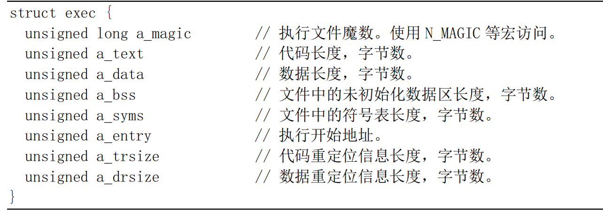

- 根据 a.out 文件中头结构魔数字段的值，我们又可把 a.out 格式的文件分成几种类型。Linux 0.11 系统使用了其中两种类型：模块目标文件使用了**OMAGIC（Old Magic）**类型的 a.out 格式，它指明文件是目标文件或者是不纯的可执行文件。其魔数是0x107（八进制0407）。而执行文件则使用了 ZMAGIC 类型的 a.out 格式，它指明文件为需求分页处理（demang-paging，即需求加载load on demand）的可执行文件。其魔数是 0x10b（八进制0413）。这两种格式的主要区别在于它们对各个部分的存储分配方式上。虽然该结构的总长度只有 32字节，但是对于一个ZMAGIC类型的执行文件来说，其文件开始部分却需要专门留出1024 字节的空间给头结构使用。除被头结构占用的 32个字节以外，其余部分均为0。从1024字节之后才开始放置程序的正文段和数据段等信息。而对于一个OMAGIC类型的.o模块文件来说，文件开始部分的 32字节头结构后面紧接着就是代码区和数据区。

- 执行头结构中的 a_text 和 a_data 字段分别指明后面只读的代码段和可读写数据段的字节长度。a_bss 字段指明内核在加载目标文件时数据段后面未初始化数据区域（bss 段）的长度。由于Linux 在分配内存时会自动对内存清零，因此 bss 段不需要被包括在模块文件或执行文件中。为了形象地表示目标文件逻辑地具有一个 bss 段，在后面图示中将使用虚线框来表示目标文件中的bss 段。

- a_entry 字段指定了程序代码开始执行的地址，而 a_syms、a_trsize 和a_drsize 字段则分别说明了数据段后符号表、代码和数据段重定位信息的大小。对于可执行文件来说并不需要符号表和重定位信息，因此除非链接程序为了调试目的而包括了符号信息，执行文件中的这几个字段的值通常为0。

#### 3.5.1.2 重定位信息部分

- Linux 0.11 系统的模块文件和执行文件都是 a.out格式的目标文件，但是只有编译器生成的模块文件中包含用于链接程序的重定位信息。代码段和数据段的重定位信息均有重定位记录（项）构成，每个记录的长度为8字节，其结构如下所示。

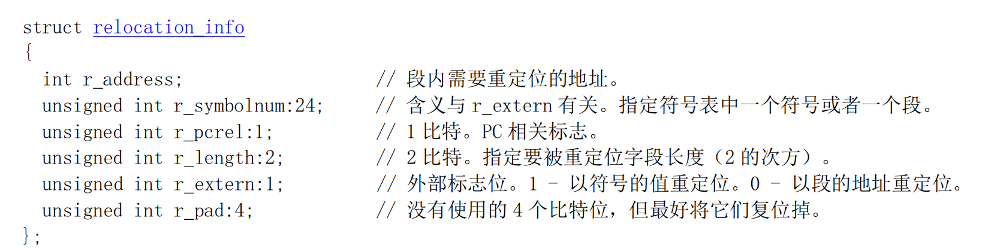

- 重定位项的功能有两个。一是当代码段被重定位到一个不同的基地址处时，重定位项则用于指出需要修改的地方。二是在模块文件中存在对未定义符号引用时，当此未定义符号最终被定义时链接程序就可以使用相应重定位项对符号的值进行修正。由上面重定位记录项的结构可以看出，每个记录项含有模块文件代码区（代码段）和数据区（数据段）中需要重定位处长度为4字节的地址以及规定如何具体进行重定位操作的信息。地址字段r_address 是指可重定位项从代码段或数据段开始算起的偏移值。2比特的长度字段 r_length 指出被重定位项的长度，0到3 分别表示被重定位项的宽度是1字节、2 字节、4 字节或8字节。标志位r_pcrel指出被重定位项是一个“PC 相关的”的项，即它作为一个相对地址被用于指令当中。外部标志位r_extern 控制着r_symbolnum 的含义，指明重定位项参考的是段还是一个符号。如果该标志值是0, 那么该重定位项是一个普通的重定位项，此时r_symbolnum 字段指定是在哪个段中寻址定位。如果该标志是1，那么该重定位项是对一个外部符号的引用，此时r_symbolnum指定目标文件中符号表中的一个符号，需要使用符号的值进行重定位。

#### 3.5.1.3 符号表和字符串部分

目标文件的最后部分是符号表和相关的字符串表。符号表记录项的结构如下所示。

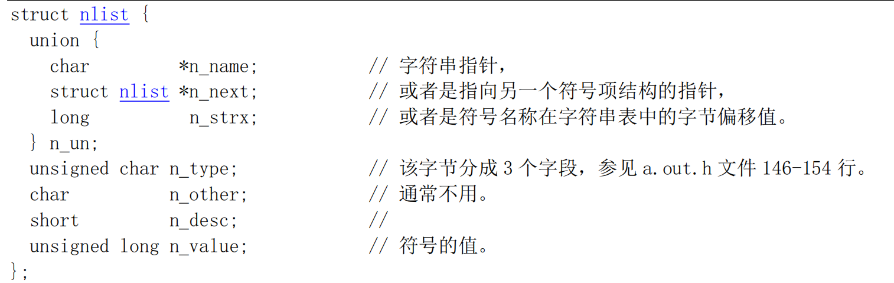

- 由于GNU gcc 编译器允许任意长度的标识符，因此标识符字符串都位于符号表后的字符串表中。每个符号表记录项长度为12字节，其中第一个字段给出了符号名字符串（以 null 结尾）在字符串表中的偏移位置。类型字段n_type 指明了符号的类型。该字段的最后一个比特位用于指明符号是否是外部的(全局的)。如果该位为1的话，那么说明该符号是一个全局符号。链接程序并不需要局部符号信息，但可供调试程序使用。n_type 字段的其余比特位用来指明符号类型。a.out.h头文件中定义了这些类型值常量符号。符号的主要的类型包括：

1. text、data 或bbs 指明是本模块文件中定义的符号。此时符号的值是模块中该符号的可重定位地址。

2. abs指明符号是一个绝对的（固定的）不可重定位的符号。符号的值就是该固定值。 

3. undef指明是一个本模块文件中未定义的符号。此时符号的值通常是0。

- 但作为一种特殊情况，编译器能够使用一个未定义的符号来要求链接程序为指定的符号名保留一块存储空间。如果一个未定义的外部（全局）符号具有非零值，那么对链接程序而言该值就是程序希望指定符号寻址的存储空间的大小值。在链接操作期间，如果该符号确实没有定义，那么链接程序就会在 bss 段中为该符号名建立一块存储空间，空间的大小是所有被链接模块中该符号值最大的一个。这个就是 bss 段中所谓的公共块（Common block）定义，主要用于支持未初始化的外部（全局）数据。例如程序中定义的未初始化的数组。如果该符号在任意一个模块中已经被定义了，那么链接程序就会使用该定义而忽略该值。

### 3.5.2 Linux 0.11 中的目标文件格式

在 Linux 0.11 系统中,我们可以使用 objdump 命令来查看模块文件或执行文件中文件头结构的具体值。例如，下面列出了hello.o目标文件及其执行文件中文件头的具体值。

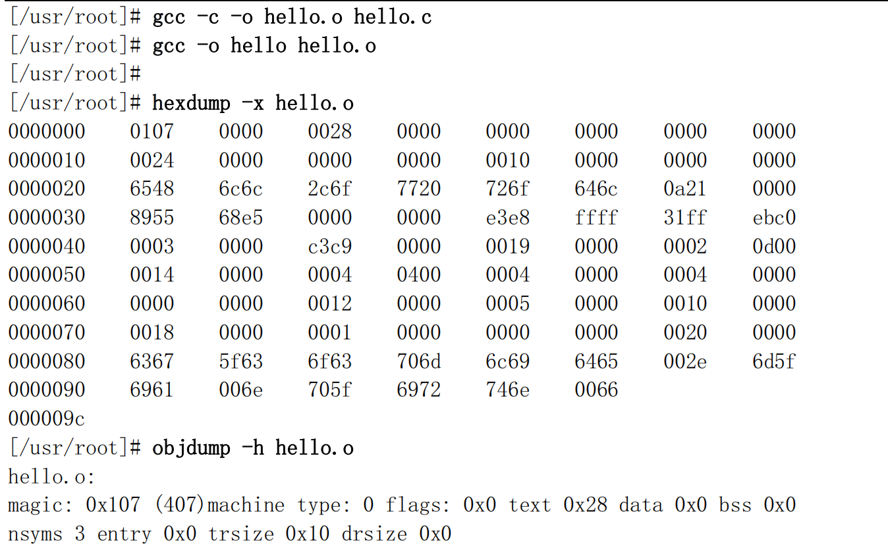

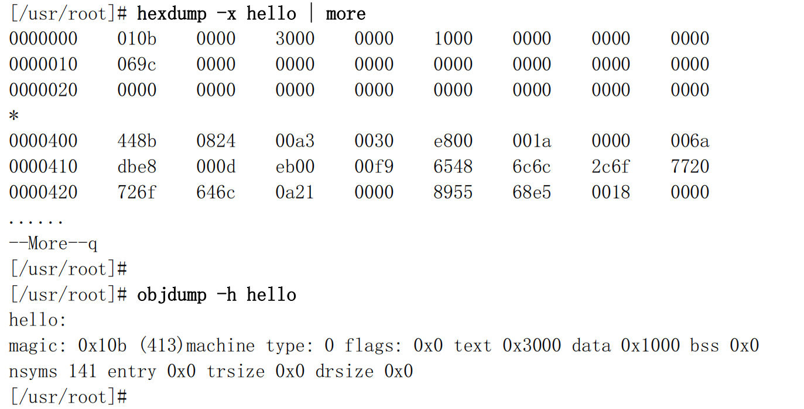

- 可以看出，hello.o 模块文件的魔数是0407（OMAGIC），代码段紧跟在头结构之后。除了文件头结构以外，还包括一个长度为0x28字节的代码段和一个具有3个符号项的符号表以及长度为0x10字节的代码段重定位信息。其余各段的长度均为0。
- 对应的执行文件 hello 的魔数是0413（ZMAGIC），代码段从文件偏移位置 1024 字节开始存放。代码段和数据段的长度分别为0x3000 和0x1000 字节，并带有包含141个项的符号表。

- 我们可以使用命令 strip 删除执行文件中的符号表信息。例如下面我们删除了 hello 执行文件中的符号信息。可以看出 hello 执行文件的符号表长度变成了0，并且 hello 文件的长度也从原来的 20591 字节减小到17412 字节。

--------

- 磁盘上 a.out执行文件的各区在进程逻辑地址空间中的对应关系如下图所示。Linux 0.11 系统中进程的逻辑空间大小是64MB。对于 ZMAGIC类型的 a.out执行文件，它的代码区的长度是内存页面的整数倍。由于Linux 0.11 内核使用需求页（Demand-paging）技术，即在一页代码实际要使用的时候才被加载到物理内存页面中，而在进行加载操作的 fs/execve()函数中仅仅为其设置了分页机制的页目录项和页表项，因此需求页技术可以加快程序的加载的速度。

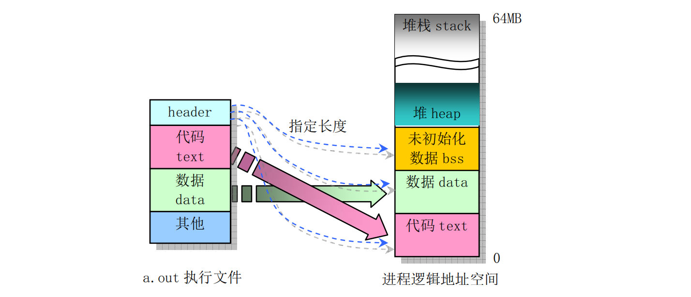

- 图中 bss 是进程的未初始化数据区，用于存放静态的未初始化数据。在开始执行程序时 bss 的第 1 页内存会被设置为全0。

- 图中 heap 是堆空间区，用于分配进程在执行过程中动态申请的内存空间。

### 3.5.3 链接程序输出

- 链接程序对输入的一个或多个模块文件以及相关的库函数模块进行处理，最终生成相应的二进制执行文件或者是一个所有模块组合而成的大模块文件。在这个过程中，链接程序的首要任务是给执行文件（或者输出的模块文件）进行存储空间分配操作。一旦存储位置确定，链接程序就可以继续执行符号绑定操作和代码修正操作。因为模块文件中定义的大多数符号与文件中的存储位置有关，所以在符号对应的位置没有确定下来之前符号是没有办法解析的。

- 每个模块文件中包括几种类型的段，链接程序的第二个任务就是把所有模块中相同类型的段组合连接在一起，在输出文件中为指定段类型形成单一一个段。例如，链接程序需要把所有输入模块文件中的代码段合并成一个段放在输出的执行文件中。

- 对于 a.out 格式的模块文件来说，由于段类型是预先知道的，因此链接程序对a.out 格式的模块文件进行存储分配比较容易。例如，对于具有两个输入模块文件和需要连接一个库函数模块的情况，其存储分配情况如下图所示。每个模块文件都有一个代码段（text）、数据段（data）和一个bss 段，也许还会有一些看似外部（全局）符号的公共块。链接程序会收集每个模块文件包括任何库函数模块中的代码段、数据段和bss 段的大小。在读入并处理了所有模块之后，任何具有非零值的未解析的外部符号都将作为公共块来看待，并且把它们分配存储在bss 段的末尾处。

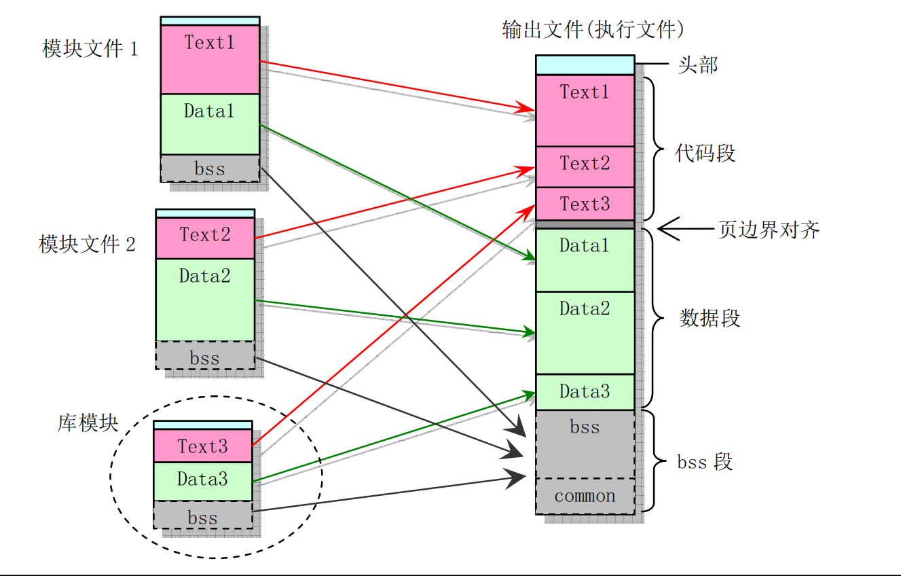

- 此后链接程序就可以为所有段分配地址。对于Linux0.11系统中使用的 ZMAGIC类型的a.out 格式输出文件中的代码段被设置成从固定地址0开始。数据段则从代码段后下一个页面边界开始。bss 段则紧随数据段开始放置。在每个段内，链接程序会把输入模块文件中的同类型段顺序存放，并按字进行边界对齐。

- 当Linux0.11 内核加载一个可执行文件时，它会根据文件头部结构中的信息首先判断文件是否是一个合适的可执行文件，即其魔数类型是否为ZMAGIC，然后系统在用户态堆栈顶部为程序设置环境参数和命令行上输入的参数信息块并为其构建一个任务数据结构。接着在设置了一些相关寄存器值后利用堆栈返回技术去执行程序。执行程序映像文件中的代码和数据将会在实际执行到或用到时利用需求加载技术（Load on demand）动态加载到内存中。

- 对于 Linux 0.11 内核的编译过程，它是根据内核的配置文件 Makefile 使用 make 命令指挥编译器和链接程序操作而完成的。在建立过程中 make还利用内核源代码 tools/目录下的 build.c程序编译生成了一个用于组合所有模块的临时工具程序build。由于内核是由引导启动程序利用 ROM BIOS 中断调用加载到内存中，因此编译产生的内核各模块中的执行头结构部分需要去掉。工具程序 build 主要功能就是分别去掉 bootsect、setup 和 system 文件中的执行头结构，然后把它们顺序组合在一起产生一个名为Image 的内核映象文件。

### 3.5.4 链接程序预定义

- 在链接过程中，链接器ld 和 ld86 会使用变量记录下执行程序中每个段的逻辑地址。因此在程序中可以通过访问这几个外部变量来获得程序中段的位置。链接器预定义的外部变量通常至少有etext、_etext、 edata、_edata、end 和_end。

- **变量名_etext 和 etext 的地址是程序正文段结束后的第 1个地址**；**_edata 和 edata 的地址是初始化数据区后面的第1个地址**；**_end和 end的地址是未初始化数据区（bss）后的第1个地址位置**。带下划线’_’前缀的名称等同于不带下划线的对应名称，它们之间的唯一区别在于ANSI、POSIX 等标准中没有定义符号 etext、edata 和 end.

- 当程序刚开始执行时，其brk 所指位置与_end 处于相同位置。但是系统调用 sys_brk()、内存分配函数 malloc()以及标准输入/输出等操作会改变这个位置。因此程序当前的brk位置需要使用 sbrk()来取得。注意，这些变量名必须看作是地址。因此在访问它们时需要使用取地址前缀’&’，例如&end等。

---

- Linux O.1x 内核在初始化块设备高速缓冲区时（fs/buffer.c），就使用了变量名_end 来获取内核映像文件 Image 在内存中的末端后的位置，并从这个位置起开始设置高速缓冲区。

### 3.5.5 Syetem.map文件

- 当运行GNU 链接器 gld（ld）时若使用了’-M'选项，或者使用 nm 命令，则会在标准输出设备（通常是屏幕）上打印出链接映像（link map）信息，即是指由连接程序产生的目标程序内存地址映像信息。其中列出了程序段装入到内存中的位置信息。具体来讲有如下信息：

1. 目标文件及符号信息映射到内存中的位置; 

2. 公共符号如何放置;

3. 链接中包含的所有文件成员及其引用的符号。

- 通常我们会把发送到标准输出设备的链接映像信息重定向到一个文件中（例如 System.map）。在编译内核时，linux/Makefile 文件产生的 System.map 文件就用于存放内核符号表信息。符号表是所有内核符号及其对应地址的一个列表，当然也包括上面说明的_etext、_edata 和_end 等符号的地址信息。随着每次内核的编译，就会产生一个新的对应 System.map 文件。当内核运行出错时，通过 System.map 文件中的符号表解析，就可以查到一个地址值对应的变量名，或反之。

- 利用 System.map 符号表文件，在内核或相关程序出错时，就可以获得我们比较容易识别的信息。符号表的样例如下所示:

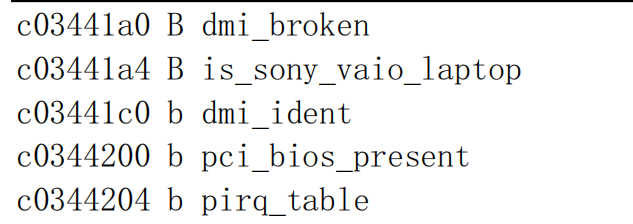

- 其中每行说明一个符号，第 1栏指明符号值（地址）；第 2栏是符号类型，指明符号位于目标文件的哪个区（sections）或其属性；第3栏是对应的符号名称。

- 第2栏中的符号类型指示符通常有表3-5所示的几种，另外还有一些与采用的目标文件格式相关。如果符号类型是小写字符，则说明符号是局部的；如果是大写字符，则说明符号是全局的（外部的）。参见文件 include/a.out.h 中 nlist{}结构n_type 字段的定义（第 110--185 行）。

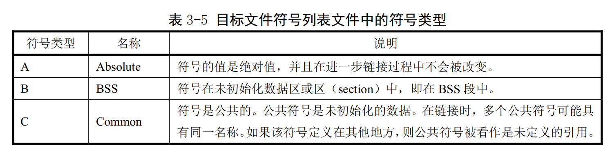

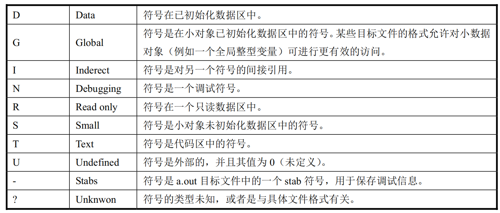

- 可以看出名称为 dmi_broken 的变量位于内核地址 0xc03441a0 处。

- System.map 位于使用它的软件（例如内核日志记录后台程序klogd）能够寻找到的地方。在系统启动时,如果没有以一个参数的形式为klogd给出 System.map 的位置,则 klogd将会在三个地方搜寻 System.map。依次为：

> /boot/System.map  
> /System.map  
> /usr/src/linux/System.map

- 尽管内核本身实际上不使用 System.map，但其他程序，象 klogd、lsof、ps 以及其他象 dosemu 等许多软件都需要有一个正确的 System.map 文件。利用该文件，这些程序就可以根据已知的内存地址查找出对应的内核变量名称，便于对内核的调试工作。

## 3.6 Make 程序和Makefile文件

- Makefile（或 makefile）文件是 make 工具程序的配置文件。Make 工具程序的主要用途是能自动地决定一个含有很多源程序文件的大型程序中哪个文件需要被重新编译。Makefile 的使用比较复杂，这里只是根据上面的 Makefile文件作些简单的介绍。**详细说明请参考GNU make 使用手册**。

- make的执行过程分为两个不同的阶段。在第一个阶段，它读取所有的Makefile文件以及包含的Makefile 文件等，记录所有的变量及其值、隐式的或显式的规则，并构造出所有目标对象及其先决条件的一幅全景图。在第二阶段期间，make 就使用这些内部结构来确定哪个目标对象需要被重建，并且使用相应的规则来操作。

- 当 make 重新编译程序时，每个修改过的C代码文件必须被重新编译。如果一个头文件被修改过了，那么为了确保正确，每一个包含该头文件的C代码程序都将被重新编译。每次编译操作都产生一个与源程序对应的目标文件。最终，如果任何源代码文件被编译过了，那么所有的目标文件不管是刚编译完的还是以前就编译好的必须连接在一起以生成新的可执行文件。

- 简单的Makefile文件含有一些规则，这些规则具有如下的形式:

> 目标（target）... : 先决条件(prerequisites)...  
>       命令（command）  
> ...

- 其中’目标’对象通常是程序生成的一个文件的名称；例如是一个可执行文件或目标文件。目标也可以是所要采取活动的名字，比如'清除’（’clean’）。’先决条件’是一个或多个文件名，是用作产生目标的输入条件。通常一个目标依赖几个文件。而’命令’是 make 需要执行的操作。一个规则可以有多个命令，每一个命令自成一行。请注意，**你需要在每个命令行之前键入一个制表符**！这是粗心者常常忽略的地方。

- 如果一个先决条件通过目录搜寻而在另外一个目录中被找到，这并不会改变规则的命令；它们将被如期执行。因此，你必须小心地设置命令，使得命令能够在 make 发现先决条件的目录中找到需要的先决条件。这就需要通过使用自动变量来做到。自动变量是一种在命令行上根据具体情况能被自动替换的变量。自动变量的值是基于目标对象及其先决条件而在命令执行前设置的。例如，’$’的值表示规则的所有先决条件，包括它们所处目录的名称；’$<’的值表示规则中的第一个先决条件；’$@'表示目标对象；另外还有一些自动变量这里就不提了。

- 有时，先决条件还常包含头文件，而这些头文件并不愿在命令中说明。此时自动变量’$<’正是第一个先决条件。例如:

> foo.o : foo.c def.c def.h hack.h  
>       cc -c &(CFLAGS) $< -o $@  

- 其中的'$<'就会被自动地替换成 foo.c，而$@则会被替换为foo.o

---

- 为了让 make 能使用习惯用法来更新一个目标对象，你可以不指定命令，写一个不带命令的规则或者不写规则。此时 make 程序将会根据源程序文件的类型（程序的后缀）来判断要使用哪个隐式规则。

- 后缀规则是为 make 程序定义隐式规则的老式方法（现在这种规则已经不用了，取而代之的是使用更通用更清晰的模式匹配规则）。下面例子就是一种双后缀规则。双后缀规则是用一对后缀定义的：源后缀和目标后缀。相应的隐式先决条件是通过使用文件名中的源后缀替换目标后缀后得到。因此，此时下面的’$<’值是’*.c’文件名。而此条 make 规则的含义是将’*.c’程序编译成'*.s’代码。

> .c.s:  
>       $(CC) $(CFLAGS) \    
>       -nostdinc -Iinclude -S -o $*.s $<

- Makefile 文件最后生成的依赖关系是用于让 make 来确定是否需要重建一个目标对象。比如当某个头文件被改动过后，make 就通过这些依赖关系，重新编译与该头文件有关的所有'*.c’文件。

2024.12.20-12.25    于昆明