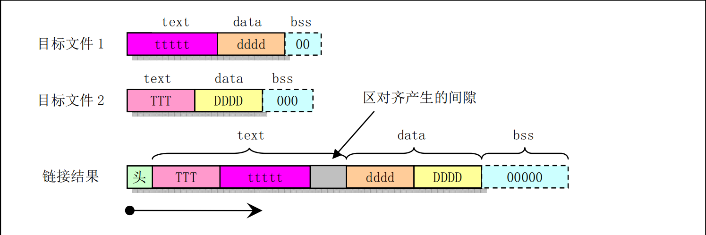

# 第三章 内核编程语言及环境

## 3.1 as86汇编器

Linux 0.1x系统是用来两种汇编器(Assembler)：
- as86汇编器，能产生16位代码，使用配套的ld86链接器。  
- GNU的gas(as)汇编器，使用GNU ld链接器链接产生目标文件。   
---

- as86和ld86是由MINIX-386的主要开发者Bruce Evans编写的Intel8086、80386汇编编译程序和链接程序。   
- 被Linux系统用来创建16位的启动扇区引导程序**boot/bootsect.s**和实模式下初始设置程序**boot/setup.s**的二进制执行代码。  
- as86语法是基于MINIX系统的汇编语言语法，而MINIX系统的汇编语法是基于PC/IX系统的汇编器语法。PC/IX是很早以前Intel 8086 CPU上运行的一个UNIX类操作系统。  

---

有关as86编译器和ld86连接器的源代码可以从FTP服务器<ftp.funet.fi>上或从网站<www.oldlinux.org>下载。

### 3.1.1 as86汇编语言语法


- 汇编器专门用来把低级汇编语言程序编译成含机器码的二进制程序或目标文件。汇编器会把输入的一
个汇编语言程序（例如 srcfile）编译成目标文件（objfile）。  
- 汇编的命令行基本格式为：  
`as [选项] -o objfile srcfile`  其中选项用来控制编译过程以产生指定格式和设置的目标文件。  
- 输入的汇编语言程序srcfile是一个文本文件。该文件内容必须是由换行字符结尾的一系列文本行组成。  

----

- **语句**可以是只包含空格、制表符和换行符的空行，也可以是**赋值语句（或定义语句）、伪操作符语句和机器指令语句**。
- **赋值语句**用于给一个符号或标识符赋值。它由标识符后跟一个等于号，再跟一个表达式组成，例如：`B0OTSEG=OxO7CO`。- **伪操作符语句**是汇编器使用的指示符，它通常并不会产生任何代码。它由伪操作码和0个或多个操作数组成。每个操作码都由一个**点字符'.'**开始。点字符'.'本身是一个特殊的符号，它表示编译过程中的**位置计数器**。其值是点符号出现处机器指令第1个字节的地址。  
- **机器指令语句**是可执行机器指令的助记符，它由操作码和0个或多个操作数构成。另外，任何语句之前都可以有**标号**。*标号是由一个标识符后跟一个冒号’：’组成。在编译过程中，当汇编器遇到一个标号，那么当前位置计数器的值就会赋值给这个标号。*因此一条汇编语句通常由**标号（可选）、指令助记符（指令名）和操作数**三个字段组成，标号位于一条指令的第一个字段。它代表其所在位置的地址，通常指明一个跳转指令的目标位置。最后还可以跟随用注释符开始的注释部分。

---

**汇编器编译产生的目标文件格式**  
- objfile 通常起码包含三个段或区（section），即**正文段（.text）、数据段（.data）和未初始化数据段（.bss）**。  
- **正文段（或称为代码段）**是一个已初始化过的段，通常其中包含程序的执行代码和只读数据。  
- **数据段**也是一个已初始化过的段，其中包含有可读/写的数据。  
- 而**未初始化数据段**是一个未初始化的段。通常汇编器产生的输出目标文件中不会为该段保留空间，但在目标文件链接成执行程序被加载时操作系统会把该段的内容全部初始化为O。在编译过程中，汇编语言程序中会产生代码或数据的语句，都会在这三个中的一个段中生成代码或数据。编译产生的字节会从'.text'段开始存放。  

### 3.1.2 as86汇编语言程序

---

**框架示例程序boot.s**  


1!  
2!boot.s -－bootsect.s 的框架程序。用代码 0x07 替换串 msg1 中1字符，然后在屏幕第1行上显示。  
3!  
4 .globl begtext, begdata, begbss, endtext, enddata, endbss !全局标识符，供ld86 链接使用；  
5.text   !正文段;  
6 begtext:  
7.data !数据段;  
8 begdata:  
9.bss !未初始化数据段;  
10 begbss:  
11.text !正文段;  
12 B00TSEG = 0x07c0  
！BIOS 加载 bootsect 代码的原始段地址;  
13  
14 entry start  
！告知链接程序，程序从 start 标号处开始执行。  
15 start:  
16 jmpi go, BOOTSEG  
！段间跳转。INITSEG指出跳转段地址，标号 go 是偏移地址。  
17 go: mov ax, cs   
！段寄存器 cs 值-->ax，用于初始化数据段寄存器 ds 和 es。  
18 mov ds, ax  
19 mov es,ax  
20 mov [msg1+17], ah  
！0x07-->替换字符串中1个点符号，喇叭将会鸣一声。  
21 mov cx, #20  
！共显示20个字符，包括回车换行符。  
22 mov dx,#0x1004  !字符串将显示在屏幕第17行、第5列处。  
23 mov bx, #0x000c  
！字符显示属性（红色）。  
24 mov bp, #msgl  
指向要显示的字符串（中断调用要求）。  
25 mov ax, #0x1301  
写字符串并移动光标到串结尾处。  
26 int 0x10  
！BI0S 中断调用0x10，功能0x13，子功能01。   
27 loopl: jmp loopl  
！死循环。  
28 msgl: .ascii "Loading system . ！调用BIOS中断显示的信息。共2O个ASCII码字符。  
29 .byte 13,10  
30 .org 510  
！表示以后语句从地址510(0x1FE)开始存放。  
31 .word 0xAA55  
！有效引导扇区标志，供BIOS 加载引导扇区使用。  
32 .text  
33 endtext:  
34 .data  
35 enddata:  
36 .bss  
37 endbss:   

---

boot.s程序说明：  
- 该程序是一个简单的引导扇区启动程序。编译链接产生的执行程序可以放入软盘第1个扇区直接用来引导计算机启动。启动后会在屏幕第17行、第5列处显示出红色字符串"Loading system.."，并且光标下移一行。然后程序就在第 27行上死循环。    
- 该程序开始的3行是注释语句。在as86汇编语言程序中，凡是以感叹号’！’或分号’；’开始的语句其后
面均为注释文字。  
- 第 4 行上的'globl'是一个伪操作码，而其后面的标号’begtext，begdata，begbss’等标号就是它的操作数。标号是后面带冒号的标识符，例如第6行上的'begtext：’。但是在引用一个标号时无须带冒号。  


---

#### 常用as86伪操作符，以boot.s为例

- '.globl'是汇编指示符（或称为汇编伪指令、伪操作符），后跟0个或多个操作数组成。用于定义所后的标号标识符是外部的或全局的，并且即使不使用也强制引入。 **'globl'后面的标号'begtext,begdata...'等为其操作数。引用一个标号时无须带冒号。**  
- 第5到11行除了定义了3个标号，还定义了3个伪操作符:'.text'、‘.data’、‘.bbs’。他们分别对应汇编程序编译产生目标文件中的3个段，即正文段、数据段和未初始化数据段。'.text'用于标识正文段的开始位置，并把切换到text段；'.data'用于标识数据段的开始位置，并把当前段切换到data段；而'.bbs'则用于标识一个未初始化的数据段的开始，并把当前段改变成bbs段。因此5--11行用于在每个段中定义一个标号，最后再切换到text段开始编写随后的代码。 示例程序实际不分段。  
- 第十四行上的标识符'entry'是保留关键字，用于迫使链接器ld86在生成的可执行文件中包括进其后指定的标号'start'。通常在链接多个目标文件生成一个可执行文件时应该在其中一个汇编程序中用关键词entry指定一个入口标号。  
---
##### **8086汇编指令-jmpi**
参考链接：[8086 jmpi详解](https://blog.csdn.net/jackailson/article/details/83755157)  

在boot.s中，为了改变cs的值，操作方法如下：  
```
entry start
start:
  jmpi go,#BOOTSEG  !jmpi为段间转移指令(inter-segment)，即跳转到'#BOOTSEG:go'位置（CS：IP）继续执行。
go:
  mov ax,cs
```

CS、IP两个寄存器是不能用MOV指令修改的，他们指示了要读取指令的地址。只能使用转移指令来修改。  

如`jmpi 0,0x9000h`即表示跳转到9000:0（CS：IP）位置继续执行了。  

---


- 第十六行是段间（Inter-segment）远跳转语句。该语句执行后CS:IP=0x07C0:0x0005。对于20位总线长度，实际寻址地址为(0x07c00+0x0005=0x07c05)

##### as86寻址方式

1. 直接寄存器寻址：
mov bx,ax
jmp bx  
2. 间接寄存器寻址：
mov [bx],ax
jmp [bx]  !**as86中，间接操作需要使用方括号对**  
3. !把立即数 1234放到ax中。把msg1地址值放到ax中。
mov ax,#1234  
mov ax,#msg1  
4. 绝对寻址。把内存地址1234（msg1）处的内容放入ax中。
mov ax,1234
mov ax,msg1
mov ax,[msg1]  
5. 索引寻址
mov ax,msg1[bx]  

---

- 第 21--25行的语句分别用于把立即数放到相应的寄存器中。立即数前一定要加并号’#’，否则将作为内存地址使用而使语句变成绝对寻址语句，见上面示例。另外，把一个标号（例如msg1）的地址值放入寄存器中时也一定要在前面加'#'，否则会变成msg1地址处的内容放到「寄存器中！  
- 第26行是BI0S屏幕显示中断调用int 0x10。这里使用其功能19、子功能1。该中断的作用是把一字符串（msg1）写到屏幕指定位置处。寄存器cx中是学符串长度值，dx中是显示位置值，bx中是显示使用的学符属性，es：bp指向字符串。  
- 第27行是一个跳转语句，跳转到当前指令处。因此这是一个死循环语句。这里采用死循环语句是为了让显示的内容能够停留在屏幕上而不被删除。  
- 第28--29行定义了字符串 msgl。定义字符串需要使用伪操作符’.ascii’，并且需要使用双引号括住学符串。伪操作符‘asciiz’还会自动在学符串后添加一个NULL（O）字符。另外，第29行上定义 回车和换行（13,10）两个字符。定义字符需要使用伪操作符’.byte’，并且需要使用单引号把字符括住。例如：“’D’”。当然我们也可以象示例中的一样直接写出字符的 ASCII码。  
- 第30行上的伪操作符语句，‘org’定义了当前汇编的位置。这条语句会把汇编器编译过程中当前段的位置计数器值调整为该伪操作符语句上给出的值。对于本示例程序，该语句把位置计数器设置为510，并在此处（第31行）放置了有效引导扇区标志字0xAA55。伪操作符’.word’用于在当前位置定义一个双字节内存对象（变量），其后可以是一个数或者是一个表达式。由于后面没有代码或数据了，因此我们可以据此确定boot.s编译出来的执行程序应该止好为512字节。  
- 第32--37行又在三个段中分别放置了三个标号。分别用来表示三个段的结束位置。这样设置可以用来在链接多个目标模块时区分各个模块中各段的开始和结束位置。由于内核中的 bootsec.s 和 setup.s 程序都是单独编译链接的程序，各自期望生成的者都是纯二进制文件而并没有与其他目标模块文件进行链接，因此示例程序中声明各个段的伪操作符（.text、.data和.bss）都完全可以省略掉，即程序中第4--l1行和32--37行可以全部删除也能编译链接产生出正确的结果。  

### 3.1.3 as86汇编语言程序的编译和链接

---
编译boot.s生成boot可执行文件。

`
as86 -0 -a -o boot.o boot.s  
...
...
`

从部分请参考原书及17章bochs实验部分  

### 3.1.4 as86和ld86使用方法和选项

此部分是as86与ld86程序参数详解，请参考原书。  

## 3.2 GNU as汇编

- 前面所述as86汇编器，仅用于编译内核中的 boot/bootsect.s 引导扇区程序和实模式下的设置程序 boot/setup.s 。  
- 内核中其余所有汇编语言程序（包括C语言产生的汇编程序）均使用gas来编译，并与C语言程序编译产生的模块链接。  
- 在编译C语言程序时，GNU gcc编译器会首先输出作为中间结果的as汇编语言文件，然后gcc会调用as汇编器把这个临时汇编语言程序编译成目标文件。  


### 3.2.1 编译as汇编语言程序

- 其中 objfile 是 as 编译输出的目标文件名，srcfile.s 是 as 的输入汇编语言程序名。如果没有使用输出文件名，那么as 会编译输出名称为a.out的默认标文件。在as程序名之后，命令行上可包含编译选项和文件名。所有选项可随意放置，但是文件名的放置次序编译结果密切相关。

- 一个程序的源程序可以被放置在一个或多个文件中，程序的源代码是如何分割放置在几个文件中并不会改变程序的语义。程序的源代码是所有这些文件按次序的组合结果。每次运行as编译器，它只编译一个源程序。但一人源程序可由多人文本文件组成（终端的标准输入也是一人文件）。  
- 我们可以在as命令行上给出零个或多个输入文件名。as将会按从左到右的顺序读取这些输入文件的内容。在命令行任何位置处的参数若没特定含义的话，将会被作为一个输入文件名看待。如果在命令行上没有给出任何文件名，那么as将会试图从终端或控制台标准输入中读取输入文件内容。在这种情况下，若已没有内容要输入时就需要手工键入Ctrl-D组合键来告知as汇编器。若想在命令行上明确指明把标准输入作为输入文件，那么就需要使用参数‘--’。  
- as的输出文件是输入的汇编语言程序编译生成的二进制数据文件，即目标文件。**除非我们使用选项’-o'指定输出文件的名称，否则 as 将产生名为a.out 的输出文件。**目标文件主要用于作为链接器 ld 的输入文件。目标文件中包含有汇编过的程序代码、协助ld产生可执行程序的信息、以及可能还包含调试符号信息。Linux0.11系统中使用的a.out目标文件格式将在本章后面进行说明。  

---
假如我们想单独编译boot/head.s汇编程序，那么可以在命令行上键入如下形式的命令:
`as -o head.o head.s`

---

### 3.2.2 as汇编语法


为了维持与 gcc 输出汇编程序的兼容性，as 汇编器使用AT&T系统V的汇编语法（下面简称为 AT&T语法）。这种语法与Intel汇编程序使用的语法（简称Intel语法）很不一样，它们之间的主要区别有一些几点：  
- AT&T语法中立即操作数前面要加一个学符S’：寄存器操作数名前要加字符百分号’%’；绝对跳转/调用（相对于与程序计数器有关的跳转/调用）操作数前面要加星号’＊’。而Intel汇编语法均没有这些限制。  
- AT&T 语法与Intel 语法使用的源和目的操作数次序正好相反。AT&T 的源和目的操作数是从左到右‘**源，目的**’。例如 Intel的语句`add eax，4`对应AT&T的`addl $4，%eax`。  
- AT&T语法中内存操作数的长度（宽度）由操作码最后一个字符来确定。操作码后缀’b’、’w’和’1’分别指示内存引用宽度为8位字节（byte）、16 位字（word）和32 位长字（long）。Intel语法则通过在内存操作数前使用前缀'byte ptr’、’word ptr’和'dword ptr'来达到同样目的。因此， Intel 的语句`mov al，byte ptr foo`对应于 AT&T 的语句`movb $foo，%al`。　 
- AT&T 语法中立即形式的远跳转和远调用为`ljmp/lcall $section，$offset`，而Intel的是 `jmp/call far section:offset`。同样，AT&T 语法中远返回指令`lret $stack-adjust`对应 Intel的`ret far stack-adjust`。  
- AT&T汇编器不提供对多代码段程序的支持，UNIX类操作系统要求所有代码在一个段中。  

#### 3.2.2.1 汇编程序预处理

- as汇编器具有对汇编语言程序内置的简单预处理功能。该预处理功能会调整并删除多余的空格字符和制表符;删除所看注释语句并目使用单个空格或一些换行符替换它们;把学符常数转换成对应的数值。但是该预处理功能不会对宏定义进行处理，也没有处理包含文件的功能。如果需要这方面的功能，那么可以让汇编语言程序使用大写的后缀’.S’让 as 使用 gcc的 CPP预处理功能。  
- 由于as汇编语言程序除了使用C语言注释语句（即’/*’和’*/’）以外，还使用井号’#’作为单行注释开始字符，因此若在汇编之前不对程序执行预处理，那么程序中包含的所有以并号’#’开始的指示符或命令均会被当作注释部分。  

#### 3.2.2.2 符号、语句和常数


- **符号（Symbol）**是由字符组成的标识符，组成符号的有效字符取自于大小写字符集、数字和三个字符’_.$’。符号不允许用数字字符开始，并且大小写含义不同。在 as 汇编程序中符号长度没有限制，并且符号中所有字符都是有效的。符号使用其他字符（例如空格、换行符）或者文件的开始来界定开始和结束处。  
- **语句（Statement）**以换行符或者行分割字符（’;’）作为结束。文件最后语句必须以换行符作为结束。若在一行的最后使用**反斜杠字符’\’**（在换行符前），那么就可以让一条语句使用多行。当as读取到反斜杠加换行符时，就会忽略掉这两个字符。  
- 语句由零个或多个**标号（Label）**开始，后面可以跟随一个确定语句类型的关键符号。**标号由符号后
面跟随一个冒号(':')构成** 。关键符号确定了语句余下部分的语义。**如果该关键符号以一个’.’开始，那
么当前语句就是一个汇编命令（或称为伪指令、指示符）**。如果关键符号以一个字母开始，那么当前语句
就是一条汇编语言指令语句。


----

- 字符串必须用双引号括住，并且其中可以使用反斜杠’\’来转义包含特殊字符。例如’\\表示一个反斜杠字符。其中第1个反斜杠是转义指示字符，说明把第2个字符看作一个普通反斜杠字符。反斜杠后若是其他字符，那么该反斜杠将不起作用并且as 汇编器将会发出警告信息。  
- 汇编程序中使用单个字符常数时可以写成在该字符前加一个单引号，例如“**'A**”表示值65、“’C”表示值67。表3-1中的转义码也同样可以用于单个字符常数。例如“**'\\**”表示是一个普通反斜杠字符常数。  

- 整数数字常数有4种表示方法，即使用'0b'或'0B'开始的二进制数（‘0-1’）；以'0'开始的八进制数（’0-7’）；以非'0'数字开始的十进制数（’0-9’）和使用’0x’或'0X'开头的十六进制数（‘0-9a-fA-F’）。若要表示负数，只需在前面添加负号’-’。


### 3.2.3 指令语句、操作数和寻址

**指令（Instructions）**是CPU执行的操作，通常指令也称作**操作码（Opcode）**；**操作数（Operand）**是
指令操作的对象；而**地址（Address）**是指定数据在内存中的位置。指令语句是程序运行时刻执行的一条
语句，它通常可包含4个组成部分：  
- 标号（可选）  
- 操作码（指令助记符）  
- 操作数（由具体指令指定）  
- 注释  


一条指令语句可以含有0个或最多3个用逗号分开的操作数。对于具有两个操作数的指令语句，第1个是源操作数，第2个是目的操作数（对于as汇编），即指令操作结果保存在第2个操作数中。  
操作数可以是立即数（即值是常数值的表达式）、寄存器（值在CPU的寄存器中）或内存（值在内存中）。一个间接操作数（Indirect operand）含有实际操作数值的地址值。AT&T语法通过在操作数前加一
个'*'字符来指定一个间接操作数。只有调转/调用指令才能使用间接操作数。见下面对跳转指令的说明。  
- 立即操作数前需要加一个'$'字符前缀；  
- 寄存器名前需要加一个'%'字符前缀；  
- 内存操作数由变量名或者含有变量地址的一个寄存器指定。变量名隐含指出了变量的地址，并指示CPU引用该地址处内存的内容。  


#### 3.2.3.1 指令操作码的命名

- AT＆T语法中指令操作码名称（即指令助记符）最后一个字符用来指明操作数的宽度。字符’b’、’w’和’l’分别指定 byte、word 和 long 类型的操作数。如果指令名称没有带这样的字符后缀，并且指令语句中不含内存操作数，那么as 就会根据**目的寄存器操作数**来尝试确定操作数宽度。例如指令语句’mov %ax,%bx’等同于’movw %ax,%bx’。同样，语句’mov $1,%bx’等同于’movw $1,%bx’。　   
- AT&T与Intel语法中几乎所有指令操作码的名称都相同，但仍有几个例外。符号扩展和零扩展指令都需要2个宽度来指明，即需要为源和目的操作数指明宽度。AT&T语法中是通过使用两个操作码后缀来做到。 AT&T 语法中**符号扩展**和**零扩展**的基本操作码名称分别是’movs...’和‘movz...’，Intel 中分别是’movsx 和’movzx’。两个后缀就附在操作码基本名上。例如“使用符号扩展从%al移动到%edx”的AT&T语句是’movsbl %al,%edx’，即从byte 到long 是 bl、从byte 到 word 是 bw、从word 到long 是 wl。AT&T 语法与Intel 语法中转换指令的对应关系见表3-2所示（见原文）。


#### 3.2.3.2 指令操作码前缀

操作码前缀用于修饰随后的操作码。它们用于重复字符串指令、提供区覆盖、执行总线锁定操作、或指定操作数和地址宽度。通常操作码前缀可作为一条没有操作数的指令独占一行并且必须直接位于所影响指令之前，但是最好与它修饰的指令放在同一行上。例如，串扫描指令’scas’使用前缀执行重复操作：
`repne scas %es:(%edi),%al`  

操作码前缀例如：   
- cs,ds,ss,es,fs,gs(区覆盖操作码前缀。通过指定使用 **区:内存操作数**内存引用形式会自动添加这种前缀。)  
- data16,addr16 (操作数/地址宽度前缀。这两个前缀会把32位操作数/地址改变成 16位的操作数/地址。但请注意，as并不支持16位寻址方式。)   
- lock(总线锁存前缀。用于在指令执行期间禁止中断（仅对某些指令有效：请参见80X86手册）。)  
- wait(协处理器指令前缀。等待协处理器完成当前指令的执行。对于 80386/80387组合用不着这个前缀)  
- rep,repe,repne(串指令操作前缀，使串指令重复执行%ecx中指定的次数。)    


#### 3.2.3.3 内存引用

- Intel语法的间接内存引用形式：section：[base + index*scale + disp]　  
- 对应于如下 AT&T语法形式：section:disp(base，index，scale)

- 其中 base 和 index 是可选的 32 位基寄存器和索引寄存器，disp是可选的偏移值。scale 是比例因子，取值范围是 l、2、4和 8。scale其乘上索引 index用来计算操作数地址。如果没有指定 scale，则 scale 取默认值1。section为内存操作数指定可选的段寄存器，并且会覆盖操作数使用的当前默认段寄存器。请注意，如果指定的段覆盖寄存器与默认操作的段寄存器相同，则as就不会为汇编的指令再输出相同的段前缀。  


#### 3.2.3.4 跳转指令

- 跳转指令用于把执行点转移到程序另一个位置处继续执行下夫。这些跳转的目的位置通常使用一个标号来表示。  
- 在生成目标代码文件时，汇编器会确定所有带有标号的指令的地址，并且把跳转到的指令的地址编码到跳转指令中。  
- 跳转指令可分为无条件跳转和条件跳转两大类。条件跳转指令将依赖于执行指令时标志寄存器中某个相关标志的状态来确定是否进行跳转，而无条件跳转则不依赖于这些标志。  
- JMP是无条件跳转指令，并可分为直接（direct）跳转和间接（indirect）跳转两类，而条件跳转指令只有直接跳转的形式。  
- 对于直接跳转指令，跳转到的目标指令的地址是作为跳转指令的一部份直接编码进跳转指令中；对于间接跳转指令，跳转的目的位置取自于某寄存器或某个内存位置中。直接跳转语句的写法是给出跳转目标处的标号；间接跳转语句的写法是必须使用一个星字符’*’作为操作指示符的前缀字符，并且该操作指示符使用movl指令相同的语法。下面是直接和间接跳转的几个例子：  
` jmp *%eax` # 间接跳转。寄存器%eax的值是跳转的目标位置。  

`jmp *(%eax)` # 间接跳转。从%eax指明的地址处读取跳转的目标位置。

---

同样，与指令计数器PC无关的间接调用的操作数也必须有一个’*’作为前缀字符。若没有使用’*’字符，那么as汇编器就会选择与指令计数PC相关的跳转标号。还有，其他任何具有内存操作数的指令都必须使用操作码后缀（’b’、’w’或’l’）指明操作数的大小（byte、word或long）。


#### 3.2.4 区与重定位

- **区（Section）（也称为段、节或部分）**用于表示一个地址范围，操作系统将会以相同的方式对待和处理在该地址范围中的数据信息。  
- 区的概念主要用来表示编译器生成的目标文件（或可执行程序）中不同的信息区域，例如目标文件中的正文区或数据区。若要正确理解和编制一个as汇编语言程序，我们就需要了解as产生的输出目标文件的格式安排。

- 链接器ld会把输入的目标文件中的内容按照一定规律组合生成一个可执行程序。当as汇编器输出一个目标文件时，该目标文件中的代码被默认设置成从地址0开始。此后ld将会在链接过程中为不同目标文件中的各个部分分配不同的最终地址位置。ld会把程序中的字节块移动到程序运行时的地址处。这些块是作为固定单元进行移动的。它们的长度以及字节次序都不会被改变。这样的固定单元就被称作是区（或段、部分）。**而为区分配运行时刻的地址的操作就被称为重定位（Relocation）操作**，其中包括调整目标文件中记录的地址，从而让它们对应到恰当的运行时刻地址上。  
- as汇编器输出产生的目标文件中至少具有3个区，分别被称为正文（text）、数据（data）和bss区。  
- 每个区都可能是空的。如果没有使用汇编命令把输出放置在’.text'或’.data'区中，这些区会仍然存在，但内容是空的。在一个目标文件中，其text区从地址0开始，随后是data区，再后面是bss 区。  
- 当一个区被重定位时，为了让链接器ld知道哪些数据会发生变化以及如何修改这些数据，as汇编器也会往目标文件中写入所需要的重定位信息。为了执行重定位操作，在每次涉及目标文件中的一个地址时，ld必须知道：  
1. 目标文件中对一人地址的引用是从什么地方算起的？  
2. 该引用的字节长度是多少？  
3. 该地址引用的是哪个区？（地址）--（区的开始地址）的值等于多少？  
4. 对地址的引用与程序计数器PC（Program-Counter）相关吗？  

　
- 实际上，as使用的所有地址都可表示为：（区）+（区中偏移）。另外，as计算的大多数表达式都有这种与区相关的特性。在下面说明中，我们使用记号“{secname N}”来表示区 secname 中偏移N。

- 除了text、data和bss 区，我们还需要了解**绝对地址区（absolute区）**。当链接器把各个目标文件组合在一起时，absolute区中的地址将始终不变。例如，ld会把地址{absolute 0}“重定位”到运行时刻地址0处。尽管链接器在链接后决不会把两个目标文件中的data区安排成重叠地址处，但是目标文件中的 absolute 区必会重叠而覆盖。  
- 另外还有一种名为“未定义的”区（Undefined section）。在汇编时不能确定所在区的任何地址都被设置成{undefined U}，其中 U 将会在以后填上。因为数值总是有定义的，所以出现未定义地址的唯一途径仅涉及未定义的符号。对一个称为公共块（common block）的引用就是这样一种符号：在汇编时它的值未知，因此它在undefined区中。

- 类以地，区名也用于描述已链接程序中区的组。链接器ld会把程序所有目标文件中的text区放在相邻的地址处。我们习惯上所说的程序的text区实际上是指其所有目标文件text区组合构成的整个地址区域。对程序中data和bss区的理解也同样如此。  

#### 3.2.4.1 链接器涉及的区

链接器ld只涉及如下4类区：  

- text 区、data 区 -- 这两个区用于保存程序。as 和 ld 会分别独立而同等地对待它们。对其中 text 区的描述也同样适合于data 区。然而当程序在运行时，则通常 text 区是不会改变的。text　区通常会被进程共享，其中含有指令代码和常数等内容。程序运行时data区的内容通常是会变化的，例如，C变量一般就存放在data区中。

- bss 区--在程序开始运行时这个区中含有0值字节。该区用于存放未初始化的变量或作为公共变量存储空间。虽然程序每个目标文件bss区的长度信息很重要，但是由于该区中存放的是0值字节，因此无须在目标文件中保存bss区。设置bss区的目的就是为了从目标文件中明确地排除0值字节。   

- absolute 区--该区的地址0总是“重定位”到运行时刻地址0 处。如果你不想让ld在重定位操作时改变你所引用的地址，那么就使用这个区。从这种观点来看，我们可以把绝对地址称作是“不可重定位的”：在重定位操作期间它们不会改变。  

- undefined 区--对不在先前所述各个区中对象的地址引用都属于本区。


图中是3个理想化的可重定位区的例子。这个例子使用传统的名称：‘.text’和‘.data’。其中
水平轴表示内存地址。



图3-1 链接两个目标文件产生已链接程序的例子


#### 3.2.4.2 子区

- 汇编取得的字节数据通常位于text或data区中。有时候在汇编源程序某个区中可能分布着一些不相邻
的数据组，但是你可以会想让它们在汇编后聚集在一起存放。as汇编器允许你利用**子区（subsection）**来达
到这个目的。在每个区中，可以有编号为0--8192 的子区存在。编制在同一个子区中的对象会在目标文件中与该子区中其他对象放在一起。例如，编译器可能想把常数存放在text区中，但是不想让这些常数散布在被汇编的整个程序中。在这种情况下，编译器就可以在每个会输出的代码区之前使用’.text0’子区，并且在每组会输出的常数之前使用‘.text1’子区。

- 使用子区是可选的。如果没有使用子区，那么所有对象都会被放在子区0中。子区会以其从小到大的
编号顺序出现在目标文件中，但是目标文件中并不包含表示子区的任何信息。处理目标文件的ld以及其
他程序并不会看到子区的踪迹，它们只会看到由所有text子区组成的 text区；由所有data 子区组成的data区。为了指定随后的语句被汇编到哪个子区中，可在’.text表达式’或’.data表达式’中使用数值参数。表达式结果应该是绝对值。如果只指定了’.text’，那么就会默认使用’.text 0’。同样地，’．data’表示使用’.data 0’。

- 每个区都有一个**位置计数器（Location Counter）**，它会对每个汇编进该区的字节进行计数。由于子区仅供 as 汇编器使用方便而设置的，因此并不存在子区计数器。虽然没有什么直接操作一个位置计数器的方法，但是汇编命令’.align’可以改变其值，并且任何标号定义都会取用位置计数器的当前值。正在执行语句汇编处理的区的位置计数器被称为当前活动计数器。

#### 3.2.4.3 bss区

- bss 区用于存储局部公共变量。你可以在bss区中分配空间，但是在程序运行之前不能在其中放置数据。因为当程序刚开始执行时，bss 区中所有字节内容都将被清零。’.lcomm'汇编命令用于在bss 区中定义一
个符号；’.comm’可用于在bss区中声明一个公共符号。

### 3.2.5 符号
- 在程序编译和链接过程中，**符号（Symbol）**是一个比较重要的概念。程序员使用符号来命名对象，链接器使用符号进行链接操作，而调试器利用符号进行调试。

- **标号（Label）**是后面紧随一个冒号的符号。**此时该符号代表活动位置计数器的当前值**，并且，例如，可作为指令的操作数使用。我们可以使用等号’=’给一个符号赋予任意数值。

- 符号名以一个字母或’._’字符之一开始。局部符号用于协助编译器和程序员临时使用名称。在一个程
序中共有10个局部符号名（‘0’...‘9’）可供重复使用。为了定义一个局部符号，只要写出形如‘N:’的标号（其中N代表任何数字）。**若是引用前面最近定义的这个符号，需要写成‘Nb’；若需引用下一个定义的局部标号，则需要写成‘Nf’。其中’b’意思是向后（backwards），’f’表示向前（forwards）**。局部标号在
使用方面没有限制，但是在任何时候我们只能向前/向后引用最远10个局部标号。

#### 3.2.5.1 特殊点符号（？？）

特殊符号’.’表示 as 汇编的当前地址。因此表达式‘mylab: .long .’就会把 mylab 定义为包含它自己所处的地址值。给’.’赋值就如同汇编命令’.org’的作用。因此表达式’.=.+4’与’.space 4’完全相同。（**没看懂**）

#### 3.2.5.2 符号属性

- 除了名字以外，每个符号都有“值”和“类型”属性。根据输出的格式不同，符号也可以具有辅助属
性。如果不定义就使用一个符号，as就会假设其所有属性均为0。这指示该符号是一个外部定义的符号。

- **符号的值通常是32位的。对于标出text、data、bss或absolute区中一个位置的符号，其值是从区开始到标号处的地址值**。**对于 text、data 和bss区，一个符号的值通常会在链接过程中由于ld改变区的基地址而变化，absolute区中符号的值不会改变。这也是为何称它们是绝对符号的原因。**

- 1d会对未定义符号的值进行特殊处理。如果未定义符号的值是0，则表示该符号在本汇编源程序中没
有定义，1d会尝试根据其他链接的文件来确定它的值。在程序使用了一个符号但没有对符号进行定义，就
会产生这样的符号。若未定义符号的值不为0，那么该符号值就表示是.comm公共声明的需要保留的公共
存储空间字节长度。符号指向该存储空间的第一个地址处。
符号的类型属性含有用于链接器和调试器的重定位信息、指示符号是外部的标志以及一些其他可选信
息。对于 a.out 格式的目标文件，符号的类型属性存放在一个8位字段中（n_type 字节）。其含义请参见
有关include/a.out.h文件的说明。


2024.11.16-      于泰安、昆明