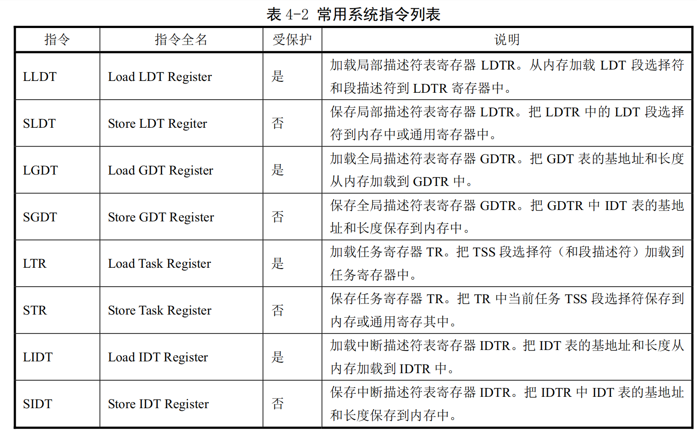

# 第四章 80X86保护模式及其编程

- 本书介绍的Linux 操作系统基于Intel公司 80X86 及相关外围硬件组成的 PC 机系统。有关 80X86 CPU 系统编程的最佳参考书籍当然是Intel公司发行的一套三卷的**《IA-32 Intel体系结构软件开发者手册》**，尤其是其中第3卷：《系统编程指南》是理解使用80X86CPU的操作系统工作原理或进行系统编程必不可少的参考资料。

- 本章主要内容包括：1．80X86基础知识；2．保护模式内存管理；3．各种保护措施；4．中断和异常处理；5．任务管理；6．保护模式编程的初始化；7．一个简单的多任务内核例子。

## 4.1 80X86 系统寄存器和系统指令（*4.1节看不懂！！*）

- **标志寄存器EFLAGS**中的系统标志和IOPL字段用于控制I/O访问、可屏蔽硬件中断、调试、任务切换以及虚拟-8086 模式，见下图所示。通常只允许操作系统代码有权修改这些标志。EFLAGS 中的其他标志是一些通用标志（进位 CF、奇偶 PF、辅助进位 AF、零标志 ZF、负号 SF、方向 DF、溢出 OF）。**这里我们仅对EFLAGS 中的系统标志进行说明**。

- TF  **位 8 是跟踪标志（Trap Flag）**。

当设置该位时可为调试操作启动单步执行方式；复位时则禁止单步执行。在单步执行方式下，处理器会在每个指令执行之后产生一个调试异常，这样我们就可以观察执行程序在执行每条指令后的状态。如果程序使用 POPF、POPFD 或IRET指令设置了 TF 标志，那么在随后指令之后处理器就会产生一个调试异常。

- IOPL  **位 13-12 是I/O 特权级（I/O Privilege Level）字段。**

该字段指明当前运行程序或任务的I/O 特权级 IOPL。当前运行程序或任务的CPL必须小于等于这个IOPL才能访问I/O地址空间。只有当CPL 为特权级0时，程序才可以使用 POPF 或IRET 指令修改这个字段。IOPL也是控制对IF标志修改的机制之一。

- NT    **位 14是嵌套任务标志（Nested Task）**。

它控制着被中断任务和调用任务之间的链接关系。在使用 CALL 指令、中断或异常执行任务调用时，处理器会设置该标志。在通过使用IRET指令从一个任务返回时，处理器会检查并修改这个NT标志。使用POPF/POPFD指令也可以修嘎这个标志，但是在应用程序中改变这个标志的状态会产生不可意料的异常。

- RF    **位 16 是恢复标志（Resume Flag）**。

该标志用于控制处理器对断点指令的响应。当设置时，这个标志会临时禁止断点指令产生的调试异常；当该标志复位时，则断点指令将会产生异常。RF 标志的主要功能是允许在调试异常之后重新执行一条指令。当调试软件使用IRETD指令返回被中断程序之前，需要设置堆栈上EFLAGS内容中的RF标志，以防止指令断点造成另一个异常。处理器会在指令返回之后自动地清除该标志，从而再次允许指令断点异常。

- VM    **位17是虚拟-8086方式（Virtual-8086Mode）标志。**

当设置该标志时，就开启虚拟-8086方式；当复位该标志时，则回到保护模式。

### 4.1.2 内存管理寄存器

- 处理器提供了4个内存管理寄存器（GDTR、LDTR、IDTR和 TR），用于指定分段内存管理所使用的系统表的基地址，如下图所示。处理器为这些寄存器的加载和保存提供了特定的指令。有关系统表的作用请参见下一节“保护模式内存管理”中的详细说明。

- GDTR、LDTR、IDTR 和TR都是段基址寄存器，这些段中含有分段机制的重要信息表。GDTR、IDTR 和LDTR 用于寻址存放描述符表的段。**TR 用于寻址一个特殊的任务状态段 TSS（Task State Segment）**。TSS
段中包含着当前执行任务的重要信息。 

1. **全局描述符表寄存器GDTR**

- GDTR 寄存器中用于存放全局描述符表GDT的 32 位线性基地址和16位表长度值。基地址指定GDT 表中字节0在线性地址空间中的地址，表长度指明GDT表的字节长度值。指令LGDT和 SGDT分别用于加载和保存GDTR寄存器的内容。在机器刚加电或处理器复位后，基地址被默认地设置为0，而长度值被设置成 0xFFFF。在保护模式初始化过程中必须给GDTR加载一个新值。 

2. **中断描述符表寄存器IDTR**

- 与 GDTR的作用类似,IDTR寄存器用于存放中断描述符表IDT的 32 位线性基地址和 16位表长度值。指令LIDT和SIDT分别用于加载和保存IDTR寄存器的内容。在机器刚加电或处理器复位后，基地址被默认地设置为0，而长度值被设置成0xFFFF。 

3. **局部描述符表寄存器LDTR**

- LDTR寄存器中用于存放局部描述符表LDT的32位线性基地址、16位段限长和描述符属性值。指令 LLDT 和 SLDT 分别用于加载和保存LDTR 寄存器的段描述符部分。包含LDT表的段必须在 GDT表中有一个段描述符项。当使用LLDT指令把含有LDT 表段的选择符加载进LDTR 时，LDT 段描述符的段基地址、段限长度以及描述符属性会被自动地加载到LDTR 中。当进行任务切换时，处理器会把新任务LDT 的段选择符和段描述符自动地加载进LDTR中。在机器加电或处理器复位后，段选择符和基地址被默认地设置为0，而段长度被设置成 0xFFFF。

4. **任务寄存器 TR**

- TR寄存器用于存放当前任务TSS段的 16 位段选择符、32位基地址、16位段长度和描述符属性值。它引用GDT表中的一个TSS类型的描述符。指令LTR和 STR分别用于加载和保存TR寄存器的段选择符部分。当使用LTR指令把选择符加载进任务寄存器时，TSS描述符中的段基地址、段限长度以及描述符属性会被自动地加载到任务寄存器中。当执行任务切换时，处理器会把新任务TSS的段选择符和段描述符自动地加载进任务寄存器TR中。 

### 4.1.3 控制寄存器

- **控制寄存器（CRO、CR1、CR2 和CR3）**用于控制和确定处理器的操作模式以及当前执行任务的特性，见图 4-3所示。CR0 中含有控制处理器操作模式和状态的系统控制标志；CR1保留不用；CR2含有导致页错误的线性地址。CR3中含有页目录表物理内存基地址,因此该寄存器也被称为页目录基地址寄存器PDBR(Page-Directory Base address Register)。

1. **CR0 中协处理器控制位**

- CR0 的4个比特位：扩展类型位ET、任务切换位 TS、仿真位EM 和数学存在位MP用于控制80X86 浮点（数学）协处理器的操作。有关协处理器的详细说明请参见第11章内容。CR0的ET位（标志）用于选择与协处理器进行通信所使用的协议，即指明系统中使用的是80387还是80287协处理器。TS、MP 和 EM位用于确定浮点指令或WAIT指令是否应该产生一个**设备不存在DNA（Device Not Available）**异常。这个异常可用来仅为使用浮点运算的任务保存和恢复浮点寄存器。对于没有使用浮点运算的任务，这样做可以加快它们之间的切换操作。

- ET    **CR0 的位 4是扩展类型（Extension Type）标志。**

当该标志为1时，表示指明系统有 80387协处理器存在，并使用 32 位协处理器协议。ET=0 指明使用 80287 协处理器。如果仿真位EM=1，则该位将被忽略。在处理器复位操作时，ET位会被初始化指明系统中使用的协处理器类型。如果系统中有 80387，则ET 被设置成1，否则若有一个 80287 或者没有协处理器，则ET被设置成0。 

- TS    **CR0 的位3是任务已切换（TaskSwitched）标志。**

该标志用于推迟保存任务切换时的协处理器内容，直到新任务开始实际执行协处理器指令。处理器在每次任务切换时都会设置该标志，并且在执行协处理器指令时测试该标志。

如果设置了TS标志并且CR0的EM标志为0，那么在执行任何协处理器指令之前会产生一个设备不存在 DNA（Device Not Available）异常。如果设置了TS标志但没有设置CR0的MP和EM标志，那么在执行协处理器指令WAIT/FWAIT之前不会产生设备不存在异常。如果设置了EM标志，那么 TS 标志对协处理器指令的执行无影响。见表 4-1所示。

在任务切换时，处理器并不自动保存协处理器的上下文，而是会设置 TS标志。这个标志会使得处理器在执行新任务指令流的任何时候遇到一条协处理器指令时产生设备不存在异常。设备不存在异常的处理程序可使用 CLTS 指令清除 TS 标志，并且保存协处理器的上下文。如果任务从没有使用过协处理器，那么相应协处理器上下文就不用保存。

- EM    **CR0的位2是仿真（EMulation）标志**。当该位设置时，表示处理器没有内部或外部协处理器，执行协处理器指令时会引起设备不存在异常；当清除时，表示系统有协处理器。设置这个标志可以迫使所有浮点指令使用软件来模拟。

- MP    **CR0的位1是监控协处理器（Monitor Coprocessor 或Math Present）标志**。

用于控制WAIT/FWAIT 指令与 TS 标志的交互作用。如果 MIP=1、TS=1，那么执行 WAIT 指令将产生一个设备不存在异常；如果 MP=0，则 TS 标志不会影响 WAIT 的执行。

---

2. **CRO 中保护控制位**

- PE    **CR0 的位0是启用保护（Protection Enable）标志**。

**当设置该位时即开启了保护模式；当复位时即进入实地址模式**。这个标志仅开启段级保护，而并没有启用分页机制。若要启用分页机制，那么 PE 和 PG 标志都要置位。

- PG    CR0的位31是分页（Paging）标志。当设置该位时即开启了分页机制；当复位时则禁止分页机制, 此时所有线性地址等同于物理地址。在开启这个标志之前必须已经或者同时开启PE 标志。即若要启用分页机制，那么 PE和PG标志都要置位。

- WP    对于Intel 80486 或以上的CPU，**CR0的位 16 是写保护（Write Proctect）标志**。当设置该标志时，处理器会禁止超级用户程序（例如特权级0的程序）向用户级只读页面执行写操作；当该位复位时则反之。该标志有利于 UNIX类操作系统在创建进程时实现写时复制（Copy on Write）技术。

-NE     **对于Intel80486 或以上的CPU，CR0 的位5是协处理器错误（Numeric Error）标志**。当设置该标志时，就启用了X87协处理器错误的内部报告机制；若复位该标志，那么就使用PC机形式的 X87协处理器错误报告机制。当NE为复位状态并且CPU的IGNNE 输入引脚有信号时，那么数学协处理器X87错误将被忽略。当NE 为复位状态并且CPU 的IGNNE 输入引脚无信号时，那么非屏蔽的数学协处理器X87错误将导致处理器通过FERR引脚在外部产生一个中断，并且在执行下一个等待形式浮点指令或WAIT/FWAIT 指令之前立刻停止指令执行。CPU的 FERR引脚用于仿真外部协处理器 80387 的ERROR 引脚，因此通常连接到中断控制器输入请求引脚上。NE 标志、IGNNE 引脚和 FERR引脚用于利用外部逻辑来实现 PC 机形式的外部错误报告机制。

- 启用保护模式PE（Protected Enable）位（位0）和开启分页PG（Paging）位（位31）分别用于控制分段和分页机制。PE用于控制分段机制。如果PE=1，处理器就工作在开启分段机制环境下，即运行在保护模式下。如果 PE=0，则处理器关闭了分段机制，并如同 8086工作于实地址模式下。PG 用于控制分页机制。如果 PG=1，则开启了分页机制。如果 PG=-0，分页机制被禁止，此时线性地址被直接作为物理地址使用。

- 如果 PE=0、PG=0，处理器工作在实地址模式下；如果 PG=0、PE=1，处理器工作在没有开启分页机制的保护模式下；如果 PG=1、PE=0，此时由于不在保护模式下不能启用分页机制，因此处理器会产生一个一般保护异常，即这种标志组合无效；如果 PG=1、PE=1，则处理器工作在开启了分页机制的保护模式下。

- 当改变PE和PG位时，我们必须小心。只有当执行程序起码有部分代码和数据在线性地址空间和物
理地址空间中具有相同地址时，我们才能改变PG位的设置。此时这部分具有相同地址的代码在分页和未分页世界之间起着桥梁的作用。无论是否开启分页机制，这部分代码都具有相同的地址。另外，在开启分页（PG=1）之前必须先刷新CPU中的页高速缓冲（或称为转换查找缓冲区TLB－Translation Lookaside Buffers）。

- 在修改该了PE位之后程序必须立刻使用一条跳转指令，以刷新处理器执行管道中已经获取的不同模
式下的任何指令。在设置PE位之前，程序必须初始化几个系统段和控制寄存器。在系统刚上电时，处理器被复位成PE=0、PG=0（即实模式状态），以允许引导代码在启用分段和分页机制之前能够初始化这些寄存器和数据结构。

---

3. **CR2 和 CR3**

- **CR2 和 CR3用于分页机制**。CR3含有存放页目录表页面的物理地址，因此 CR3 也被称为 PDBR。因为页目录表页面是页对齐的，所以该寄存器只有高 20位是有效的。而低12位保留供更高级处理器使用，因此在往 CR3 中加载一个新值时低 12 位必须设置为 0。

- 使用MOV指令加载CR3时具有让页高速缓冲无效的副作用。为了减少地址转换所要求的总线周期数
量，最近访问的页目录和页表会被存放在处理器的页高速缓冲器件中，该缓冲器件被称为转换查找缓冲区 TLB（Translation Lookaside Buffer）。只有当 TLB 中不包含要求的页表项时才会使用额外的总线周期从内存中读取页表项。

- 即使CR0中的 PG位处于复位状态（PG=0），我们也能先加载 CR3。以允许对分页机制进行初始化。当切换任务时，CR3的内容也会随之改变。但是如果新任务的CR3值与原任务的一样，处理器就无需刷新页高速缓冲。这样共享页表的任务可以执行得更快。

- CR2用于出现页异常时报告出错信息。在报告页异常时，处理器会把引起异常的线性地址存放在CR2 中。因此操作系统中的页异常处理程序可以通过检查CR2的内容来确定线性地址空间中哪一个页面引发了异常。

### 4.1.4 系统指令

系统指令用于处理系统级功能，例如加载系统寄存器、管理中断等。大多数系统指令只能由处于特权级0的操作系统软件执行，其余一些指令可以在任何特权级上执行，因此应用程序也能使用。表4-2 中列出了我们将用到的一些系统指令。其中还指出了它们是否受到保护。

## 4.2 保护模式内存地址

### 4.2.1 内存寻址

- 内存是指一组有序字节组成的数组，每个字节有唯一的内存地址。内存寻址则是指对存储在内存中的某个指定数据对象的地址进行定位。这里，数据对象是指存储在内存中的一个指定数据类型的数值或字符串。80X86支持多种数据类型：1字节、2字节（1个字）或4字节（双字或长字）的无符号整型数或带符号整型数，以及多字节字符串等。通常字节中某一比特位的定位或寻址可以基于字节来寻址，因此最小数据类型的寻址是对1字节数据（数值或字符）的定位。通常内存地址从0开始编址，对于80X86CPU来说，其地址总线宽度为32 位，因此一共有 2^32个不同物理地址。即内存物理地址空间有 4G，总共可以寻址4G字节的物理内存。对于多字节数据类型（例如2字节整数数据类型），在内存中这些字节相邻存放。 80X86首先存放低值字节，随后地址处存放高值字节。因此 80X86CPU是一种先存小值（Little Endium） 的处理器。

- **对于 80X86 CPU，一条指令主要由操作码（Opcode）和操作对象即操作数（Oprand）构成**。操作数可以位于一个寄存器中，也可以在内存中。若要定位内存中的操作数，就要进行内存寻址。80X86有许多指令的操作数涉及内存寻址，并且针对所寻址对象数据类型的不同，也有很多不同的寻址方案可供选择。

- 为了进行内存寻址，**80X86使用了一种称为段（Segment）的寻址技术**。这种寻址技术把内存空间分成一个或多个称为段的线性区域，从而对内存中一个数据对象的寻址就需要使用一个段的起始地址（即段地址）和一个段内偏移地址两部分构成。**段地址部分使用16位的段选择符指定，其中14位可以选择2~14次方即16384个段。段内偏移地址部分使用 32 位的值来指定，因此段内地址可以是0到4G。即一个段的最大长度可达 4G。程序中由16位的段和32位的偏移构成的48位地址或长指针称为一个逻辑地址（虚拟地址）**。它唯一确定了一个数据对象的段地址和段内偏移地址。而仅由32位偏移地址或指针指定的地址是基于当前段的对象地址。

- **80X86为段部分提供了6个存放段选择符的段寄存器：CS、DS、ES、SS、FS和GS**。其中**CS总是用于寻址代码段，而堆栈段则专门使用 SS段寄存器**。在任何指定时刻由CS寻址的段称为当前代码段。此时 EIP寄存器中包含了当前代码段内下一条要执行指令的段内偏移地址。因此要执行指令的地址可表示成 CS:[EIP]。后面将说明的段间控制转移指令可以被用来为CS 和EIP 赋予新值，从而可以把执行位置改变到其他的代码段中，这样就实现了在不同段中程序的控制传递。

- 由段寄存器 SS寻址的段称为当前堆栈段。栈顶由ESP寄存器内容指定。因此堆栈顶处地址是SS:[ESP]。另外4个段寄存器是通用段寄存器。当指令中没有指定所操作数据的段时，那么 DS将是默认的数据段寄存器。

- 为了指定内存操作数的段内偏移地址，80X86指令规定了计算偏移量的很多方式，称为指令寻址方式。指令的偏移量由三部分相加组成：基地址寄存器、变址寄存器和一个偏移常量。即:

> 偏移地址 = 基地址 +（变址 x 比例因子）＋ 偏移量

### 4.2.2 地址变换

- 任何完整的内存管理系统都包含两个关键部分：保护和地址变换。提供保护措施是可以防止一个任务访问另一个任务或操作系统的内存区域。地址变换能够让操作系统在给任务分配内存时具有灵活性，并且因为我们可以让某些物理地址不被任何逻辑地址所映射，所以在地址变换过程中同时也提供了内存保护功能。

- 正如上面提到的，计算机中的物理内存是字节的线性数组，每个字节具有一个唯一的物理地址；程序中的地址是由两部分构成的逻辑地制。这种逻辑地址并不能直接用于访问物理内存，而需要使用地址变换机制将它变换或映射到物理内存地址上。内存管理机制即用于将这种逻辑地址转换成物理内存地址。

- 为了减少确定地址变换所需要的信息，变换或映射通常以内存块作为操作单位。分段机制和分页机制是两种广泛使用的地址变换技术。它们的不同之处在于逻辑地址是如何组织成被映射的内存块、变换信息如何指定以及编程人员如何进行操作。分段和分页操作都使用驻留在内存中的表来指定它们各自的变换信息。这些表只能由操作系统访问，以防止应用程序擅自修改。

- 80X86在从逻辑地址到物理地址变换过程中使用了分段和分页两种机制，见图4-4所示。第一阶段使用分段机制把程序的逻辑地址变换成处理器可寻址内存空间（称为线性地址空间）中的地址。第二阶段使用分页机制把线性地址转换为物理地址。在地址变换过程中，第一阶段的分段变换机制总是使用的，而第二阶段的分页机制则是供选用的。如果没有启用分页机制，那么分段机制产生的线性地址空间就直接映射到处理器的物理地址空间上。物理地址空间定义为处理器在其地址总线上能够产生的地址范围。

1. **分段机制**

- 分段提供了隔绝各个代码、数据和堆栈区域的机制，因此多个程序（或任务）可以运行在同一个处理器上而不会互相干扰。分页机制为传统需求页、虚拟内存系统提供了实现机制。其中虚拟内存系统用于实现程序代码按要求被映射到物理内存中。分页机制当然也能用于提供多任务之间的隔离措施。

- 如图4-5所示，分段提供了一种机制，用于把处理器可寻址的线性地址空间划分成一些较小的称为段的受保护地址空间区域。段可以用来存放程序的代码、数据和堆栈，或者用来存放系统数据结构（例如TSS 或LDT）。如果处理器中有多个程序或任务在运行，那么每个程序可分配各自的一套段。此时处理器就可以加强这些段之间的界限，并且确保一个程序不会通过访问另一个程序的段而干扰程序的执行。分段机制还允许对段进行分类。这样，对特定类型段的操作能够受到限制。

- 一个系统中所有使用的段都包含在处理器线性地址空间中。为了定位指定段中的一个字节，程序必须提供一个逻辑地址。逻辑地址包括一个段选择符和一个偏移量。段选择符是一个段的唯一标识。另外，段选择符提供了段描述符表（例如全局描述符表GDT）中一个数据结构（称为段描述符）的偏移量。每个段都有一个段描述符。段描述符指明段的大小、访问权限和段的特权级、段类型以及段的第1个字节在线性地址空间中的位置（称为段的基地址）。逻辑地址的偏移量部分加到段的基地址上就可以定位段中某个字节的位置。因此基地址加上偏移量就形成了处理器线性地址空间中的地址。

- 线性地址空间与物理地址空间具有相同的结构。相对于两维的逻辑地址空间来说，它们两者都是一维地址空间。虚拟地址（逻辑地址）空间可包含最多16K的段，而每个段最长可达4GB，使得虚拟地址空间容量达到64TB（2^46）。线性地址空间和物理地址空间都是 4GB（2^32）。实际上，如果禁用分页机制，那么线性地址空间就是物理地址空间。

2. **分页机制**

- 因为多任务系统通常定义的线性地址空间都要比其含有的物理内存容量大得多，所以需要使用某种“虚拟化”线性地址空间的方法，即使用虚拟存储技术。虚拟存储是一种内存管理技术，使用这种技术可让编程人员产生内存空间要比计算机中实际物理内存容量大很多的错觉。利用这种错觉，我们可以随意编制大型程序而无需考虑实际物理内存究竟有多少。

- 分页机制支持虚拟存储技术。在使用虚拟存储的环境中，大容量的线性地址空间需要使用小块的物理内存（RAM或ROM）以及某些外部存储空间（例如大容量硬盘）来模拟。当使用分页时，每个段被划分成页面（通常每页为4KB大小），页面会被存储于物理内存中或硬盘上。操作系统通过维护一个页目录和一些页表来留意这些页面。当程序（或任务）试图访问线性地址空间中的一个地址位置时，处理器就会使用页目录和页表把线性地址转换成一个物理地址，然后在该内存位置上执行所要求的操作（读或写）。

- 如果当前被访问的页面不在物理内存中，处理器就会中断程序的执行（通过产生一个页错误异常）。然后操作系统就可以从硬盘上把该页面读入物理内存中，并继续执行刚才被中断的程序。当操作系统严格实现了分页机制时，那么对于正确执行的程序来说页面在物理内存和硬盘之间的交换就是透明的。

- 80X86分页机制最适合支持虚拟存储技术。分页机制会使用大小固定的内存块，而分段管理则使用了大小可变的块来管理内存。无论在物理内存中还是在硬盘上，分页使用固定大小的块更为适合管理物理内存。另一方面，分段机制使用大小可变的块更适合处理复杂系统的逻辑分区。可以定义与逻辑块大小适合的内存单元而无需受到固定大小页面的限制。每个段都可以作为一个单元来处理，从而简化了段的保护和共享操作。

- 分段和分页是两种不同的地址变换机制，它们都对整个地址变换操作提供独立的处理阶段。尽管两种机制都使用存储在内存中的变换表，但所用的表结构不同。实际上，段表存储在线性地址空间，而页表则保存在物理地址空间。因而段变换表可由分页机制重新定位而无需段机制的信息或合作。段变换机制把虚拟地址（逻辑地址）变换成线性地址，并且在线性地址空间中访问自己的表，但是并不知晓分页机制把这些线性地址转换到物理地址的过程。类似地，分页机制也不知道程序产生地址的虚拟地址空间。分页机制只是简单地把线性地址转换成物理地址，并且在物理内存中访问自己的转换表。

### 4.2.3 保护

- 80X86支持两类保护。其一是通过给每个任务不同的虚拟地址（逻辑地址）空间来完全隔离各个任务。这是通过给每个任务逻辑地址到物理地址不同的变换映射来做到。另一个保护机制对任务进行操作，以保护操作系统内存段和处理器特殊系统寄存器不被应用程序访问。 

1. **任务之间的保护**

- 保护的一个重要方面是提供应用程序各任务之间的保护能力。80X86使用的方法是通过把每个任务放置在不同的虚拟地址空间中，并给予每个任务不同的逻辑地址到物理地址的变换映射。每个任务中的地址变换功能被定义成一个任务中的逻辑地址映射到物理内存的一部分区域，而另一个任务中的逻辑地址映射到物理内存中的不同区域中。这样，因为一个任务不可能生成能够映射到其他任务逻辑地址对应使用的物理内存部分，所以所有任务都被隔绝开了。只需给每个任务各自独立的映射表，每个任务就会有不同的地址变换函数。在 80X86中，每个任务都有自己的段表和页表。当处理器切换去执行一个新任务时，任务切换的关键部分就是切换到新任务的变换表。

- 通过在所有任务中安排具有相同的虚拟到物理地址映射部分，并且把操作系统存储在这个公共的虚拟地址空间部分，操作系统可以被所有任务共享。这个所有任务都具有的相同虚拟地址空间部分被称为全局地址空间（Global address space）。这也正是现代Linux 操作系统使用虚拟地址空间的方式。

- 每个任务唯一的虚拟地址空间部分被称为局部地址空间（Local address space）。局部地址空间含有需要与系统中其他任务区别开的私有的代码和数据。由于每个任务中具有不同的局部地址空间，因此两个不同任务中对相同虚拟地址处的引用将转换到不同的物理地址处。这使得操作系统可以给与每个任务的内存相同的虚拟地址，但仍然能隔绝每个任务。另一方面，所有任务在全局地址空间中对相同虚拟地址的引用将被转换到同一个物理地址处。这给公共代码和数据（例如操作系统）的共享提供了支持。

2. **特权级保护**

- 在一个任务中，定义了4个执行特权级（Privilege Levels），用于依据段中含有数据的敏感度以及任务中不同程序部分的受信程度，来限制对任务中各段的访问。最敏感的数据被赋予了最高特权级，它们只能被任务中最受信任的部分访问。不太敏感的数据被赋予较低的特权级，它们可以被任务中较低特权级的代码访问。

- 特权级用数字0到3表示，0具有最高特权级，而3则是最低特权级。每个内存段都与一个特权级相关联。这个特权级限制具有足够特权级的程序来访问一个段。我们知道，处理器从CS寄存器指定的段中取得和执行指令，**当前特权级（Current Privilege Level），即CPL** 就是当前活动代码段的特权级，并且它定义了当前所执行程序的特权级别。CPL确定了哪些段能够被程序访问。

- 每当程序企图访问一个段时，当前特权级就会与段的特权级进行比较，以确定是否有访问许可。在给定CPL 级别上执行的程序允许访问同级别或低级别的数据段。任何对高级别段的引用都是非法的，并且会引发一个异常来通知操作系统。

- 每个特权级都有自己的程序栈，以避免使用共享栈带来的保护问题。当程序从一个特权级切换到另一个特权级上执行时，堆栈段也随之改换到新级别的堆栈中。

2024.12.25-     于昆明