# 第五章 Linux内核体系结构

- 本章首先概要介绍了Linux内核的编制模式和体系结构，然后详细描述了Linux内核源代码目录中组织形式以及子目录中各个代码文件的主要功能以及基本调用的层次关系。接下来就直接切入正题，从内核源文件Linux/目录下的第一个文件Makefile开始，对每一行代码进行详细注释说明。

- 本章内容可以看作是对内核源代码的总结概述，也可以作为阅读后续章节的参考信息。对于较难理解的地方可以先跳过，待阅读到后面相关内容时再返回来参考本章内容。**在阅读本章之前请先复习或学习有关80X86保护模式运行方式工作原理。**

- 一个完整可用的操作系统主要由4部分组成：**硬件、操作系统内核、操作系统服务和用户应用程序**, 见图5-1所示。

1. 用户应用程序是指那些字处理程序、Internet浏览器程序或用户自行编制的各种应用程序; 

2. 操作系统服务程序是指那些向用户提供的服务被看作是操作系统部分功能的程序。在Linux操作系统上, 这些程序包括X窗口系统、shell命令解释系统以及那些内核编程接口等系统程序；

3. **操作系统内核程序即是本书所感兴趣的部分，*它主要用于对硬件资源的抽象和访问调度***。

- **Linux 内核的主要用途就是为了与计算机硬件进行交互，实现对硬件部件的编程控制和接口操作, 调度对硬件资源的访问，并为计算机上的用户程序提供一个高级的执行环境和对硬件的虚拟接口。**

## 5.1 Linux内核模式

- 目前，操作系统内核的结构模式主要可分为**整体式的单内核模式和层次式的微内核模式**。而本书所注释的**Linux0.11内核，则是采用了单内核模式**。单内核模式的主要优点是内核代码结构紧凑、执行速度快，不足之处主要是层次结构性不强。

- 在单内核模式的系统中，操作系统所提供服务的流程为：应用主程序使用指定的参数值执行系统调用指令(int x80)，使CPU从用户态（User Mode）切换到核心态（Kernel Model），然后操作系统根据具体的参数值调用特定的系统调用服务程序，而这些服务程序则根据需要再调用底层的一些支持函数以完成特定的功能。在完成了应用程序所要求的服务后，操作系统又使CPU从核心态切换回用户态，从而返回到应用程序中继续执行后面的指令。因此概要地讲，单内核模式的内核也可粗略地分为三个层次：调用服务的主程序层、执行系统调用的服务层和支持系统调用的底层函数。见图5-2所示。

## 5.2 Linux内核系统体系结构

Linux 内核主要由 5个模块构成，它们分别是：

- 进程调度模块  
- 内存管理模块  
- 文件系统模块  
- 进程间通信模块  
- 网络接口模块

- 进程调度模块用来负责控制进程对CPU资源的使用。所采取的调度策略是各进程能够公平合理地访问CPU，同时保证内核能及时地执行硬件操作。内存管理模块用于确保所有进程能够安全地共享机器主内存区，同时，内存管理模块还支持虚拟内存管理方式，使得Linux支持进程使用比实际内存空间更多的内存容量。并可以利用文件系统把暂时不用的内存数据块交换到外部存储设备上去，当需要时再交换回来。文件系统模块用于支持对外部设备的驱动和存储。虚拟文件系统模块通过向所有的外部存储设备提供一个通用的文件接口，隐藏了各种硬件设备的不同细节。从而提供并支持与其他操作系统兼容的多种文件系统格式。进程间通信模块子系统用于支持多种进程间的信息交换方式。网络接口模块提供对多种网络通信标准的访问并支持许多网络硬件。

- 这几个模块之间的依赖关系见图 5-3所示。其中的连线代表它们之间的依赖关系，虚线和虚框部分
表示Linux0.11中还未实现的部分（从Linux0.95版才开始逐步实现虚拟文件系统，而**网络接口的支持到0.96版才有**）。

- 由图可以看出，**所有的模块都与进程调度模块存在依赖关系。因为它们都需要依靠进程调度程序来挂起（暂停）或重新运行它们的进程**。

- 其他几个模块的依赖关系有些不太明显，但同样也很重要。进程调度子系统需要使用内存管理来调
整一特定进程所使用的物理内存空间。进程间通信子系统则需要依靠内存管理器来支持共享内存通信机制。这种通信机制允许两个进程访问内存的同一个区域以进行进程间信息的交换。虚拟文件系统也会使用网络接口来支持网络文件系统（NFS），同样也能使用内存管理子系统提供内存虚拟盘（ramdisk）设备。而内存管理子系统也会使用文件系统来支持内存数据块的交换操作。

----

- 若从单内核模式结构模型出发，我们还可以根据Linux0.11内核源代码的结构将内核主要模块绘制成图5-4 所示的框图结构。

- 其中内核级中的几个方框，除了硬件控制方框以外，其他粗线方框分别对应内核源代码的目录组织结构。

### 5.3 Linux内核对内存的管理和使用

### 5.3.1 物理内存

在Linux 0.11 内核中，为了有效地使用机器中的物理内存，在系统初始化阶段内存被划分成几个功能区域，见图5-5所示。

- 其中，**Linux 内核程序占据在物理内存的开始部分**，接下来是供硬盘或软盘等块设备使用的高速缓冲区部分（其中要扣除显示卡内存和ROM BIOS所占用的内存地址范围640K--1MB）。当一个进程需要读取块设备中的数据时，系统会首先把数据读到高速缓冲区中；当有数据需要写到块设备上去时，系统也是先将数据放到高速缓冲区中，然后由块设备驱动程序写到相应的设备上。内存的最后部分是供所有程序可以随时申请和使用的主内存区。内核程序在使用主内存区时，也同样首先要向内核内存管理模块提出申请，并在申请成功后方能使用。对于含有RAM虚拟盘的系统，主内存区头部还要划去一部分，供虚拟盘存放数据。

- 由于计算机系统中所含的实际物理内存容量有限,因此CPU中通常都提供了内存管理机制对系统中的内存进行有效的管理。在Intel 80386及以后的CPU中提供了两种内存管理（地址变换）系统：**内存分段系统（Segmentation System）和分页系统（Paging System）**。其中分页管理系统是可选择的，由系统程序员通过编程来确定是否采用。为了能有效地使用物理内存，Linux 系统同时采用了内存分段和分页管理机制。

### 5.3.2 内存地址空间概念

- Linux 0.11内核中，在进行地址映射操作时，我们需要首先分清3种地址以及它们之间的变换概念：

- **a．程序（进程）的虚拟和逻辑地址；b.CPU的线性地址；c．实际物理内存地址。**

- **虚拟地址（VirtualAddress）**是指由程序产生的由段选择符和段内偏移地址两个部分组成的地址。因为这两部分组成的地址并没有直接用来访问物理内存，而是需要通过分段地址变换机制处理或映射后才对应到物理内存地址上，因此这种地址被称为虚拟地址。**虚拟地址空间由GDT映射的全局地址空间和由LDT映射的局部地址空间组成**。选择符的索引部分由13个比特位表示，加上区分GDT和LDT的1 个比特位，因此Intel80X86CPU共可以索引16384个选择符。若每个段的长度都取最大值 4G，则最大虚拟地址空间范围是16384*4G=64T。

- **逻辑地址（Logical Address）**是指由程序产生的与段相关的偏移地址部分。在Intel保护模式下即是指程序执行代码段限长内的偏移地址（假定代码段、数据段完全一样）。应用程序员仅需与逻辑地址打交道，而分段和分页机制对他来说是完全透明的，仅由系统编程人员涉及。不过有些资料并不区分逻辑地址和虚拟地址的概念，而是将它们统称为逻辑地址。

- **线性地址（LinearAddress）**是虚拟地址到物理地址变换之间的中间层，是处理器可寻址的内存空间（称为线性地址空间）中的地址。**程序代码会产生逻辑地址，或者说是段中的偏移地址，加上相应段的基地址就生成了一个线性地址**。如果启用了分页机制，那么线性地址可以再经变换以产生一个物理地址。若没有启用分页机制，那么线性地址直接就是物理地址。Intel 80386 的线性地址空间容量为4G。

- **物理地址（Physical Address）**是指出现在 CPU外部地址总线上的寻址物理内存的地址信号，是地址变换的最终结果地址。如果启用了分页机制，那么线性地址会使用页目录和页表中的项变换成物理地址。如果没有启用分页机制，那么线性地址就直接成为物理地址了。

- 虚拟存储（或虚拟内存）（Virtual Memory）是指计算机呈现出要比实际拥有的内存大得多的内存量。因此它允许程序员编制并运行比实际系统拥有的内存大得多的程序。这使得许多大型项目也能够在具有有限内存资源的系统上实现。一个很恰当的比喻是：你不需要很长的轨道就可以让一列火车从上海开到北京。你只需要足够长的铁轨（比如说3公里）就可以完成这个任务。采取的方法是把后面的铁轨立刻铺到火车的前面，只要你的操作足够快并能满足要求，列车就能象在一条完整的轨道上运行。这也就是虚拟内存管理需要完成的任务。在Linux 0.11内核中，给每个程序（进程）都划分了总容量为64MB 的虚拟内存空间。因此程序的逻辑地址范围是0x0000000到0x4000000。（0x4000000 = 64MB）

如上所述，有时我们也把逻辑地址称为虚拟地址。因为逻辑地址与虚拟内存空间的概念类似，并且也是与实际物理内存容量无关。

### 5.3.3 内存分段机制

- 在内存分段系统中，一个程序的逻辑地址通过分段机制自动地映射（变换）到中间层的 4GB（2^32） 线性地址空间中。程序每次对内存的引用都是对内存段中内存的引用。当程序引用一个内存地址时，通过把相应的段基址加到程序员看得见的逻辑地址上就形成了一个对应的线性地址。此时若没有启用分页机制，则该线性地址就被送到CPU的外部地址总线上，用于直接寻址对应的物理内存。见图5-6所示。

- CPU进行地址变换（映射）的主要目的是为了解决虚拟内存空间到物理内存空间的映射问题。虚拟内存空间的含义是指一种利用二级或外部存储空间，使程序能不受实际物理内存量限制而使用内存的一种方法。通常虚拟内存空间要比实际物理内存量大得多。

- 那么虚拟存储管理是怎样实现的呢？原理与上述列车运行的比喻类似。首先，当一个程序需要使用一块不存在的内存时（也即在内存页表项中已标出相应内存页面不在内存中），CPU就需要一种方法来得知这个情况。这是通过80386的页错误异常中断来实现的。当一个进程引用一个不存在页面中的内存地址时，就会触发CPU产生页出错异常中断，并把引起中断的线性地址放到CR2 控制寄存器中。因此处理该中断的过程就可以知道发生页异常的确切地址，从而可以把进程要求的页面从二级存储空间（比如硬盘上）加载到物理内存中。如果此时物理内存已经被全部占用，那么可以借助二级存储空间的一部分作为交换缓冲区（Swapper）把内存中暂时不使用的页面交换到二级缓冲区中，然后把要求的页面调入内存中。这也就是内存管理的缺页加载机制，**在Linux 0.11内核中是在程序 mm/memory.c** 中实现。

- Intel CPU使用段（Segment）的概念来对程序进行寻址。每个段定义了内存中的某个区域以及访问的优先级等信息。假定大家知晓实模式下内存寻址原理，现在我们根据CPU在实模式和保护模式下寻址方式的不同，用比较的方法来简单说明32位保护模式运行机制下内存寻址的主要特点。

- **在实模式下，寻址一个内存地址主要是使用段和偏移值**，段值被存放在段寄存器中（例如 ds），并且段的长度被固定为64KB。段内偏移地址存放在任意一个可用于寻址的寄存器中（例如 si）。因此，根据段寄存器和偏移寄存器中的值，就可以算出实际指向的内存地址，见图 5-7(a)所示。

- 而**在保护模式运行方式下，段寄存器中存放的不再是被寻址段的基地址，而是一个段描述符表（Segment Descriptor Table）中某一描述符项在表中的索引值**。索引值指定的段描述符项中含有需要寻址的内存段的基地址、段的长度值和段的访问特权级别等信息。**寻址的内存位置是由该段描述符项中指定的段基地址值与一个段内偏移值组合而成**。段的长度可变，由描述符中的内容指定。可见，和实模式下的寻址相比，段寄存器值换成了段描述符表中相应段描述符的索引值以及段表选择位和特权级，称为**段选择符（Segment Selector）**，但偏移值还是使用了原实模式下的概念。这样，在保护模式下寻址一个内存地址就需要比实模式下多一道手续，也即需要使用段描述符表。**这是由于在保护模式下访问一个内存段需要的信息比较多，而一个16位的段寄存器放不下这么多内容**。示意图见图5-7(b)所示。注意，如果你不在一个段描述符中定义一个内存线性地址空间区域，那么该地址区域就完全不能被寻址，CPU将拒绝访问该地址区域。

- **每个描述符占用8个字节**，其中含有所描述段在线性地址空间中的**起始地址（基址）、段的长度、段的类型（例如代码段和数据段）、段的特权级别和其他一些信息**。一个段可以定义的最大长度是4GB。

- 保存描述符项的描述符表有3种类型，每种用于不同目的。**全局描述符表 GDT（Global Descriptor Table）**是主要的基本描述符表,该表可被所有程序用于引用访问一个内存段。**中断描述符表 IDT（Interrupt Descriptor Table）**保存有定义中断或异常处理过程的段描述符。**IDT 表直接替代了8086 系统中的中断向量表**。为了能在 80X86 保护模式下正常运行，我们必须为CPU定义一个GDT表和一个IDT表。最后一种类型的表是**局部描述符表LDT（Local Descriptor Table）**。***该表应用于多任务系统中，通常每个任务使用一个LDT表***。作为对GDT表的扩充，每个LDT表为对应任务提供了更多的可用描述符项，因而也为每个任务提供了可寻址内存空间的范围。这些表可以保存在线性地址空间的任何地方。

- **为了让CPU能定位 GDT表、IDT表和当前的LDT表，需要为CPU分别设置GDTR、IDTR和LDTR三个特殊寄存器**。这些寄存器中将存储对应表的 32位线性基地址和表的限长字节值。表限长值是表的长度值-1。

- 当CPU要寻址一个段时,就会使用16位的段寄存器中的选择符来定位一个段描述符。在 80X86CPU
中，段寄存器中的值右移3位即是描述符表中一个描述符的索引值。13位的索引值最多可定位8192（0--8191）个的描述符项。选择符中位2（TI）用来指定使用哪个表。若该位是0则选择符指定的是GDT 表中的描述符，否则是LDT表中的描述符。

- 每个程序都可有若干个内存段组成。程序的逻辑地址（或称为虚拟地址）即是用于寻址这些段和段中具体地址位置。在Linux 0.11中，程序逻辑地址到线性地址的变换过程使用了CPU的全局段描述符表 GDT和局部段描述符表LDT。由GDT映射的地址空间称为全局地址空间，由LDT映射的地址空间则称为局部地址空间，而这两者构成了虚拟地址的空间。具体的使用方式见图5-8所示。

（注：GDT跟LDT二者有点类似二级页表的关系，GDT类似页表目录，同时也有页表的成分，因为可以用来索引内核任务段）

- 图中画出了具有两个任务时的情况。可以看出，每个任务的局部描述符表LDT本身也是由GDT中描述符定义的一个内存段，在该段中存放着对应任务的代码段和数据段描述符，因此**LDT段很短，其段限长通常只要大于24字节即可**。同样，每个任务的任务状态段TSS也是由GDT中描述符定义的一个内存段，其段限长也只要满足能够存放一个TSS数据结构就够了。

- 对于中断描述符表idt，它保存在内核代码段中。由于在Linux 0.11内核中，内核和各任务的代码段
和数据段都分别被映射到线性地址空间中相同基址处，且段限长也一样，因此内核的代码段和数据段是重叠的，各任务的代码段和数据段分别也是重叠的，参见图5-10 或图5-11所示。**任务状态段TSS（Task State Segment）用于在任务切换时 CPU自动保存或恢复相关任务的当前执行上下文（CPU当前状态）**。例如对于切换出的任务，CPU 就把其寄存器等信息保存在该任务的 TSS 段中，同时CPU使用新切换进任务的 TSS 段中的信息来设置各寄存器，以恢复该任务的执行环境，参见图4-37所示。在Linux 0.11 中,每个任务的TSS 段内容被保存在该任务的任务数据结构中。另外,Linux0.11内核中没有使用到GDT 表中第 4个描述符（图中 syscall描述符项）。从include/linux/sched.h文件中第150行上的原英文注释（如下所示）可以猜想到，Linus 当时设计内核时曾经想把系统调用的代码放在这个专门独立的段中。

> /*  
> * Entry into gdt where to find first TSS. O-nul, 1-cs, 2-ds, 3-syscall  
> * 4-TSS0,5-LDTO,6-TSS1 etc ...   
> */   

### 5.3.4 内存分页管理

- 使用分页机制最普遍的场合是当系统内存实际上被分成很多凌乱的块时,它可以建立一个大而连续的内存空间映像，好让程序不用操心和管理这些分散的内存块。分页机制增强了分段机制的性能。

- 内存分页管理机制的基本原理是将CPU整个线性内存区域划分成 4096字节为1页的内存页面。程
序申请使用内存时，系统就以内存页为单位进行分配。内存分页机制的实现方式与分段机制很相似，但并不如分段机制那么完善。因为分页机制是在分段机制之上实现的，所以其结果是对系统内存具有非常灵活的控制权，并且在分段机制的内存保护上更增加了分页保护机制。为了在80X86保护模式下使用分页机制，需要把控制寄存器CR0的最高比特位（位31）置位。

- 在使用这种内存分页管理方法时，每个执行中的进程（任务）可以使用比实际内存容量大得多的连
续地址空间。为了在使用分页机制的条件下把线性地址映射到容量相对很小的物理内存空间上，80386 使用了**页目录表和页表**。**页目录表项与页表项格式基本相同，都占用4个字节**，并且每个页目录表或页表必须只能包含1024个页表项。因此一个页目录表或一个页表分别共占用1页内存（1024*4B，即4KB）。**页目录项和页表项的小区别在于页表项有个已写位D（Dirty），而页目录项则没有**。

- 线性地址到物理地址的变换过程见图5-9所示。**图中控制寄存器CR3保存着是当前页目录表在物理内存中的基地址**（因此 CR3也被称为页目录基地址寄存器PDBR）。32位的线性地址被分成三个部分，分别用来在页目录表和页表中定位对应的页目录项和页表项以及在对应的物理内存页面中指定页面内的偏移位置。因为1个页表可有1024项，因此**一个页表最多可以映射1024＊4KB=4MB内存**；又因为一个页目录表最多有1024项，对应1024个二级页表，因此**一个页目录表最多可以映射1024＊4MB=4GB 容量的内存**。即**一个页目录表就可以映射整个线性地址空间范围**。

- 由于**Linux0.1x系统中内核和所有任务都共用同一个页目录表**，使得任何时刻处理器线性地址空间到物理地址空间的映射函数都一样。因此**为了让内核和所有任务都不互相重叠和干扰，它们都必须从虚拟地址空间映射到线性地址空间的不同位置，即占用不同的线性地址空间范围**。

- 对于Intel 80386系统，其CPU可以提供多达4G的线性地址空间。一个任务的虚拟地址需要首先通
过其局部段描述符变换为CPU整个线性地址空间中的地址，然后再使用页目录表PDT（一级页表）和页表PT（二级页表）映射到实际物理地址页上。为了使用实际物理内存，每个进程的线性地址通过二级内存页表动态地映射到主内存区域的不同物理内存页上。由于**Linux 0.11 中把每个进程最大可用虚拟内存空间定义为 64MB**，**因此每个进程的逻辑地址通过加上(任务号)*64MB，即可转换为线性空间中的地址**。不过在注释中，在不至于搞混的情况下我们有时将进程中的此类地址简单地称为逻辑地址或线性地址。

- 对于Linux 0.11 系统，**内核设置全局描述符表GDT 中的段描述符项数最大为 256**，其中 2 项空闲、2 项系统使用，每个进程使用两项。**因此，此时系统可以最多容纳(256-4)/2=126个任务**，并且虚拟地址范围是（(256-4)/2）*64MB 约等于 8G。但 0.11 内核中人工定义最大任务数NR_TASKS=64个，每个任务逻辑地址范围是64M，并且**各个任务在线性地址空间中的起始位置是（任务号）*64MB** 。

- 因此全部任务所使用的线性地址空间范围是64MB*64 =4G，见图5-10所示。图中示出了当系统具有4个任务时的情况。

- 内核代码段和数据段被映射到线性地址空间的开始16MB部分，并且代码和数据段都映射到同一个区域，完全互相重叠。**而第1个任务（任务0）是由内核“人工”启动运行的**，其代码和数据包含在内核代码和数据中，因此该任务所占用的线性地址空间范围比较特殊。**任务0的代码段和数据段的长度是从线性地址0开始的640KB范围**，其代码和数据段也完全重叠，并且与内核代码段和数据段有重叠的部分。实际上，**Linux0.11中所有任务的指令空间I（Instruction）和数据空间D（Data）都合用一块内存，即一个进程的所有代码、数据和堆栈部分都处于同一内存段中**，也即是I&D不分离的一种使用方式。

- **任务1的线性地址空间范围也只有从64MB开始的640KB长度**。它们之间的详细对应关系见后面说明。任务2和任务3分别被映射线性地址128MB 和192MB 开始的地方，并且它们的逻辑地址范围均是 64MB。由于 4G地址空间范围正好是CPU的线性地址空间范围和可寻址的最大物理地址空间范围，而且在把任务0和任务1的逻辑地址范围看作64MB时，系统中同时可有任务的逻辑地址范围总和也是 4GB，因此在0.11内核中比较容易混淆三种地址概念。

- 如果也按照线性空间中任务的排列顺序排列虚拟空间中的任务，那么我们可以有图5-11所示的系统同时可拥有所有任务在虚拟地址空间中的示意图，所占用虚拟空间范围也是4GB。其中没有考虑内核代码和数据在虚拟空间中所占用的范围。另外，在图中对于进程2和进程3还分别给出了各自逻辑空间中代码段和数据段（包括数据和堆栈内容）的位置示意图。

- 请还需注意，进程逻辑地址空间中代码段（Code Section）和数据段（Data Section）的概念与CPU分段机制中的代码段和数据段不是同一个概念。CPU分段机制中段的概念确定了在线性地址空间中一个段的用途以及被执行或访问的约束和限制，每个段可以设置在4GB线性地址空间中的任何地方，它们可以相互独立也可以完全重叠或部分重叠。而进程在其逻辑地址空间中的代码段和数据段则是指由编译器在编译程序和操作系统在加载程序时规定的在进程逻辑空间中顺序排列的代码区域、初始化和未初始化的数据区域以及堆栈区域。进程逻辑地址空间中代码段和数据段等结构形式见图所示。有关逻辑地址空间的说明请参见内存管理一章内容。

### 5.3.5 CPU多任务和保护方式

- Intel 80X86CPU共分4个保护级，0级具有最高优先级，而 3 级优先级最低。Linux0.11操作系统使用了CPU的0和3两个保护级。内核代码本身会由系统中的所有任务共享。而每个任务则都有自己的代码和数据区，这两个区域保存于局部地址空间，因此系统中的其他任务是看不见的（不能访问的）。而内核代码和数据是由所有任务共享的,因此它保存在全局地址空间中。图5-13给出了这种结构的示意图。图中同心圆代表CPU的保护级别（保护层），这里仅使用了CPU的0级和3级。而径向射线则用来区分系统中的各个任务。每条径向射线指出了各任务的边界。除了每个任务虚拟地址空间的全局地址区域, 任务1中的地址与任务2中相同地址处是无关的。

- **当一个任务（进程）执行系统调用而陷入内核代码中执行时，我们就称进程处于内核运行态（或简称为内核态）**。此时处理器处于特权级最高的（0级）内核代码中执行。当进程处于内核态时，执行的内核代码会使用当前进程的内核栈。**每个进程都有自己的内核栈**。当进程在执行用户自己的代码时，则称其处于用户运行态（用户态）。即此时处理器在特权级最低的（3级）用户代码中运行。当正在执行用户程序而突然被中断程序中断时，此时用户程序也可以象征性地称为处于进程的内核态。因为**中断处理程序将使用当前进程的内核栈**。这与处于内核态的进程的状态有些类似。进程的内核态和用户态将在后面有关进程运行状态一节中作更详细的说明。

### 5.3.6 虚拟地址、线性地址和物理地址之间的关系

前面我们根据内存分段和分页机制详细说明了CPU的内存管理方式。现在我们以Linux0.11系统为
例，详细说明内核代码和数据以及各任务的代码和数据在虚拟地址空间、线性地址空间和物理地址空间
中的对应关系。由于任务0和任务1的生成或创建过程比较特殊，我们将对它们分别进行描述。

#### 内核代码和数据的地址

对于Linux 0.11 内核代码和数据来说，在head.s程序的初始化操作中已经把内核代码段和数据段都
设置成为长度为16MB的段。在线性地址空间中这两个段的范围重叠，都是从线性地址0开始到地址 OxFFFFFF共16MB 地址范围。**在该范围中含有内核所有的代码、内核段表（GDT、IDT、TSS）、页目录表和内核的二级页表、内核局部数据以及内核临时堆栈（将被用作第1个任务即任务0的用户堆栈）**。其页目录表和二级页表已设置成把0--16MB的线性地址空间一一对应到物理地址上，占用了4个目录项，即4个二级页表。因此对于内核代码或数据的地址来说，我们可以直接把它们看作是物理内存中的地址。此时内核的虚拟地址空间、线性地址空间和物理地址空间三者之间的关系可用图5-14来表示。

- 因此，默认情况下Linux 0.11 内核最多可管理 16MB 的物理内存，共有 4096（4K）个物理页面（页帧）,每个页面4KB。通过上述分析可以看出：

1. **内核代码段和数据段区域在线性地址空间和物理地址空间中是一样的。这样设置可以大大简化内核的初始化操作**。

2. **GDT和IDT在内核数据段中，因此它们的线性地址也同样等于它们的物理地址**。在实模式下的 setup.s 程序初始化操作中，我们曾经设置过临时的 GDT 和IDT，这是进入保护模式之前必须设置的。由于这两个表当时处于物理内存大约0x90200 处，而进入保护模式后内核系统模块处于物理内存0开始位置，并且0x90200 处的空间将被挪作他用（用于高速缓冲），因此在进入保护模式后，在运行的第1个程序head.s 中我们需要重新设置这两个表。即设置GDTR 和IDTR指向新的GDT和IDT，描述符也需要重新加载。但由于开启分页机制时这两个表的位置没有变动，因此无须再重新建立或移动表位置。

3. 除任务0以外，所有其他任务所需要的物理内存页面与线性地址中的不同或部分不同，因此内核需要动态地在主内存区中为它们作映射操作，动态地建立页目录项和页表项。虽然任务1的代码和数据也在内核中，但由于他需要另行分配获得内存，因此也需要自己的映射表项。

- 虽然Linux 0.11默认可管理16MB 物理内存，但是系统中并不是一定要有这些物理内存。**机器中只要有 4MB（甚至 2MB）物理内存就完全可以运行Linux0.11 系统了**。若机器只有 4MB 物理内存，那么此时内核 4MB--16MB 地址范围就会映射到不存在的物理内存地址上。但这并不妨碍系统的运行。因为在初始化时内核内存管理程序会知道机器中所含物理内存量的确切大小，因而不会让CPU分页机制把线性地址页面映射到不存在的 4MB--16MB中去。内核中这样的默认设置主要是为了便于系统物理内存的扩展，实际并不会用到不存在的物理内存区域。如果系统有多于 16MB 的物理内存，由于在 init/main.c 程序中初始化时限制了对16MB 以上内存的使用，并且这里内核也仅映射了0--16MB 的内存范围，因此在 16MB之上的物理内存将不会用到。

- 通过在这里为内核增加一些页表，并且对init/main.c 程序稍作修改，我们可以对此限制进行扩展。例如在系统中有32MB 物理内存的情况下，我们就需要为内核代码和数据段建立 8个二级页表项来把 32MB 的线性地址范围映射到物理内存上。

#### 任务0的地址对应关系

- **任务0是系统中一个人工启动的第一个任务**。它的代码段和数据段长度被设置为640KB。该任务的代码和数据直接包含在内核代码和数据中，是从线性地址0开始的640KB内容，因此可以它直接使用内核代码已经设置好的页目录和页表进行分页地址变换。同样，它的代码和数据段在线性地址空间中也是重叠的。对应的任务状态段TSS0 也是手工预设置好的，并且位于任务0数据结构信息中，参见 sched.h 第 113 行开始的数据。TSS0 段位于内核 sched.c 程序的代码中，长度为104 字节，具体位置可参见图5-23 中“任务0结构信息”一项所示。三个地址空间中的映射对应关系见图5-15所示。

- **由于任务0直接被包含在内核代码中，因此不需要为其再另外分配内存页**。它运行时所需要的内核态堆栈和用户态堆栈空间也都在内核代码区中，并且由于在内核初始化时（head.s）这些内核页面在页表项中的属性都已经被设置成了0b111，即对应页面用户可读写并且存在，因此用户堆栈 user_stack[]空间虽然在内核空间中，但任务0仍然能对其进行读写操作。

#### 任务1的地址对应关系

- 与任务0类似，任务1也是一个特殊的任务。**它的代码也在内核代码区域中**。与任务0不同的是在线性地址空间中，系统在使用 fork()创建任务1（init进程）时为存放任务1的二级页表而在主内存区申请了一页内存来存放，并复制了父进程（任务0）的页目录和二级页表项。因此任务1有自己的页目录和页表表项，它把任务1占用的线性空间范围64MB--128MB（实际上是64MB--64MB+640KB）也同样映射到了物理地址0--640KB 处。此时任务1的长度也是 640KB，并且其代码段和数据段相重叠，只占用一个页目录项和一个二级页表。另外，系统还会为任务1在主内存区域中申请一页内存用来存放它的任务数据结构和用作任务1的内核堆栈空间。任务数据结构（也称进程控制块PCB）信息中包括任务1 的TSS 段结构信息。见图 5-16所示。

- 任务1的用户态堆栈空间将直接共享使用处于内核代码和数据区域（线性地址0--640KB）中任务0 的用户态堆栈空间 user stack[]（参见kernel/sched.c，第 67--72 行），因此这个堆栈需要在任务1实际使用之前保持“干净”，以确保被复制用于任务1的堆栈不含有无用数据。在刚开始创建任务1时，任务0 的用户态堆栈 user_stack[]与任务1共享使用，但当任务1开始运行时，由于任务1 映射到 user_stack[] 处的页表项被设置成只读，使得任务1在执行堆栈操作时将会引起写页面异常，从而由内核另行分配主内存区页面作为堆栈空间使用。

#### 其他任务的地址对应关系

- 对于被创建的从任务2开始的其他任务，它们的父进程都是init（任务1）进程。我们已经知道，**在Linux0.11 系统中共可以有 64个进程同时存在**。下面我们以任务2为例来说明其他任何任务对地址空间的使用情况。

- 从任务 2 开始，如果任务号以 nr 来表示，那么任务 nr 在线性地址空间中的起始位置将被设定在 nr\*64MB 处。例如任务 2 的开始位置=nr\*64MB=2\* 64MB=128MB。任务代码段和数据段的最大长度被设置为64MB，因此任务2占有的线性地址空间范围是128MB--192MB，共占用64MB/4MB=16个页目录项。虚拟空间中任务代码段和数据段都被映射到线性地址空间相同的范围，因此它们也完全重叠。图5-17显示出了任务2的代码段和数据段在三种地址空间中的对应关系。

- 在任务 2 被创建出来之后，将在其中运行 execve()函数来执行 shell 程序。当内核通过复制任务 1 刚创建任务2时，除了占用线性地址空间范围不同外（128MB--128MB+640KB），此时任务2 的代码和数据在三种地址空间中的关系与任务1的类似。当任务 2 的代码（init()）调用execve()系统调用开始加载并执行 shell程序时，该系统调用会释放掉从任务1复制的页目录和页表表项及相应内存页面，然后为新的执行程序 shell 重新设置相关页目录和页表表项。图 5-17 给出的是任务 2 中开始执行 shell 程序时的情况，即任务2原先复制任务1的代码和数据被 shell程序的代码段和数据段替换后的情况。图中显示出已经映射了一页物理内存页面的情况。这里请注意，在执行 execve()函数时，系统虽然在线性地址空间为任务2分配了64MB 的空间范围，但是内核并不会立刻为其分配和映射物理内存页面。**只有当任务2开始执行时由于发生缺页而引起异常时才会由内存管理程序为其在主内存区中分配并映射一页物理内存到其线性地址空间中。这种分配和映射物理内存页面的方法称为需求加载（Load on demand）**。参见内存管理一章中的相关描述。

- 从Linux 内核0.99 版以后，对内存空间的使用方式发生了变化。每个进程可以单独享用整个 4G的地址空间范围。如果我们能理解本节说描述的内存管理概念，那么对于现在所使用的Linux 2.x内核中所使用的内存管理原理也能立刻明白。

### 5.3.7 用户申请内存的动态分配

- 当用户应用程序使用C 函数库中的内存分配函数malloc()申请内存时，这些动态申请的内存容量或大小均由高层次的C 库函数 malloc()来进行管理，内核本身并不会插手管理。因为内核已经为每个进程（除了任务0和1，它们与内核代码一起常驻内存中）在CPU的 4G线性地址空间中分配了64MB的空间，所以只要进程执行时寻址的范围在它的64MB 范围内，内核也同样会通过内存缺页管理机制自动为寻址对应的页面分配物理内存页面并进行映射操作。

- 但是内核会为进程使用的代码和数据空间维护一个当前位置值brk，这个值保存在每个进程的数据结构中。它指出了进程代码和数据（包括动态分配的数据空间）在进程地址空间中的末端位置。当 malloc()函数为程序分配内存时，它会通过系统调用 brk()把程序要求新增的空间长度通知内核，内核代码从而可以根据 malloc()所提供的信息来更新 brk的值，但此时并不为新申请的空间映射物理内存页面。只有当程序寻址到某个不存在对应物理页面的地址时，内核才会进行相关物理内存页面的映射操作。

- 若进程代码寻址的某个数据所在的页面不存在，并且该页面所处位置属于进程堆范围，即不属于其执行文件映像文件对应的内存范围中，那么CPU就会产生一个缺页异常，并在异常处理程序中为指定的页面分配并映射一页物理内存页面。至于用户程序此次申请内存的字节长度数量和在对应物理页面中的具体位置，则均由C库中内存分配函数 malloc()负责管理。内核以页面为单位分配和映射物理内存，该函数则具体记录用户程序使用了一页内存的多少字节。剩余的容量将保留给程序再申请内存时使用。

- 当用户使用内存释放函数free()动态释放已申请的内存块时,C库中的内存管理函数就会把所释放的内存块标记为空闲，以备程序再次申请内存时使用。在这个过程中内核为该进程所分配的这个物理页面并不会被释放掉。只有当进程最终结束时内核才会全面收回已分配和映射到该进程地址空间范围的所有物理内存页面。
有关库函数 malloc()和 free()的具体代码实现请参见内核库中的 lib/malloc.c 程序。

## 5.4 Linux系统的中断机制

本节介绍中断机制基本原理和相关的可编程控制器硬件逻辑以及Linux系统中使用中断的方法。有关可编程控制器的具体编程方法请参见下一章 setup.s程序后的说明。

### 5.4.1 中断操作原理

- 微型计算机系统通常包括输入输出设备。处理器向这些设备提供服务的一种方法是使用轮询方式。在这种方法中处理器顺序地查询系统中的每个设备，“询问”它们是否需要服务。这种方法的优点是软件编程简单，但缺点是太耗处理器资源，影响系统性能。向设备提供服务的另一种方法是在设备需要服务时自己向处理器提出请求。处理器也只有在设备提出请求时才为其提供服务。

- **当设备向处理器提出服务请求时，处理器会在执行完当前的一条指令后立刻应答设备的请求，并转而执行该设备的相关服务程序。当服务程序执行完成后，处理器会接着去做刚才被中断的程序。这种处理方式就叫做中断（Interrupt）方法，而设备向处理器发出的服务请求则称为中断请求(IRQ－Interrupt Request)**。处理器响应请求而执行的设备相关程序则被称为中断服务程序或中断服务过程(ISR-Interrupt Service Routine)。

- 可编程中断控制器（PIC-Programmable Interrupt Controller）是微机系统中管理设备中断请求的管理者。它通过连接到设备的中断请求引脚接受设备发出的终端服务请求信号。当设备激活其中断请求IRQ 信号时，PIC立刻会检测到。在同时收到几个设备的中断服务请求的情况下，PIC会对它们进行优先级比较并选出最高优先级的中断请求进行处理。如果此时处理器正在执行一个设备的中断服务过程，那么 PIC 还需要把选出的中断请求与正在处理的中断请求的优先级进行比较，并基于该比较结果来确定是否向处理器发出一个中断信号。当PIC向处理器的INT引脚发出一个中断信号时，处理器会立刻停下当时所做的事情并询问PIC需要执行哪个中断服务请求。PIC则通过向数据总线发送出与中断请求对应的中断号来告知处理器要执行哪个中断服务过程。处理器则根据读取的中断号通过查询中断向量表（或32 位保护模式下的中断描述符表）取得相关设备的中断向量（即中断服务程序的地址）并开始执行中断服务程序。当中断服务程序执行结束，处理器就继续执行被中断信号打断的程序。

- 以上描述的是输入输出设备的中断服务处理过程。但是中断方法并非一定与硬件相关，它也可以用于软件中。通过使用int指令并使用其操作数指明中断号，就可以让处理器去执行相应的中断处理过程。 PC/AT系列微机共提供了对 256个中断的支持，其中大部分都用于软件中断或异常，异常是处理器在处理过程中检测到错误而产生的中断操作。只有下面提及的一些中断被用于设备上。

### 5.4.2 80X86 微机的中断子系统

- 在使用80X86组成的微机机系统中采用了8259A可编程中断控制器芯片。每个8259A芯片可以管理8个中断源。通过多片级联方式，8259A 能构成最多管理64个中断向量的系统。在PC/AT系列兼容机中，使用了两片8259A芯片，共可管理15级中断向量。其级连示意图见图5-18所示。其中从芯片的 INT引脚连接到主芯片的IR2引脚上，即8259A从芯片发出的中断信号将作为8259A主芯片的IRQ2输入信号。主 8259A芯片的端口基地址是0x20，从芯片是0xA0。IRQ9 引脚的作用与 PC/XT的IRQ2相同, 即PC/AT 机利用硬件电路把使用IRQ2 的设备的IRQ2引I脚重新定向到了PIC 的 IRQ9引脚上，并利用 BIOS中的软件把IRQ9的中断int 71重新定向到了IRQ2 的中断 intOx0A的中断处理过程。这样一来可使得任何使用 IRQ2 的 PC/XT的8 位设配卡在 PC/AT 机下面仍然能正常使用。做到了 PC机系列的向下兼容性。

- 在总线控制器控制下，8259A芯片可以处于编程状态和操作状态。编程状态是CPU使用 IN 或OUT 指令对8259A芯片进行初始化编程的状态。一旦完成了初始化编程，芯片即进入操作状态，此时芯片即可随时响应外部设备提出的中断请求（IRQ0－IRQ15)，同时系统还可以使用操作命令字随时修改其中断处理方式。通过中断判优选择，芯片将选中当前最高优先级的中断请求作为中断服务对象，并通过CPU 引脚INT通知CPU外中断请求的到来，CPU响应后，芯片从数据总线D7-DO将编程设定的当前服务对象的中断号送出，CPU由此获取对应的中断向量值，并执行中断服务程序。

### 5.4.3 中断向量表

- 上节已指出CPU是根据中断号获取中断向量值，即对应中断服务程序的入口地址值。因此为了让CPU由中断号查找到对应得中断向量，就需要在内存中建立一张查询表，即中断向量表（在 32 位保护模式下该表称为中断描述符表，见下面说明)。80X86微机支持256个中断，对应每个中断需要安排一个中断服务程序。在80X86实模式运行方式下，每个中断向量由4个字节组成。这4个字节指明了一个中断服务程序的段值和段内偏移值。因此整个向量表的长度为1024字节。当80X86微机启动时,ROMBIOS 中的程序会在物理内存开始地址0x0000:0x0000 处初始化并设置中断向量表，而各中断的默认中断服务程序则在BIOS中给出。由于中断向量表中的向量是按中断号顺序排列，因此给定一个中断号N，那么它对应的中断向量在内存中的位置就是0x0000:N*4，即对应的中断服务程序入口地址保存在物理内存 0x0000:N*4位置处。

- 在BIOS执行初始化操作时，它设置了两个8259A芯片支持的16个硬件中断向量和BIOS提供的中断号为0x10一0x1f的中断调用功能向量等。对于实际没有使用的向量则填入临时的哑中断服务程序的地址。以后在系统引导加载操作系统时会根据实际需要修改某些中断向量的值。例如，对于DOS操作系统, 它会重新设置中断0x20一0x2f 的中断向量值。而对于 Linux 系统，除了在刚开始加载内核时需要用到 BIOS 提供的显示和磁盘读操作中断功能，在内核正常运行之前则会在 setup.s 程序中重新初始化 8259A芯片并且在 head.s 程序中重新设置一张中断向量表（中断描述符表)。完全抛弃了BIOS 所提供的中断服务功能。

- 当 Intel CPU运行在 32 位保护模式下时，需要使用中断描述符表 IDT（Interrupt Descriptor Table）来管理中断或异常。IDT是Intel8086--80186CPU中使用的中断向量表的直接替代物。其作用也类似于中断向量表，只是其中每个中断描述符项中除了含有中断服务程序地址以外，还包含有关特权级和描述符类别等信息。Linux 操作系统工作于 80X86的保护模式下，因此它使用中断描述符表来设置和保存各中断的“向量”信息。

### 5.4.4 Linux内核的中断处理

- 对于 Linux 内核来说，中断信号通常分为两类：硬件中断和软件中断(异常)。每个中断是由 0-255 之间的一个数字来标识。对于中断 int0--int31(Ox00--0xlf)，每个中断的功能由 Intel 公司固定设定或保留用，属于软件中断，但 Intel公司称之为异常。因为这些中断是在 CPU 执行指令时探测到异常情况而引起的。通常还可分为故障(Fault)和陷阱(traps)两类。中断 int32--int255 (0x20--0xff)可以由用户自己设定。所有中断的分类以及执行后CPU的动作方式见表5-1所示。

- 在 Linux 系统中，则将 int32--int47（0x20--0x2f）对应于 8259A中断控制芯片发出的硬件中断请求信号IRQ0--IRQ15（见表5-2 所示）,并把程序编程发出的系统调用（system call)中断设置为int128(0x80）。系统调用中断是用户程序使用操作系统资源的唯一界面接口。

- 在系统初始化时，内核在head.s程序中首先使用一个哑中断向量（中断描述符）对中断描述符表（Interrupt Descriptor Table-IDT）中所有 256个描述符进行了默认设置（boot/head.s，78）。这个哑中断向量指向一个默认的“无中断”处理过程（boot/head.s，150)。当发生了一个中断而又没有重新设置过该中断向量时就会显示信息“未知中断（Unknown interrupt)”。这里对所有 256 项都进行设置可以有效防止出现一般保护性错误（A germeal protection fault）(异常 13)。否则的话，如果设置的 IDT 少于 256 项, 那么在一个要求的中断所指定的描述符项大于设置的最大描述符项时，CPU就会产生一个一般保护出错（异常13)。另外，如果硬件出现问题而没有把设备的向量放到数据总线上，此时CPU通常会从数据总线上读入全 1(0xff)作为向量，因此会去读取IDT表中的第 256项，因此也会造成一般保护出错。对于系统中需要使用的一些中断，内核会在其继续初始化的处理过程中（init/main.c）重新设置这些中断的中断描述符项，让它们指向对应的实际处理过程。通常，异常中断处理过程（intO --int 31）都在 traps.c 的初始化函数中进行了重新设置（kernl/traps.c，181)，而系统调用中断 int128 则在调度程序初始化函数中进行了重新设置（kernel/sched.c，385）。

- 另外，在设置中断描述符表IDT时Linux 内核使用了中断门和陷阱门两种描述符。它们之间的区别在于对标志寄存器EFLAGS中的中断允许标志IF的影响。由中断门描述符执行的中断会复位IF标志，因此可以避免其它中断干扰当前中断的处理，随后的中断结束指令iret会从堆栈上恢复IF标志的原值；而通过陷阱门执行的中断则不会影响 IF 标志。参见第 11 章中对 include/asm/system.h 文件的说明。

### 5.4.5 标志寄存器的中断标志

- 为了避免竞争条件和中断对临界代码区的干扰，在Linux 0.11 内核代码中许多地方使用了cli 和 sti 指令。cli指令用来复位CPU标志寄存器中的中断标志，使得系统在执行cli指令后不会响应外部中断。 sti指令用来设置标志寄存器中的中断标志，以允许CPU能识别并响应外部设备发出的中断。当进入可能引起竞争条件的代码区时，内核中就会使用cli指令来关闭对外部中断的响应，而在执行完竞争代码区时内核就会执行 sti指令以重新允许CPU响应外部中断。例如，在修改文件超级块的锁定标志和任务进入/退出等待队列操作时都需要首先使用cli指令关闭 CPU对外部中断的响应,在操作完成之后再使用 sti 指令开启对外部中断的响应。如果不使用cli、sti指令对，即在需要修改一个文件超级块时不使用cli来关闭对外部中断的响应，那么在修改之前判断出该超级块锁定标志没有置位而想设置这个标志时，若此时正好发生系统时钟中断而切换到其他任务去运行，并且碰巧其他任务也需要修改这个超级块，那么此时这个其他任务会先设置超级块的锁定标志并且对超级块进行修改操作。当系统又切换回原来的任务时，此时该任务不会再去判断锁定标志就会继续执行设置超级块的锁定标志，从而造成两个任务对临界代码区的同时多重操作，引起超级块数据的不一致性，严重时会导致内核系统崩溃。

## 5.5 Linux的系统调用

### 5.5.1 系统调用接口

- 系统调用（通常称为 syscalls）是Linux 内核与上层应用程序进行交互通信的唯一接口，参见图 5-4 所示。从对中断机制的说明可知，用户程序通过直接或间接（通过库函数）调用中断intOx80，并在eax 寄存器中指定系统调用功能号，即可使用内核资源，包括系统硬件资源。不过通常应用程序都是使用具有标准接口定义的C函数库中的函数间接地使用内核的系统调用，见图5-19所示。

- 通常系统调用使用函数形式进行调用，因此可带有一个或多个参数。对于系统调用执行的结果，它会在返回值中表示出来。通常负值表示错误，而0则表示成功。在出错的情况下，错误的类型码被存放在全局变量 errno 中。通过调用库函数 perrorO，我们可以打印出该错误码对应的出错字符串信息。

- 在Linux内核中，每个系统调用都具有唯一的一个系统调用功能号。这些功能号定义在文件 include/unistd.h中第60行开始处。例如，write 系统调用的功能号是4，定义为符号__NR_write。这些系统调用功能号实际上对应于 include/linux/sys.h 中定义的系统调用处理程序指针数组表 sys_call_table[]中项的索引值。因此writeO系统调用的处理程序指针就位于该数组的项4处。

- 另外，我们从 sys_call_table[]中可以看出，内核中所有系统调用处理函数的名称基本上都是以符号'sys_开始的。例如系统调用 read()在内核源代码中的实现函数就是 sys_read()。

### 5.5.2 系统调用处理过程

- 当应用程序经过库函数向内核发出一个中断调用int0x80时，就开始执行一个系统调用。其中寄存器eax中存放着系统调用号，而携带的参数可依次存放在寄存器ebx、ecx和edx中。因此Linux0.11内核中用户程序能够向内核最多直接传递三个参数，当然也可以不带参数。处理系统调用中断int0x80的过程是程序kernel/system_call.s 中的 system_call。
为了方便执行系统调用，内核源代码在include/unistd.h文件（133一183行）中定义了宏函数_syscallnO，其中 n代表携带的参数个数，可以分别0至3。因此最多可以直接传递3个参数。若需要传递大块数据给内核，则可以传递这块数据的指针值。例如对于readO系统调用，其定义是：  

`int read(int fd, char *buf, int n);`

- 因此我们可以在用户程序中直接使用上面的_syscall3O来执行一个系统调用readO，而不用通过C函数库作中介。实际上C函数库中函数最终调用系统调用的形式和这里给出的完全一样。

- 对于include/unistd.h中给出的每个系统调用宏，都有2+2*n个参数。其中第1个参数对应系统调用
返回值的类型；第2个参数是系统调用的名称；随后是系统调用所携带参数的类型和名称。这个宏会被扩展成包含内嵌汇编语句的C函数，见如下所示。

- 可以看出，这个宏经过展开就是一个读操作系统调用的具体实现。其中使用了嵌入汇编语句以功能号__NR_read(3)执行了Linux 的系统中断调用 0x80。该中断调用在 eax(__res)寄存器中返回了实际读取的字节数。若返回的值小于0，则表示此次读操作出错，于是将出错号取反后存入全局变量ermmno中，并向调用程序返回-1值。

- 当进入内核中的系统调用处理程序 kernel/system_call.s 后,system_call 的代码会首先检查 eax 中的系统调用功能号是否在有效系统调用号范围内，然后根据 sys_call_table[]函数指针表调用执行相应的系统调用处理程序。  

`call _sys_call _table(,%eax, 4) // kernel/system_call.s 第 94 行。`  

- 这句汇编语句操作数的含义是间接调用地址在_sys_call_table + %eax * 4 处的函数。由于 sys_call_table[] 指针每项4个字节，因此这里需要给系统调用功能号乘上4。然后用所得到的值从表中获取被调用处理函数的地址。

### 5.5.3 Linux系统调用的参数传递方式

- 关于Linux用户进程向系统中断调用过程传递参数方面，Linux系统使用了通用寄存器传递方法，例如寄存器 ebx、ecx和édx。这种使用寄存器传递参数方法的一个明显优点就是：当进入系统中断服务程序而保存寄存器值时，这些传递参数的寄存器也被自动地放在了内核态堆栈上，因此用不着再专门对传递参数的寄存器进行特殊处理。这种方法是Linus 当时所知的最简单最快速的参数传递方法。另外还有一种使用Intel CPU提供的系统调用门（SystemCall gate）的参数传递方法，它在进程用户态堆栈和内核态堆栈自动复制传递的参数。但这种方法使用起来步骤比较复杂。

## 5.6 系统时间和定时

### 5.6.1 系统时间

- 为了让操作系统能自动地准确提供当前时间和日期信息，PC/AT微机系统中提供了用电池供电的实时钟RT（RealTime）电路支持。通常这部分电路与保存系统信息的少量CMOS RAM集成在一个芯片上,因此这部分电路被称为RT/CMOS RAM电路。PC/AT微机或其兼容机中使用了Motorola公司的 MC146818芯片。

- 在初始化时，Linux 0.11 内核通过 init/main.c 程序中的 time_init()函数读取这块芯片中保存的当前时间和日期信息，并通过kernel/mktime.c 程序中的kernel_mktime()函数转换成从1970年1月1日午夜0 时开始计起到当前的以秒为单位的时间，我们称之为UNIX日历时间。该时间确定了系统开始运行的日历时间，被保存在全局变量startup_time 中供内核所有代码使用。用户程序可以使用系统调用 time()来读取 startup_time 的值，而超级用户则可以通过系统调用 stime()来修改这个系统时间值。

- 另外，再通过下面介绍的从系统启动开始计数的系统滴答值 jiffies，程序就可以唯一地确定运行时刻的当前时间值。由于每个滴答定时值是10毫秒，因此内核代码中定义了一个宏来方便代码对当前时间的访问。这个宏定义在 include/linux/sched.h 文件第 142 行上，其形式如下:

`#define CURRENT_TIME (startup_time + jiffies/HZ)`  

- 其中HZ=100,是内核系统时钟频率。当前时间宏 CURRENT_TIME 被定义为系统开机时间 startup_time 加上开机后系统运行的时间jifies/100。在修改一个文件被访问时间或其i节点被修改时间时均使用了这个宏。

### 5.6.2 系统定时

- 在Linux0.11内核的初始化过程中，PC机的可编程定时芯片Intel8253（8254）的计数器通道0被设置成运行在方式3下（方波发生器方式），并且初始计数值LATCH被设置成每隔10毫秒在通道0输出端OUT发出一个方波上升沿。由于8254芯片的时钟输入频率为1.193180MHz，因此初始计数值 LATCH=1193180/100，约为11931。由于OUT引脚被连接到可编程中断控制芯片的0级上，因此系统每隔10毫秒就会发出一个时钟中断请求（IRQ0）信号。这个时间节拍就是操作系统运行的脉搏，我们称之为1个系统滴答或一个系统时钟周期。因此每经过1个滴答时间，系统就会调用一次时钟中断处理程序（timer_interrupt）。

- 时钟中断处理程序 timer_interrupt 主要用来通过 jiffies 变量来累计自系统启动以来经过的时钟滴答数。每当发生一次时钟中断jiffies值就增1。然后调用C语言函数do_timer()作进一步的处理。调用时所带的参数CPL是从被中断程序的段选择符（保存在堆栈中的CS段寄存器值）中取得当前代码特权级 CPL.

- do_timer()函数则根据特权级对当前进程运行时间作累计。如果CPL=0，则表示进程运行在内核态时被中断，因此内核就会把进程的内核态运行时间统计值stime增1，否则把进程用户态运行时间统计值增 1。如果软盘处理程序 floppy.c 在操作过程中添加过定时器，则对定时器链表进行处理。若某个定时器时间到（递减后等于0），则调用该定时器的处理函数。然后对当前进程运行时间进行处理，把当前进程运行时间片减1。时间片是一个进程在被切换掉之前所能持续运行的CPU时间，其单位是上面定义的嘀嗒数。如果进程时间片值递减后还大于0，表示其时间片还没有用完，于是就退出do_timer()继续运行当前进程。如果此时进程时间片已经递减为0，表示该进程已经用完了此次使用CPU的时间片，于是程序就会根据被中断程序的级别来确定进一步处理的方法。若被中断的当前进程是工作在用户态的（特权级别大于0），则dotimer()就会调用调度程序schedule()切换到其他进程去运行。如果被中断的当前进程工作在内核态，也即在内核程序中运行时被中断,则 do_timer()会立刻退出。因此这样的处理方式决定了Linux 系统的进程在内核态运行时不会被调度程序切换。即进程在内核态程序中运行时是不可抢占的（nonpreemptive），但当处于用户态程序中运行时则是可以被抢占的（preemptive）。

- 注意，上述定时器专门用于软盘马达开启和关闭定时操作。这种定时器类似现代Linux系统中的动态定时器（Dynamic Timer），仅供内核使用。这种定时器可以在需要时动态地创建，而在定时到期时动态地撤销。在Linux 0.11 内核中定时器同时最多可以有 64个。定时器的处理代码在 sched.c 程序 264--336 行。

## 5.7 Linux 进程控制

- 程序是一个可执行的文件，而进程（process）是一个执行中的程序实例。利用分时技术，在 Linux 操作系统上同时可以运行多个进程。分时技术的基本原理是把CPU的运行时间划分成一个个规定长度的时间片(time slice)，让每个进程在一个时间片内运行。当进程的时间片用完时系统就利用调度程序切换到另一个进程去运行。因此实际上对于具有单个CPU的机器来说某一时刻只能运行一个进程。但由于每个进程运行的时间片很短（例如15个系统滴答=150毫秒），所以表面看来好象所有进程在同时运行着。

- 对于Linux0.11内核来讲，系统最多可有64个进程同时存在。除了第一个进程用“手工”建立以外，其余的都是现有进程使用系统调用 fork 创建的新进程，被创建的进程称为子进程（child process），创建者，则称为父进程（parent process）。内核程序使用进程标识号（process ID，pid）来标识每个进程。进程由可执行的指令代码、数据和堆栈区组成。进程中的代码和数据部分分别对应一个执行文件中的代码段、数据段。每个进程只能执行自己的代码和访问自己的数据及堆栈区。进程之间的通信需要通过系统调用来进行。对于只有一个CPU的系统，在某一时刻只能有一个进程正在运行。内核通过调度程序分时调度各个进程运行。

- 我们已经知道，Linux系统中一个进程可以在内核态（kernelmode）或用户态（usermode）下执行，并且分别使用各自独立的内核态堆栈和用户态堆栈。用户堆栈用于进程在用户态下临时保存调用函数的参数、局部变量等数据；内核堆栈则含有内核程序执行函数调用时的信息。

- 另外在Linux内核中，进程通常被称作任务（task），而把运行在用户空间的程序称作进程。本书将在尽量遵守这个默认规则的同时混用这两个术语。

### 5.7.1 任务数据结构

- 内核程序通过进程表对进程进行管理，每个进程在进程表中占有一项。在Linux系统中，进程表项
是一个taskstruct任务结构指针。任务数据结构定义在头文件include/linux/sched.h中。有些书上称其为进程控制块PCB（Process Control Block）或进程描述符PD（Processor Descriptor）。其中保存着用于控制和管理进程的所有信息。主要包括进程当前运行的状态信息、信号、进程号、父进程号、运行时间累计值、正在使用的文件和本任务的局部描述符以及任务状态段信息。该结构每个字段的具体含义如下所示。

- **long state**字段含有进程的当前状态代号。如果进程正在等待使用 CPU 或者进程正被运行，那么 state 的值是TASK_RUNNING。如果进程正在等待某一事件的发生因而处于空闲状态，那么 state 的值就是TASKINTERRUPTIBLE或者TASKUNINTERRUPTIBLE。这两个值含义的区别在于处于 TASKINTERRUPTIBLE状态的进程能够被信号唤醒并激活，而处于TASKUNINTERRUPTIBLE状态的进程则通常是在直接或间接地等待硬件条件的满足因而不会接受任何信号。TASKSTOPPED状态用于说明一个进程正处于停止状态。例如进程在收到一个相关信号时（例如SIGSTOP、SIGTTIN或 SIGTTOU等）或者当进程被另一个进程使用ptrace系统调用监控并且控制权在监控进程中时。 TASK_ZOMBIE 状态用于描述一个进程已经被终止，但其任务数据结构项仍然存在于任务结构表中。一个进程在这些状态之间的转换过程见下节说明。

- **long counter** 字段保存着进程在被暂时停止本次运行之前还能执行的时间滴答数，即在正常情况下还需要经过几个系统时钟周期才切换到另一个进程。调度程序会使用进程的counter值来选择下一个要执行的进程，因此counter可以看作是一个进程的动态特性。在一个进程刚被创建时counter的初值等于 priority.

- **long priority**用于给counter 赋初值。在Linux 0.11 中这个初值为15个系统时钟周期时间（15个嘀嗒)。当需要时调度程序会使用 priority 的值为 counter 赋一个初值，参见 sched.c 程序和 fork.c 程序。当然，priority 的单位也是时间滴答数。

- **long signal** 字段是进程当前所收到信号的位图，共32 个比特位，每个比特位代表一种信号，信号值=位偏移值+1。因此Linux 内核最多有 32个信号。在每个系统调用处理过程的最后，系统会使用该信号位图对信号进行预处理。

- **struct sigaction sigaction[32]**结构数组用来保存处理各信号所使用的操作和属性。数组的每一项对应一个信号。

- **long blocked** 字段是进程当前不想处理的信号的阻塞位图。与 signal 字段类似，其每一比特位代表一种被阻塞的信号。

- **int exit**字段是用来保存程序终止时的退出码。在子进程结束后父进程可以查询它的这个退出码。 

- **unsigned long start_code** 字段是进程代码在 CPU 线性地址空间中的开始地址，在 Linux 0.1x 内核
中其值是64MB的整数倍。

- **unsigned long end_code** 字段保存着进程代码的字节长度值。

- **unsigned long end_data** 字段保存着进程的代码长度 +数据长度的总字节长度值。

- **unsigned long brk** 字段也是进程代码和数据的总字节长度值（指针值），但是还包括未初始化的的数据区 bss，参见图 10-6 所示。这是 brk 在一个进程开始执行时的初值。通过修改这个指针，内核可以为进程添加和释放动态分配的内存。这通常是通过调用 malloc()函数并通过 brk 系统调用由内核进行操作。

- **unsigned long start_stack** 字段值指向进程逻辑地址空间中堆栈的起始处。同样请参见图 10-6 中的堆栈指针位置。

- **long pid** 是进程标识号，即进程号。它被用来唯一地标识进程。

- **long father** 是创建本进程的父进程的进程号。 

- **long pgrp** 是指进程所属进程组号。

- **long session** 是进程的会话号，即所属会话的进程号。

- **long leader** 是会话首进程号。有关进程组和会话的概念请参见第 4 章程序列表后的说明。 

- **unsigned short uid** 是拥有该进程的用户标识号（用户 id）。

- **unsigned short euid** 是有效用户标识号，用于指明访问文件的权力。

- **unsigned short suid** 是保存的用户标识号。当执行文件的设置用户 ID 标志（set-user-ID）置位时, suid中保存着执行文件的uid。否则 suid等于进程的euid。

- **unsigned short gid** 是用户所属组标识号（组 id）。指明了拥有该进程的用户组。 

- **unsigned short egid** 是有效组标识号，用于指明该组用户访问文件的权限。

- **unsigned short sgid** 是保存的用户组标识号。当执行文件的设置组 ID 标志（set-group-ID）置位时， sgid 中保存着执行文件的 gid。否则 sgid 等于进程的 egid。有关这些用户号和组号的描述请参见第 5 章 sys.c 程序前的概述。

- **long alarm** 是进程的报警定时值（滴答数）。如果进程使用系统调用 alarm()设置过该字段值(alarm() 在kernel/sched.c 第 338行开始处。内核会把该函数以秒为单位的参数值转换成滴答值，加上系统当前时间滴答值之后保存在该字段中)，那么此后当系统时间滴答值超过了alarm 字段值时，内核就会向该进程发送一个SIGALRM信号。默认时该信号会终止程序的执行。当然我们也可以使用信号捕捉函数（signal() 或 sigaction()）来捕捉该信号进行指定的操作。

- **long utime** 是累计进程在用户态运行的时间（滴答数）。

- **long stime** 是累计进程在系统态（内核态）运行的时间（滴答数）。 

- **long cutime** 是累计进程的子进程在用户态运行的时间（滴答数）。

- **long cstime** 是累计进程的子进程内核态运行的时间（滴答数）。 

- **long start_time** 是进程生成并开始运行的时刻。

- **unsigned short used_math** 是一个标志，指明本进程是否使用了协处理器。 

- **int tty** 是进程使用 tty 终端的子设备号。-1 表示没有使用。

- **unsigned short umask** 是进程创建新文件时所使用的属性屏蔽位，即新建文件所设置的访问属性。 

- **struct m_inode* pwd** 是进程的当前工作目录i节点结构。每个进程都有一个当前工作目录，用于
解析相对路径名，并且可以使用系统调用chdir来改变之。

- **structm inode * root**是进程自己的根目录i节点结构。每个进程都可有自己指定的根目录，用于
解析绝对路径名。只有超级用户能通过系统调用chroot来修改这个根目录。

- **struct m_inode * executable** 是进程运行的执行文件在内存中i节点结构指针。系统可根据该字段
来判断系统中是否还有另一个进程在运行同一个执行文件。如果有的话那么这个内存中i节点引用计数值 executable->i_count 会大于1。在进程被创建时该字段被赋予和父进程同一字段相同的值，即表示正在与父进程运行同一个程序。当在进程中调用exec()类函数而去执行一个指定的执行文件时，该字段值就会被替换成 exec()函数所执行程序的内存i节点指针。当进程调用 exit()函数而执行退出处理时该字段所指内存i节点的引用计数会被减 1，并且该字段将被置空。该字段的主要作用体现在 memory.c 程序的 share_page()函数中。该函数代码根据进程的 executable 所指节点的引用计数可判断系统中当前运行的程序是否有多个拷贝存在（起码2个）。若是的话则在他们之间尝试页面共享操作。

在系统初始化时，在第1次调用执行 execve()函数之前，系统创建的所有任务的 executable 都是0。这些任务包括任务0、任务1以及任务1直接创建的没有执行过 execve()的所有任务，即代码直接包含在内核代码中的所有任务的executable 都是()。因为任务0的代码包含在内核代码中，它不是由系统从文件系统上加载运行的执行文件，因此内核代码中固定设置它的executable值为0。另外，创建新进程时， fork()会复制父进程的任务数据结构，因此任务1的executable也是0。但在执行了execve()之后，executable 就被赋予了被执行文件的内存i节点的指针。此后所有任务的该值就均不会为0了。

- **unsigned long close_on_exec** 是一个进程文件描述符（文件句柄）位图标志。每个比特位代表一个文件描述符，用于确定在调用系统调用execveO时需要关闭的文件描述符（参见include/fcntl.h）。当一个程序使用 fork()函数创建了一个子进程时，通常会在该子进程中调用execve()函数加载执行另一个新程序。此时子进程将完全被新程序替换掉，并在子进程中开始执行新程序。若一个文件描述符在 close_on_exec 中的对应比特位是置位状态，那么在子进程执行 execve()调用时对应打开着的文件描述符将被关闭，即在新程序中该文件描述符被关闭。否则该文件描述符将始终处于打开状态。

- **structfile*filp[NR_OPEN]**是进程使用的所有打开文件的文件结构指针表，最多 32 项。文件描述符的值即是该结构中的索引值。其中每一项用于文件描述符定位文件指针和访问文件。

- **struct desc_struct ldt[3]**是该进程局部描述符表结构。定义了该任务在虚拟地址空间中的代码段和
数据段。其中数组项0是空项，项1是代码段描述符，项2是数据段（包含数据和堆栈）描述符。

- **struct tss_struct tss** 是进程的任务状态段TSS（Task State Segment）信息结构。在任务从执行中被切换出时 tss struct 结构保存了当前处理器的所有寄存器值。当任务又被CPU 重新执行时，CPU 就会利用这些值恢复到任务被切换出时的状态，并开始执行。

当一个进程在执行时，CPU的所有寄存器中的值、进程的状态以及堆栈中的内容被称为该进程的上下文。当内核需要切换（switch）至另一个进程时，它就需要保存当前进程的所有状态，也即保存当前进程的上下文，以便在再次执行该进程时，能够恢复到切换时的状态执行下去。在Linux中，当前进程上下文均保存在进程的任务数据结构中。在发生中断时，内核就在被中断进程的上下文中，在内核态下执行中断服务例程。但同时会保留所有需要用到的资源，以便中断服务结束时能恢复被中断进程的执行。

### 5.7.2 进程运行状态

- 一个进程在其生存期内，可处于一组不同的状态下，称为进程状态。见图5-20 所示。进程状态保存在进程任务结构的 state 字段中。当进程正在等待系统中的资源而处于等待状态时，则称其处于睡眠等待状态。在Linux系统中，睡眠等待状态被分为可中断的和不可中断的等待状态。

- **运行状态（TASK_RUNNING）**

当进程正在被CPU执行，或已经准备就绪随时可由调度程序执行，则称该进程为处于运行状态（running）。若此时进程没有被 CPU执行，则称其处于就绪运行状态。见图 5-20中三个标号为 0 的状态。进程可以在内核态运行，也可以在用户态运行。当一个进程在内核代码中运行时，我们称其处于内核运行态，或简称为内核态；当一个进程正在执行用户自己的代码时，我们称其为处于用户运行态（用户态）。当系统资源已经可用时，进程就被唤醒而进入准备运行状态，该状态称为就绪态。这些状态（图中中间一列）在内核中表示方法相同，都被成为处于TASK_RUNNING状态。当一个新进程刚被创建出后就处于本状态中（最下一个0处）。

- **可中断睡眠状态（TASK_INTERRUPTIBLE）**

当进程处于可中断等待（睡眠）状态时，系统不会调度该进程执行。当系统产生一个中断或者释放了进程正在等待的资源，或者进程收到一个信号，都可以唤醒进程转换到就绪状态（可运行状态）。

- **不可中断睡眠状态（TASK_UNINTERRUPTIBLE）**

除了不会因为收到信号而被唤醒，该状态与可中断睡眠状态类似。但处于该状态的进程只有被使用 wake_up()函数明确唤醒时才能转换到可运行的就绪状态。该状态通常在进程需要不受干扰地等待或者所等待事件会很快发生时使用。

- **暂停状态（TASK_STOPPED）**

当进程收到信号SIGSTOP、SIGTSTP、SIGTTIN或SIGTTOU时就会进入暂停状态。可向其发送 SIGCONT信号让进程转换到可运行状态。进程在调试期间接收到任何信号均会进入该状态。在Linux 0.11中，还未实现对该状态的转换处理。处于该状态的进程将被作为进程终止来处理。

- **僵死状态（TASK_ZOMBIE）**

当进程已停止运行，但其父进程还没有调用wait()询问其状态时，则称该进程处于僵死状态。为了让父进程能够获取其停止运行的信息，此时子进程的任务数据结构信息还需要保留着。一旦父进程调用wait()取得了子进程的信息，则处于该状态进程的任务数据结构就会被释放掉。

- 当一个进程的运行时间片用完，系统就会使用调度程序强制切换到其他的进程去执行。另外，如果进程在内核态执行时需要等待系统的某个资源,此时该进程就会调用 sleep_on()或 interruptible_sleep_on()自愿地放弃CPU的使用权，而让调度程序去执行其他进程。进程则进入睡眠状态（TASK_UNINTERRUPTIBLE 或TASK_INTERRUPTIBLE）。

- 只有当进程从“内核运行态”转移到“睡眠状态”时，内核才会进行进程切换操作。在内核态下运行的进程不能被其他进程抢占，而且一个进程不能改变另一个进程的状态。为了避免进程切换时造成内核数据错误，内核在执行临界区代码时会禁止一切中断。

### 5.7.3 进程初始化

- 在boot/目录中，引导程序把内核从磁盘上加载到内存中，并让系统进入保护模式下运行后，就开始执行系统初始化程序init/main.c。该程序首先确定如何分配使用系统物理内存，然后调用内核各部分的初始化函数分别对内存管理、中断处理、块设备和字符设备、进程管理以及硬盘和软盘硬件进行初始化处理。在完成了这些操作之后，系统各部分已经处于可运行状态。此后程序把自己“手工”移动到任务 0（进程0）中运行，并使用fork()调用首次创建出进程1。在进程1中程序将继续进行应用环境的初始化并执行 shell 登录程序。而原进程 0 则会在系统空闲时被调度执行，此时任务 0 仅执行 pause()系统调用，其中又会去执行调度函数。

- “移动到任务0中执行”这个过程由宏 move_to_user_mode（include/asm/system.h）完成。它把 main.c程序执行流从内核态（特权级0）移动到了用户态（特权级3）的任务0中继续运行。在移动之前，系统在对调度程序的初始化过程（sched_init()）中，首先对任务0的运行环境进行了设置。这包括人工预先设置好任务0数据结构各字段的值（include/linux/sched.h）、在全局描述符表中添入任务0的任务状态段（TSS）描述符和局部描述符表（LDT）的段描述符，并把它们分别加载到任务寄存器tr和局部描述符表寄存器 ldtr 中。

- 这里需要强调的是，内核初始化是一个特殊过程，内核初始化代码也即是任务0的代码。从任务0数据结构中设置的初始数据可知，任务0的代码段和数据段的基址是0、段限长是640KB。而内核代码段和数据段的基址是0、段限长是16MB，因此任务0的代码段和数据段分别包含在内核代码段和数据段中。内核初始化程序main.c也即是任务0中的代码，只是在移动到任务0之前系统正以内核态特权级 0 运行着 main.c 程序。宏 move_to_user_mode 的功能就是把运行特权级从内核态的0 级变换到用户态的 3级，但是仍然继续执行原来的代码指令流。

- 在移动到任务0 的过程中，宏 move_to_user_mode 使用了中断返回指令造成特权级改变的方法。使用这种方法进行控制权转移是由CPU保护机制造成的。CPU允许低级别（如特权级3）代码通过调用门或中断、陷阱门来调用或转移到高级别代码中运行，但反之则不行。因此内核采用了这种模拟IRET返回低级别代码的方法。该方法的主要思想是在堆栈中构筑中断返回指令需要的内容，把返回地址的段选择符设置成任务0代码段选择符，其特权级为3。此后执行中断返回指令iret时将导致系统CPU从特权级0跳转到外层的特权级3上运行。参见图5-21所示的特权级发生变化时中断返回堆栈结构示意图。

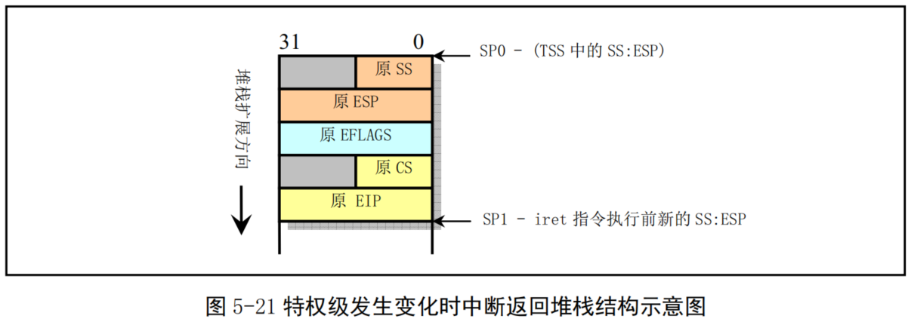

- 宏 move_to_user_mode 首先往内核堆栈中压入任务0堆栈段（即数据段）选择符和内核堆栈指针。然后压入标志寄存器内容。最后压入任务0代码段选择符和执行中断返回后需要执行的下一条指令的偏移位置。该偏移位置是iret后的一条指令处。

- 当执行iret指令时，CPU把返回地址送入CS:EIP 中，同时弹出堆栈中标志寄存器内容。由于CPU判断出目的代码段的特权级是3，与当前内核态的0级不同。于是CPU会把堆栈中的堆栈段选择符和堆栈指针弹出到SS:ESP中。由于特权级发上了变化，段寄存器DS、ES、FS和GS的值变得无效，此时 CPU会把这些段寄存器清零。因此在执行了iret指令后需要重新加载这些段寄存器。此后，系统就开始以特权级3运行在任务0的代码上。所使用的用户态堆栈还是原来在移动之前使用的堆栈。而其内核态堆栈则被指定为其任务数据结构所在页面的顶端开始（PAGE_SIZE+(long)&init_task）。由于以后在创建新进程时，需要复制任务0的任务数据结构，包括其用户堆栈指针，因此要求任务0的用户态堆栈在创建任务1（进程1）之前保持“干净”状态。

### 5.7.4 创建新进程

- Linux系统中创建新进程使用fork()系统调用。所有进程都是通过复制进程0而得到的，都是进程0的子进程。

- 在创建新进程的过程中，系统首先在任务数组中找出一个还没有被任何进程使用的空项（空槽）。如果系统已经有 64个进程在运行，则 fork()系统调用会因为任务数组表中没有可用空项而出错返回。然后系统为新建进程在主内存区中申请一页内存来存放其任务数据结构信息，并复制当前进程任务数据结构中的所有内容作为新进程任务数据结构的模板。为了防止这个还未处理完成的新建进程被调度函数执行，此时应该立刻将新进程状态置为不可中断的等待状态（TASKUNINTERRUPTIBLE）。

- 随后对复制的任务数据结构进行修改。把当前进程设置为新进程的父进程，清除信号位图并复位新进程各统计值，并设置初始运行时间片值为15个系统滴答数（150毫秒）。接着根据当前进程设置任务状态段（TSS）中各寄存器的值。由于创建进程时新进程返回值应为0，所以需要设置tss.eax=0。新建进程内核态堆栈指针 tss.esp0 被设置成新进程任务数据结构所在内存页面的顶端，而堆栈段 tss.ss0 被设置成内核数据段选择符。tss.ldt被设置为局部表描述符在GDT中的索引值。如果当前进程使用了协处理器，则还需要把协处理器的完整状态保存到新进程的tss.i387结构中。

- 此后系统设置新任务的代码和数据段基址、限长，并复制当前进程内存分页管理的页表。注意，此时系统并不为新的进程分配实际的物理内存页面，而是让它共享其父进程的内存页面。只有当父进程或新进程中任意一个有写内存操作时，系统才会为执行写操作的进程分配相关的独自使用的内存页面。这种处理方式称为写时复制（Copy On Write）技术。

- 随后，如果父进程中有文件是打开的，则应将对应文件的打开次数增1。接着在GDT中设置新任务的TSS和LDT描述符项，其中基地址信息指向新进程任务结构中的tss和1Idt。最后再将新任务设置成可运行状态并返回新进程号。

- 另外请注意，创建一个新的子进程和加载运行一个执行程序文件是两个不同的概念。当创建子进程时，它完全复制了父进程的代码和数据区，并会在其中执行子进程部分的代码。而执行块设备上的一个程序时，一般是在子进程中运行 exec()系统调用来操作的。在进入 exec()后，子进程原来的代码和数据区就会被清掉（释放）。待该子进程开始运行新程序时，由于此时内核还没有从块设备上加载该程序的代码， CPU就会立刻产生代码页面不存在的异常（Fault），此时内存管理程序就会从块设备上加载相应的代码页面，然后CPU又重新执行引起异常的指令。到此时新程序的代码才真正开始被执行。

### 5.7.5 进程调度

- 内核中的调度程序用于选择系统中下一个要运行的进程。这种选择运行机制是多任务操作系统的基
础。调度程序可以看作为在所有处于运行状态的进程之间分配CPU运行时间的管理代码。由前面描述可知，Linux进程是抢占式的，但被抢占的进程仍然处于TASK_RUNNING状态，只是暂时没有被CPU运行。进程的抢占发生在进程处于用户态执行阶段，在内核态执行时是不能被抢占的。

- 为了能让进程有效地使用系统资源，又能使进程有较快的响应时间，就需要对进程的切换调度采用一定的调度策略。在Linux0.11中采用了基于优先级排队的调度策略。

#### 调度程序

- schedule()函数首先扫描任务数组。通过比较每个就绪态（TASK_RUNNING）任务的运行时间递减滴答计数counter 的值来确定当前哪个进程运行的时间最少。哪一个的值大，就表示运行时间还不长，于是就选中该进程，并使用任务切换宏函数切换到该进程运行。

- 如果此时所有处于TASK_RUNNING状态进程的时间片都已经用完，系统就会根据每个进程的优先权值 priority，对系统中所有进程（包括正在睡眠的进程）重新计算每个任务需要运行的时间片值 counter。计算的公式是：`counter = counter/2 + priority`

- 这样对于正在睡眠的进程当它们被唤醒时就具有较高的时间片counter值。然后 schedule()函数重新扫描任务数组中所有处于TASK_RUNNING状态的进程，并重复上述过程，直到选择出一个进程为止。最后调用switch_to()执行实际的进程切换操作。

- 如果此时没有其他进程可运行,系统就会选择进程0运行。对于Linux 0.11来说,进程0会调用 pause() 把自己置为可中断的睡眠状态并再次调用 schedule()。不过在调度进程运行时，schedule()并不在意进程0 处于什么状态。只要系统空闲就调度进程0运行。

#### 进程切换

- 每当选择出一个新的可运行进程时，schedule()函数就会调用定义在 include/asm/system.h中的 switch_to()宏执行实际进程切换操作。该宏会把 CPU的当前进程状态（上下文）替换成新进程的状态。在进行切换之前，switch_to()首先检查要切换到的进程是否就是当前进程，如果是则什么也不做，直接退出。否则就首先把内核全局变量current置为新任务的指针，然后长跳转到新任务的任务状态段TSS 组成的地址处，造成CPU执行任务切换操作。此时CPU会把其所有寄存器的状态保存到当前任务寄存器 TR中TSS段选择符所指向的当前进程任务数据结构的tsS 结构中，然后把新任务状态段选择符所指向的新任务数据结构中tss结构中的寄存器信息恢复到CPU中，系统就正式开始运行新切换的任务了。这个过程可参见图5-22所示。

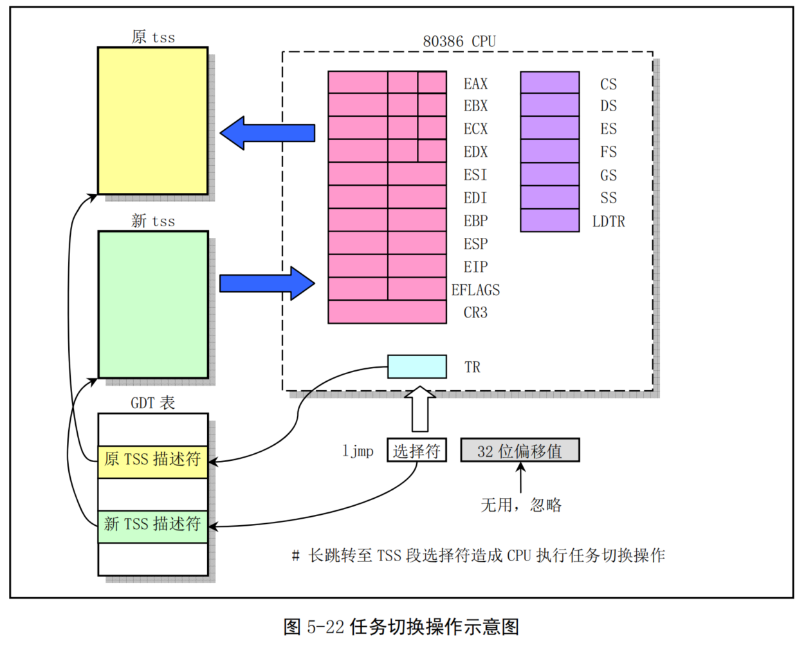

### 5.7.6 终止进程

- 当一个进程结束了运行或在半途中终止了运行，那么内核就需要释放该进程所占用的系统资源。这包括进程运行时打开的文件、申请的内存等。

- 当一个用户程序调用exit()系统调用时，就会执行内核函数do_exit()。该函数会首先释放进程代码段和数据段占用的内存页面，关闭进程打开着的所有文件，对进程使用的当前工作目录、根目录和运行程序的i节点进行同步操作。如果进程有子进程，则让 init 进程作为其所有子进程的父进程。如果进程是一个会话头进程并且有控制终端，则释放控制终端，并向属于该会话的所有进程发送挂断信号SIGHUP，这通常会终止该会话中的所有进程。然后把进程状态置为僵死状态TASK_ZOMBIE。并向其原父进程发送 SIGCHLD 信号，通知其某个子进程已经终止。最后 do_exit()调用调度函数去执行其他进程。由此可见在进程被终止时，它的任务数据结构仍然保留着。因为其父进程还需要使用其中的信息。

- 在子进程在执行期间，父进程通常使用wait()或 waitpid()函数等待其某个子进程终止。当等待的子进程被终止并处于僵死状态时，父进程就会把子进程运行所使用的时间累加到自己进程中。最终释放已终止子进程任务数据结构所占用的内存页面，并置空子进程在任务数组中占用的指针项。

## 5.8 Linux系统中堆栈的使用方法

- 本节内容概要描述了Linux 内核从开机引导到系统正常运行过程中对堆栈的使用方式。这部分内容的说明与内核代码关系比较密切，可以先跳过。在开始阅读相应代码时再回来仔细研究。

- Linux0.11系统中共使用了四种堆栈。一种是系统引导初始化时临时使用的堆栈；一种是进入保护模式之后提供内核程序初始化使用的堆栈，位于内核代码地址空间固定位置处。该堆栈也是后来任务0 使用的用户态堆栈；另一种是每个任务通过系统调用，执行内核程序时使用的堆栈，我们称之为任务的内核态堆栈。每个任务都有自己独立的内核态堆栈；最后一种是任务在用户态执行的堆栈，位于任务（进程）逻辑地址空间近末端处。

- 使用多个栈或在不同情况下使用不同栈的主要原因有两个。首先是由于从实模式进入保护模式，使得CPU对内存寻址访问方式发生了变化，因此需要重新调整设置栈区域。另外，为了解决不同CPU特权级共享使用堆栈带来的保护问题，执行0级的内核代码和执行3级的用户代码需要使用不同的栈。当一个任务进入内核态运行时，就会使用其TSS 段中给出的特权级0的堆栈指针tss.ss0、tss.esp0，即内核栈。原用户栈指针会被保存在内核栈中。而当从内核态返回用户态时，就会恢复使用用户态的堆栈。下面分别对它们进行说明。

### 5.8.1 初始化阶段

#### 开机初始化时(bootsect.s，setup.s)

当 bootsect 代码被 ROM BIOS 引导加载到物理内存 0x7c00 处时，并没有设置堆栈段，当然程序也没有使用堆栈。直到bootsect被移动到0x9000:0处时，才把堆栈段寄存器SS设置为0x9000，堆栈指针 esp 寄存器设置为 0xff00，也即堆栈顶端在 0x9000:0xff00 处，参见 boot/bootsect.s 第 61、62 行。setup.s程序中也沿用了bootsect中设置的堆栈段。这就是系统初始化时临时使用的堆栈。

#### 进入保护模式时(head.s)
从head.s程序起，系统开始正式在保护模式下运行。此时堆栈段被设置为内核数据段（0x10），堆栈指针 esp 设置成指向 user_stack 数组的顶端（参见 head.s，第 31行），保留了1页内存（4K）作为堆栈使用。user_stack 数组定义在 sched.c 的 67--72 行，共含有 1024个长字。它在物理内存中的位置示意图可参见下图5-23所示。此时该堆栈是内核程序自己使用的堆栈。其中的给出地址是大约值，它们与编译时的实际设置参数有关。这些地址位置是从编译内核时生成的 system.map 文件中查到的。

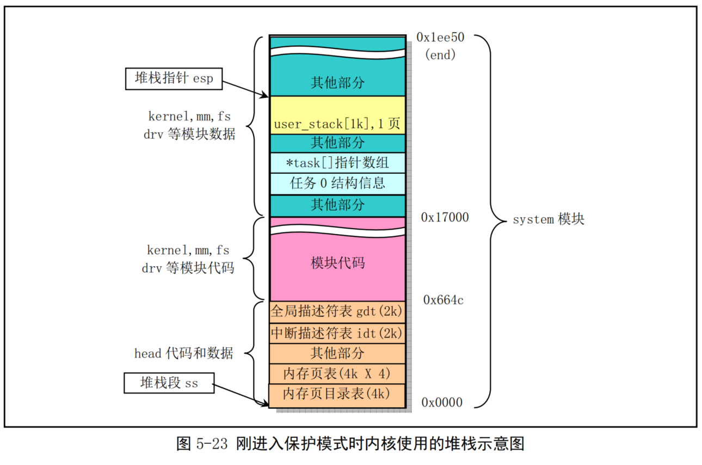

#### 初始化时(main.c)
在 init/main.c 程序中，在执行move_to_user_mode()代码把控制权移交给任务0之前，系统一直使用上述堆栈。而在执行过 move_to_user_mode()之后，main.c 的代码被“切换”成任务0中执行。通过执行 fork()系统调用，main.c中的init()将在任务1中执行，并使用任务1的堆栈。而main()本身则在被“切换” 成为任务0后，仍然继续使用上述内核程序自己的堆栈作为任务0的用户态堆栈。关于任务所使用堆栈的详细描述见后面说明。

### 5.8.2 任务的堆栈

- 每个任务都有两个堆栈，分别用于用户态和内核态程序的执行，并且分别称为用户态堆栈和内核态堆栈。除了处于不同CPU特权级中，这两个堆栈之间的主要区别在于任务的内核态堆栈很小，所保存的数据量最多不能超过（4096－任务数据结构块）个字节，大约为3K字节。而任务的用户态堆栈却可以在用户的64MB空间内延伸。

#### 在用户态运行时
每个任务（除了任务0和任务1）有自己的64MB 地址空间。当一个任务（进程）刚被创建时，它的用户态堆栈指针被设置在其地址空间的靠近末端（64MB顶端）部分。实际上末端部分还要包括执行程序的参数和环境变量，然后才是用户堆栈空间，见图5-24所示。应用程序在用户态下运行时就一直使用这个堆栈。堆栈实际使用的物理内存则由 CPU 分页机制确定。由于Linux 实现了写时复制功能（Copy on Write），因此在进程被创建后，若该进程及其父进程都没有使用堆栈，则两者共享同一堆栈对应的物理内存页面。只有当其中一个进程执行堆栈写操作（例如 push操作）时内核内存管理程序才会为写操作进程分配新的内存页面。而进程0和进程1的用户堆栈比较特殊，见后面说明。

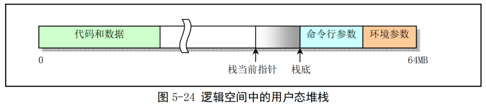

#### 在内核态运行时
- 每个任务有其自己的内核态堆栈，用于任务在内核代码中执行期间。其所在线性地址中的位置由该任务 TSS 段中 ss0 和 esp0 两个字段指定。ss0 是任务内核态堆栈的段选择符，esp0 是堆栈栈低指针。因此每当任务从用户代码转移进入内核代码中执行时，任务的内核态栈总是空的。任务内核态堆栈被设置在位于其任务数据结构所在页面的末端，即与任务的任务数据结构（task_struct）放在同一页面内。这是在建立新任务时，fork()程序在任务 tss段的内核级堆栈字段(tss.esp0和 tss.ss0)中设置的，参见 kernel/fork.c，93 行:
`p->tss.esp0 = PAGE_SIZE + (long)p; p->tss.ss0 = 0x10;`

- 其中 p 是新任务的任务数据结构指针，tss 是任务状态段结构。内核为新任务申请内存用作保存其 task_struct 结构数据，而 tss 结构（段）是task_struct 中的一个字段。该任务的内核堆栈段值 tss.ss0 也被设置成为0x10（即内核数据段选择符），而 tss.esp0 则指向保存 task_struct 结构页面的末端。见图5-25 所示。实际上 tss.esp0 被设置成指向该页面（外）上一字节处（图中堆栈底处）。这是因为Intel CPU执行堆栈操作时是先递减堆栈指针 esp 值，然后在 esp 指针处保存入栈内容。

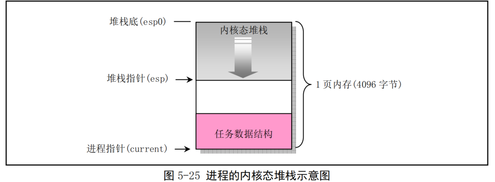

- 为什么从主内存区申请得来的用于保存任务数据结构的一页内存也能被设置成内核数据段中的数据
呢，也即tss.ss0为什么能被设置成0x10呢？这是因为用户内核态栈仍然属于内核数据空间。我们可以从内核代码段的长度范围来说明。在head.s程序的末端，分别设置了内核代码段和数据段的描述符，段长度都被设置成了16MB。这个长度值是Linux0.11内核所能支持的最大物理内存长度（参见head.s，110 行开始的注释）。因此，内核代码可以寻址到整个物理内存范围中的任何位置，当然也包括主内存区。每当任务执行内核程序而需要使用其内核栈时，CPU就会利用TSS结构把它的内核态堆栈设置成由 tss.ss0 和 tss.esp0这两个值构成。在任务切换时，老任务的内核栈指针esp0不会被保存。对CPU来讲，这两个值是只读的。因此每当一个任务进入内核态执行时，其内核态堆栈总是空的。

#### 任务0和任务1的堆栈
- 任务0（空闲进程idle）和任务1（初始化进程init）的堆栈比较特殊，需要特别予以说明。任务0和任务1的代码段和数据段相同，限长也都是640KB，但它们被映射到不同的线性地址范围中。任务0 的段基地址从线性地址0开始，而任务1的段基地址从64MB开始。但是它们全都映射到物理地址 0--640KB范围中。这个地址范围也就是内核代码和基本数据所存放的地方。在执行了 move_to_user_mode()之后，任务0和任务1的内核态堆栈分别位于各自任务数据结构所在页面的末端, 而任务0的用户态堆栈就是前面进入保护模式后所使用的堆栈，即 sched.c 的 user_stack[]数组的位置。由于任务1在创建时复制了任务0的用户堆栈，因此刚开始时任务0和任务1共享使用同一个用户堆栈空间。但是当任务1 开始运行时，由于任务1 映射到 user_stack[]处的页表项被设置成只读，使得任务1 在执行堆栈操作时将会引起写页面异常，从而内核会使用写时复制机制为任务1另行分配主内存区页面作为堆栈空间使用。只有到此时，任务1才开始使用自己独立的用户堆栈内存页面。因此任务0的堆栈需要在任务1实际开始使用之前保持“干净”，即任务0此时不能使用堆栈，以确保复制的堆栈页面中不含有任务0的数据。

- 任务0的内核态堆栈是在其人工设置的初始化任务数据结构中指定的，而它的用户态堆栈是在执行 move_to_user_mode()时，在模拟 iret返回之前的堆栈中设置的，参见图 5-21 所示。我们知道，当进行特权级会发生变化的控制权转移时，目的代码会使用新特权级的堆栈，而原特权级代码堆栈指针将保留在新堆栈中。因此这里先把任务0用户堆栈指针压入当前处于特权级的堆栈中，同时把代码指针也压入堆栈，然后执行IRET指令即可实现把控制权从特权级0的代码转移到特权级3的任务0代码中。在这个人工设置内容的堆栈中，原 esp 值被设置成仍然是user_stack中原来的位置值，而原 ss 段选择符被设置成0x17，即设置成用户态局部表LDT中的数据段选择符。然后把任务0代码段选择符0x0f压入堆栈作为栈中原CS段的选择符，把下一条指令的指针作为原EIP压入堆栈。这样，通过执行IRET指令即可“返回”到任务的代码中继续执行了。

### 5.8.3 任务内核态堆栈与用户态堆栈之间的切换

- 在Linux0.11系统中，所有中断服务程序都属于内核代码。如果一个中断产生时任务正在用户代码中执行，那么该中断就会引起CPU特权级从3级到0级的变化，此时CPU就会进行用户态堆栈到内核态堆栈的切换操作。CPU会从当前任务的任务状态段TSS中取得新堆栈的段选择符和偏移值。因为中断服务程序在内核中，属于0级特权级代码，所以 48 比特的内核态堆栈指针会从TSS 的 ss0 和 esp0 字段中获得。在定位了新堆栈（内核态堆栈）之后，CPU 就会首先把原用户态堆栈指针 ss 和 esp 压入内核态堆栈，随后把标志寄存器 eflags 的内容和返回位置 cs、eip 压入内核态堆栈。

- 内核的系统调用是一个软件中断，因此任务调用系统调用时就会进入内核并执行内核中的中断服务代码。此时内核代码就会使用该任务的内核态堆栈进行操作。同样，当进入内核程序时，由于特权级别发生了改变（从用户态转到内核态），用户态堆栈的堆栈段和堆栈指针以及eflags会被保存在任务的内核态堆栈中。而在执行 iret 退出内核程序返回到用户程序时，将恢复用户态的堆栈和 eflags。这个过程见图 5-26 所示。

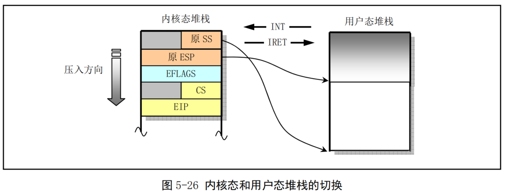

- 如果一个任务正在内核态中运行，那么若CPU响应中断就不再需要进行堆栈切换操作，因为此时该任务运行的内核代码已经在使用内核态堆栈，并且不涉及优先级别的变化，所以CPU仅把 eflags 和中断返回指针cs、eip 压入当前内核态堆栈，然后执行中断服务过程。

## 5.9 Linux 0.11 采用的文件系统

- 内核代码若要正常运行就需要文件系统的支持。用于向内核提供最基本信息和支持的是根文件系统，
即Linux系统引导启动时，默认使用的文件系统是根文件系统。其中包括操作系统最起码的一些配置文件和命令执行程序。对于Linux系统中使用的UNIX类文件系统，其中主要包括一些规定的目录、配置文件、设备驱动程序、开发程序以及所有其他用户数据或文本文件等。其中一般都包括以下一些子目录和文件:  

---
etc/    目录主要含有一些系统配置文件；  
dev/    含有设备特殊文件，用于使用文件操作语句操作设备；   
bin/    存放系统执行程序。例如 sh、mkfs、fdisk等；  
usr/    存放库函数、手册和其他一些文件；   
usr/bin 存放用户常用的普通命令；  
var/    用于存放系统运行时可变的数据或者是日志等信息。

---

- 存放文件系统的设备就是文件系统设备。比如，对于一般使用的Windows2000操作系统，硬盘C盘就是文件系统设备，而硬盘上按一定规则存放的文件就组成文件系统，Windows2000有NTFS或FAT32 等文件系统。而Linux0.11内核所支持的文件系统是MINIX1.0文件系统。目前Linux系统上使用最广泛的则是ext2或ext3文件系统。

- 对于第1章中介绍的在软盘上运行的Linux 0.11 系统，它由简单的 2 张软盘组成：bootimage 盘和 rootimage 盘。bootimage 是引导启动Image 文件，其中主要包括磁盘引导扇区代码、操作系统加载程序和内核执行代码。rootimage 就是用于向内核提供最基本支持的根文件系统。这两个盘合起来就相当于一张可启动的DOS操作系统盘。

- 当Linux启动盘加载根文件系统时，会根据启动盘上引导扇区第509、510字节处一个字（ROOT_DEV）中的根文件系统设备号从指定的设备中加载根文件系统。如果这个设备号是0的话，则表示需要从引导盘所在当前驱动器中加载根文件系统。若该设备号是一个硬盘分区设备号的话，就会从该指定硬盘分区中加载根文件系统。

## 5.10Linux内核源代码的目录结构

- 由于Linux内核是一种单内核模式的系统，因此，内核中所有的程序几乎都有紧密的联系，它们之间的依赖和调用关系非常密切。所以在阅读一个源代码文件时往往需要参阅其他相关的文件。因此有必要在开始阅读内核源代码之前，先熟悉一下源代码文件的目录结构和安排。

- 这里我们首先列出Linux内核完整的源代码目录，包括其中的子目录。然后逐一介绍各个目录中所包含程序的主要功能，使得整个内核源代码的安排形式能在我们的头脑中建立起一个大概的框架，以便于下一章开始的源代码阅读工作。
当我们使用tar命令将linux-0.11.tar.gz解开时，内核源代码文件被放到了linux/目录中。其中的目录结构见图5-27所示：

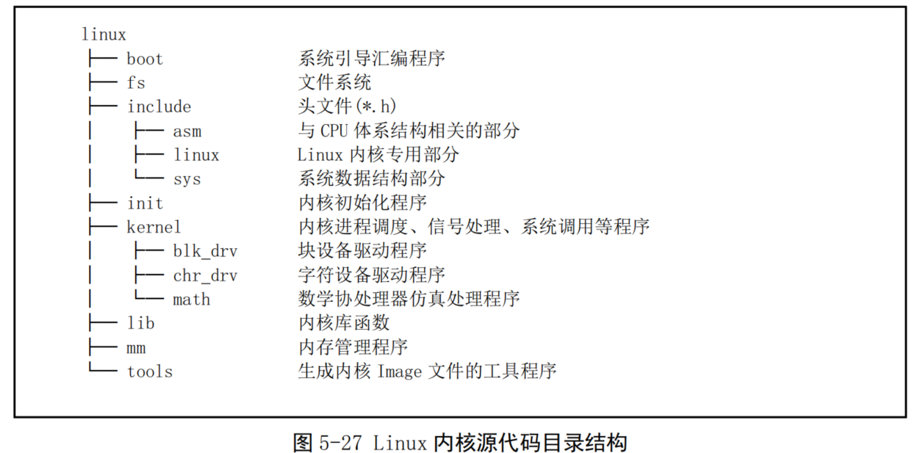

- 该内核版本的源代码目录中含有14个子目录，总共包括102个代码文件。下面逐个对这些子目录中的内容进行描述。

### 5.10.1 内核主目录linux

- linux 目录是源代码的主目录，在该主目录中除了包括所有的 14个子目录以外，还含有唯一的一个Makefile文件。该文件是编译辅助工具软件 make的参数配置文件。make工具软件的主要用途是通过识别哪些文件已被修改过，从而自动地决定在一个含有多个源程序文件的程序系统中哪些文件需要被重新编译。因此，make工具软件是程序项目的管理软件。

- linux目录下的这个Makefile文件还嵌套地调用了所有子目录中包含的Makefile文件,这样，当linux 目录（包括子目录）下的任何文件被修改过时，make都会对其进行重新编译。因此为了编译整个内核所有的源代码文件，只要在linux目录下运行一次make软件即可。

### 5.10.2引导启动程序目录boot

- boot目录中含有3个汇编语言文件，是内核源代码文件中最先被编译的程序。这3个程序完成的主要功能是当计算机加电时引导内核启动，将内核代码加载到内存中，并做一些进入32位保护运行方式前的系统初始化工作。其中 bootsect.s 和 setup.s 程序需要使用 as86 软件来编译，使用的是 as86 的汇编语言格式（与微软的类似），而head.s 需要用GNUas 来编译，使用的是AT&T格式的汇编语言。这两种汇编语言在下一章的代码注释里以及代码列表后面的说明中会有简单的介绍。

- bootsect.s程序是磁盘引导块程序，编译后会驻留在磁盘的第一个扇区中（引导扇区，0磁道（柱面）， 0磁头，第1个扇区）。在PC机加电ROM BIOS自检后，将被BIOS加载到内存0x7C00处进行执行。

- setup.s 程序主要用于读取机器的硬件配置参数，并把内核模块 system 移动到适当的内存位置处。

- head.s程序会被编译连接在 system模块的最前部分，主要进行硬件设备的探测设置和内存管理页面的初始设置工作。

### 5.10.3文件系统目录fs

- Linux 0.11内核的文件系统采用了1.0版的MINIX文件系统，这是由于Linux是在MINIX系统上开发的，采用MINIX文件系统便于进行交叉编译，并且可以从MINIX中加载Linux分区。虽然使用的是 MINIX文件系统，但Linux对其处理方式与MINIX系统不同。主要的区别在于MINIX对文件系统采用单线程处理方式，而Linux则采用了多线程方式。由于采用了多线程处理方式，Linux程序就必须处理多线程带来的竞争条件、死锁等问题，因此Linux文件系统代码要比MINIX系统的复杂得多。为了避免竞争条件的发生，Linux系统对资源分配进行了严格地检查，并且在内核模式下运行时，如果任务没有主动睡眠（调用 sleep()），就不让内核切换任务。

- fs/目录是文件系统实现程序的目录，共包含17个C语言程序。这些程序之间的主要引用关系见图 5-28所示。图中每个方框代表一个文件，从上到下按基本引用关系放置。其中各文件名均略去了后缀.c，虚框中是的程序文件不属于文件系统，带箭头的线条表示引用关系，粗线条表示有相互引用关系。

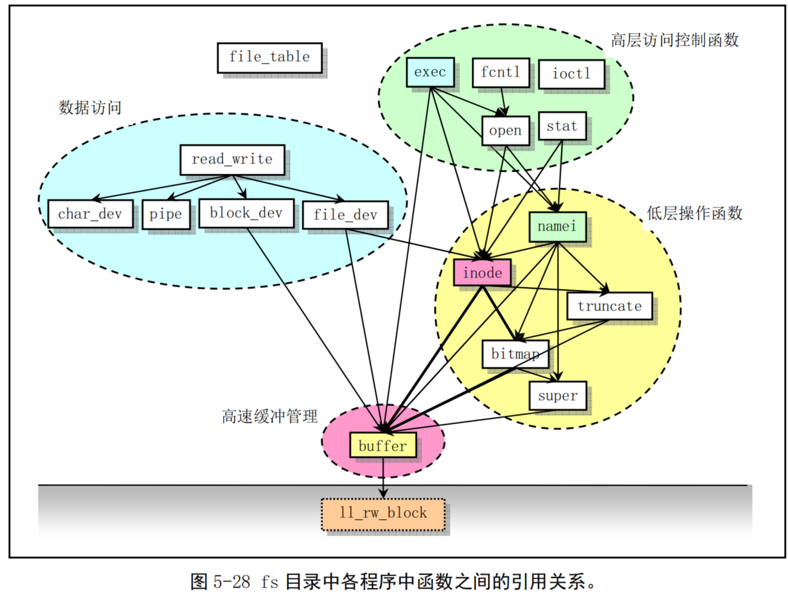

- 由图可以看出，该目录中的程序可以划分成四个部分：高速缓冲区管理、低层文件操作、文件数据访问和文件高层函数，在对本目录中文件进行注释说明时，我们也将分成这四个部分来描述。

- 对于文件系统，我们可以将它看成是内存高速缓冲区的扩展部分。所有对文件系统中数据的访问，都需要首先读取到高速缓冲区中。本目录中的程序主要用来管理高速缓冲区中缓冲块的使用分配和块设备上的文件系统。管理高速缓冲区的程序是buffer.c，而其他程序则主要都是用于文件系统管理。

- 在file_table.c文件中，目前仅定义了一个文件句柄（描述符）结构数组。ioctl.c文件将引用 kernel/chr_drv/tty.c 中的函数，实现字符设备的 io控制功能。exec.c 程序主要包含一个执行程序函数 do_execve()，它是所有 exec()函数簇中的主要函数。fcntl.c 程序用于实现文件i/o 控制的系统调用函数。 read_write.c 程序用于实现文件读/写和定位三个系统调用函数。stat.c 程序中实现了两个获取文件状态的系统调用函数。open.c 程序主要包含实现修改文件属性和创建与关闭文件的系统调用函数。

- char_dev.c 主要包含字符设备读写函数rw_char()。pipe.c 程序中包含管道读写函数和创建管道的系统调用。
- file_dev.c 程序中包含基于i节点和描述符结构的文件读写函数。namei.c程序主要包括文件系统中目录名和文件名的操作函数和系统调用函数。block_dev.c程序包含块数据读和写函数。inode.c程序中包含针对文件系统i节点操作的函数。truncate.c程序用于在删除文件时释放文件所占用的设备数据空间。 bitmap.c 程序用于处理文件系统中 i节点和逻辑数据块的位图。super.c 程序中包含对文件系统超级块的处理函数。buffer.c 程序主要用于对内存高速缓冲区进行处理。虚框中的 1l_rw_block 是块设备的底层读函数，它并不在 fs目录中，而是kernel/blk_drv/ll rw_block.c 中的块设备读写驱动函数。放在这里只是让我们清楚的看到，文件系统对于块设备中数据的读写，都需要通过高速缓冲区与块设备的驱动程序（ll_rw_block()）来操作来进行，文件系统程序集本身并不直接与块设备的驱动程序打交道。

- 在对程序进行注释过程中，我们将另外给出这些文件中各个主要函数之间的调用层次关系。

### 5.10.4头文件主目录include

- 头文件目录中总共有 32个.h头文件。其中主目录下有 13 个，asm 子目录中有 4个，linux 子目录中有10个，Sys子目录中有5个。这些头文件各自的功能见如下简述，具体的作用和所包含的信息请参见对头文件的注释一章。

---

<a.out.h>   a.out头文件，定义了 a.out执行文件格式和一些宏。  
<const.h>   常数符号头文件，目前仅定义了i节点中imode字段的各标志位。  
<ctype.h>   字符类型头文件。定义了一些有关字符类型判断和转换的宏。    
<errno.h>   错误号头文件。包含系统中各种出错号。(Linus 从 minix 中引进的)。  
<fcntl.h>   文件控制头文件。用于文件及其描述符的操作控制常数符号的定义。  
<signal.h>  信号头文件。定义信号符号常量，信号结构以及信号操作函数原型。  
<stdarg.h>  标准参数头文件。以宏的形式定义变量参数列表。主要说明了一个类型（va list）和三个宏（va_start,va_arg 和 va_end），用于 vsprintf、vprintf、vfprintf 函数。    
<stddef.h>  标准定义头文件。定义了 NULL,offsetof(TYPE,MEMBER)。   
<string.h>  字符串头文件。主要定义了一些有关字符串操作的嵌入函数。    
<termios.h> 终端输入输出函数头文件。主要定义控制异步通信口的终端接口。  
<time.h>    时间类型头文件。其中最主要定义了tm 结构和一些有关时间的函数原形。  
<unistd.h>  Linux标准头文件。定义了各种符号常数和类型，并声明了各种函数。如定义了__LIBRARY__，则还包括系统调用号和内嵌汇编_syscall0()等。  
<utime.h>   用户时间头文件。定义了访问和修改时间结构以及utime()原型。

----

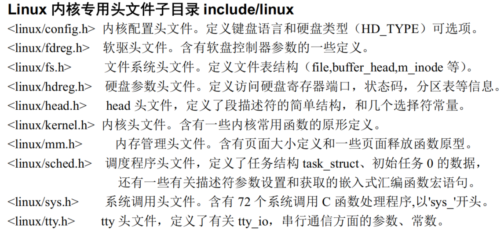

----

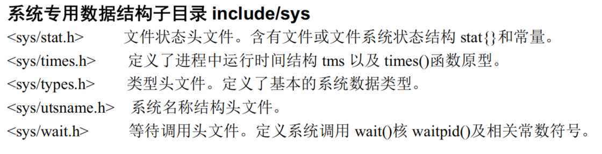

### 5.10.5内核初始化程序目录init

- 该目录中仅包含一个文件main.c。用于执行内核所有的初始化工作，然后移到用户模式创建新进程，并在控制台设备上运行 shell 程序。

- 程序首先根据机器内存的多少对缓冲区内存容量进行分配，如果还设置了要使用虚拟盘，则在缓冲区内存后面也为它留下空间。之后就进行所有硬件的初始化工作，包括人工创建第一个任务（task()），并设置了中断允许标志。在执行从核心态移到用户态之后，系统第一次调用创建进程函数 fork()，创建出一个用于运行init()的进程，在该子进程中，系统将进行控制台环境设置，并且在生成一个子进程用来运行 shell 程序。

### 5.10.6 内核程序主目录kernel

- linux/kernel 目录中共包含12个代码文件和一个Makefile 文件，另外还有3个子目录。所有处理任务的程序都保存在kermnel/目录中，其中包括象fork、exit、调度程序以及一些系统调用程序等。还包括处理中断异常和陷阱的处理过程。子目录中包括了低层的设备驱动程序，如 get_hd_block和 tty_write 等。由于这些文件中代码之间调用关系复杂，因此这里就不详细列出各文件之间的引用关系图，但仍然可以进行大概分类，见图 5-29 所示。

- asm.s 程序是用于处理系统硬件异常所引起的中断，对各硬件异常的实际处理程序则是在 traps.c文件中，在各个中断处理过程中，将分别调用 traps.c 中相应的C语言处理函数。

- exit.c程序主要包括用于处理进程终止的系统调用。包含进程释放、会话（进程组）终止和程序退出处理函数以及杀死进程、终止进程、挂起进程等系统调用函数。

- fork.c程序给出了sys_fork()系统调用中使用了两个C语言函数：find_empty_process()和 copy_process()。

- mktime.c 程序包含一个内核使用的时间函数 mktime(),用于计算从1970 年1月1日0时起到开机当日的秒数，作为开机秒时间。仅在 init/main.c 中被调用一次。

- panic.c 程序包含一个显示内核出错信息并停机的函数 panic()。 printk.c程序包含一个内核专用信息显示函数printk()。

- sched.c 程序中包括有关调度的基本函数(sleep_on、wakeup、schedule 等)以及一些简单的系统调用函数。另外还有几个与定时相关的软盘操作函数。

- signal.c程序中包括了有关信号处理的4个系统调用以及一个在对应的中断处理程序中处理信号的函数 do_signal()。

- sys.c 程序包括很多系统调用函数，其中有些还没有实现。

- system_call.s 程序实现了Linux 系统调用（int 0x80）的接口处理过程，实际的处理过程则包含在各系统调用相应的C语言处理函数中，这些处理函数分布在整个Linux 内核代码中。

- vsprintf.c程序实现了现在已经归入标准库函数中的字符串格式化函数。

#### 块设备驱动程序子目录kernel/blkdrv

- 通常情况下，用户是通过文件系统来访问设备的，因此设备驱动程序为文件系统实现了调用接口。在使用块设备时，由于其数据吞吐量大，为了能够高效率地使用块设备上的数据，在用户进程与块设备之间使用了高速缓冲机制。在访问块设备上的数据时，系统首先以数据块的形式把块设备上的数据读入到高速缓冲区中，然后再提供给用户。bk_drv子目录共包含4个c文件和1个头文件。头文件 blk.h 由于是块设备程序专用的，所以与C文件放在一起。这几个文件之间的大致关系，见图5-30所示。

- blk.h中定义了3个C程序中共用的块设备结构和数据块请求结构。hd.c 程序主要实现对硬盘数据块进行读/写的底层驱动函数，主要是 do_hd_request()函数；floppy.c 程序中主要实现了对软盘数据块的读/写驱动函数，主要是do_fd_request()函数。ll_rw_blk.c中程序实现了低层块设备数据读/写函数 ll_rw_block()，内核中所有其他程序都是通过该函数对块设备进行数据读写操作。你将看到该函数在许多访问块设备数据的地方被调用，尤其是在高速缓冲区处理文件fs/buffer.c 中。

#### 字符设备驱动程序子目录kernel/chr_drv
- 字符设备程序子目录共含有4个C语言程序和2个汇编程序文件。这些文件实现了对串行端口 rs-232、串行终端、键盘和控制台终端设备的驱动。图5-31是这些文件之间的大致调用层次关系。

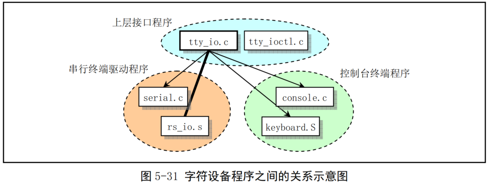

- tty_io.c 程序中包含 tty 字符设备读函数 tty_read()和写函数 tty_write()，为文件系统提供了上层访问接口。另外还包括在串行中断处理过程中调用的 C 函数 do_tty_interrupt()，该函数将会在中断类型为读字符的处理中被调用。

- console.c文件主要包含控制台初始化程序和控制台写函数con_write()，用于被 tty设备调用。还包含对显示器和键盘中断的初始化设置程序con_init()。

- rs_io.s汇编程序用于实现两个串行接口的中断处理程序。该中断处理程序会根据从中断标识寄存器（端口0x3fa或0x2fa）中取得的4种中断类型分别进行处理，并在处理中断类型为读字符的代码中调用 do_tty_interrupt().

- serial.c用于对异步串行通信芯片UART进行初始化操作，并设置两个通信端口的中断向量。另外还包括tty用于往串口输出的rs_write()函数。

- tty_ioctl.c 程序实现了 tty 的 io 控制接口函数 tty_ioctlO以及对 termio(s)终端 io 结构的读写函数，并会在实现系统调用 sys_ioctl()的 fs/ioctl.c 程序中被调用。

- keyboard.S 程序主要实现了键盘中断处理过程keyboard_interrupt。

#### 协处理器仿真和操作程序子目录kernel/math

该子目录中目前仅有一个C程序math_emulate.c。其中的 math_emulate()函数是中断 int7的中断处理程序调用的C 函数。当机器中没有数学协处理器，而CPU 却又执行了协处理器的指令时，就会引发该中断。因此，使用该中断就可以用软件来仿真协处理器的功能。本书所讨论的内核版本还没有包含有关协处理器的仿真代码。本程序中只是打印一条出错信息，并向用户程序发送一个协处理器错误信号 SIGFPE。

### 5.10.7内核库函数目录lib
- 与普通用户程序不同，内核代码不能使用标准C函数库及其他一些函数库。主要原因是由于完整的C函数库很大。因此在内核源代码中有专门一个lib/目录提供内核需要用到的一些函数。内核函数库用于为内核初始化程序init/main.c运行在用户态的进程（进程0、1）提供调用支持。它与普通静态库的实现方法完全一样。读者可从中了解一般libc 函数库的基本组成原理。在lib/目录中共有12个C语言文件，除了一个由 tytso 编制的 malloc.c程序较长以外，其他的程序很短，有的只有一二行代码，实现了一些系统调用的接口函数。

- 这些文件中主要包括有退出函数_exit()、关闭文件函数 close(fd)、复制文件描述符函数 dup()、文件打开函数 open()、写文件函数write()、执行程序函数 execve()、内存分配函数 malloc()、等待子进程状态函数wait()、创建会话系统调用 setsid()以及在 include/string.h中实现的所有字符串操作函数。 

### 5.10.8内存管理程序目录mm

- 该目录包括2个代码文件。主要用于管理程序对主内存区的使用，实现了进程逻辑地址到线性地址以及线性地址到主内存区中物理内存地址的映射，通过内存的分页管理机制，在进程的虚拟内存页与主内存区的物理内存页之间建立了对应关系。

- Linux内核对内存的处理使用了分页和分段两种方式。首先是将386的4G虚拟地址空间分割成64 个段，每个段64MIB。所有内核程序占用其中第一个段，并且物理地址与该段线性地址相同。然后每个任务分配一个段使用。分页机制用于把指定的物理内存页面映射到段内，检测fork创建的任何重复的拷贝，并执行写时复制机制。

- page.s 文件包括内存页面异常中断（int 14）处理程序，主要用于处理程序由于缺页而引起的页异常中断和访问非法地址而引起的页保护。

- memory.c 程序包括对内存进行初始化的函数 mem_init()，由 page.s 的内存处理中断过程调用的 do_no_page()和 do_wp_page()函数。在创建新进程而执行复制进程操作时，即使用该文件中的内存处理函数来分配管理内存空间。

### 5.10.9编译内核工具程序目录tools
该目录下的build.c程序用于将Linux各个目录中被分别编译生成的目标代码连接合并成一个可运行的内核映像文件image。其具体的功能可参见下一章内容。

## 5.11内核系统与应用程序的关系
- 在Linux系统中，内核为用户程序提供了两方面的支持。其一是系统调用接口（在第5章中说明)，也即中断调用int0x80；另一方面是通过开发环境库函数或内核库函数（在第12章中说明）与内核进行信息交流。不过内核库函数仅供内核创建的任务0和任务1使用，它们最终还是去调用系统调用。因此内核对所有用户程序或进程实际上只提供系统调用这一种统一的接口。lib/目录下内核库函数代码的实现方法与基本C函数库libc中类似函数的实现方法基本相同，为了使用内核资源，最终都是通过内嵌汇编代码调用了内核系统调用功能，参见图5-4所示。

- 系统调用主要提供给系统软件编程或者用于库函数的实现。而一般用户开发的程序则是通过调用象libc 等库中函数来访问内核资源。这些库中的函数或资源通常被称为应用程序编成接口（API)。其中定义了应用程序使用的一组标准编成接口。通过调用这些库中的程序，应用程序代码能够完成各种常用工作，例如，打开和关闭对文件或设备的访问、进行科学计算、出错处理以及访问组和用户标识号ID等系统信息。

- 在UNIX类操作系统中，最为普遍使用的是基于POSIX标准的API接口。Linux当然也不例外。API 与系统调用的区别在于：为了实现某一应用程序接口标准，例如POSIX，其中的API可以与一个系统调用对应，也可能由几个系统调用的功能共同实现。当然某些API函数可能根本就不需要使用系统调用，即不使用内核功能。因此函数库可以看作是实现象POSIX标准的主体界面，应用程序不用管它与系统调用之间到底存在什么关系。无论一个操作系统提供的系统调用是多么得不同，但只要它遵循同一个API 标准，那么应用程序就可以在这些操作系统之间具有可移植性。

- 系统调用是内核与外界接口的最高层。在内核中，每个系统调用都有一个序列号（在include/unistd.h 头文件中定义），并且常以宏的形式实现。应用程序不应该直接使用系统调用，因为这样的话，程序的移植性就不好了。因此目前Linux标准库LSB（Linux StandardBase）和许多其他标准都不允许应用程序直接访问系统调用宏。系统调用的有关文档可参见Linux操作系统的在线手册的第2部分。

- 库函数一般包括C语言没有提供的执行高级功能的用户级函数，例如输入/输出和字符串处理函数。某些库函数只是系统调用的增强功能版。例如，标准 I/O 库函数 fopen 和 fclose 提供了与系统调用 open 和close 类似的功能，但却是在更高的层次上。在这种情况下，系统调用通常能提供比库函数略微好一些的性能，但是库函数却能提供更多的功能，而且更具检错能力。系统提供的库函数有关文档可参见操作系统的在线手册第3部分。

2024.12.28-2025.2.

于昆明、泰安