# DLL生成与使用

参考链接:https://blog.csdn.net/elaine_bao/article/details/51784864  
https://blog.csdn.net/qq_30139555/article/details/103621955  
https://learn.microsoft.com/zh-cn/cpp/build/walkthrough-creating-and-using-a-dynamic-link-library-cpp?view=msvc-170


## 1.动态链接库（dll）概述
没接触dll之前觉得它很神秘，就像是一个黑盒子，既不能直接运行，也不能接收消息。它们是一些独立的文件，其中包含能被可执行程序或其他dll调用来完成某项工作的函数，只有在其他模块调用dll中的函数时，dll才发挥作用。
在实际编程中，我们可以把完成某项功能的函数放在一个动态链接库里，然后提供给其他程序调用。像Windows API中所有的函数都包含在dll中，如Kernel32.dll, User32.dll, GDI32.dll等。那么dll究竟有什么好处呢？

### 1.1 静态库和动态库

- 静态库：函数和数据被编译进一个二进制文件（扩展名通常为.lib）,在使用静态库的情况下，在编译链接可执行文件时，链接器从静态库中复制这些函数和数据，并把它们和应用程序的其他模块组合起来创建最终的可执行文件（.exe）。当发布产品时，只需要发布这个可执行文件，并不需要发布被使用的静态库。

- 动态库：在使用动态库时，往往提供两个文件：一个引入库（.lib，非必须）和一个.dll文件。这里的引入库和静态库文件虽然扩展名都是.lib，但是有着本质上的区别，对于一个动态链接库来说，其引入库文件包含该动态库导出的函数和变量的符号名，而.dll文件包含该动态库实际的函数和数据。

### 1.2 使用动态链接库的好处
- 可以使用多种编程语言编写：比如我们可以用VC++编写dll，然后在VB编写的程序中调用它。
- 增强产品功能：可以通过开发新的dll取代产品原有的dll，达到增强产品性能的目的。比如我们看到很多产品踢动了界面插件功能，允许用户动态地更换程序的界面，这就可以通过更换界面dll来实现。
- 提供二次开发的平台：用户可以单独利用dll调用其中实现的功能，来完成其他应用，实现二次开发。
- 节省内存：如果多个应用程序使用同一个dll，该dll的页面只需要存入内存一次，所有的应用程序都可以共享它的页面，从而节省内存。
## 2.dll的创建
dll的创建主要有两种方法：一是使用 __declspec(dllexport) 创建dll，二是使用模块定义（.def）文件创建dll。

首先打开Visual Studio 2022，点击创建新项目  
  

点击动态链接库(DLL)
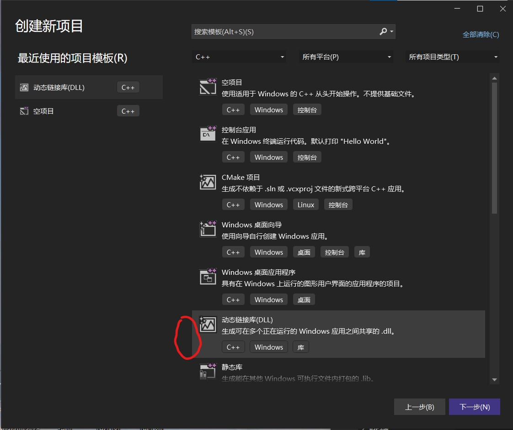

注意不要勾选“将解决方案和项目放在同一目录中”。项目命名为Dll2。点击创建。
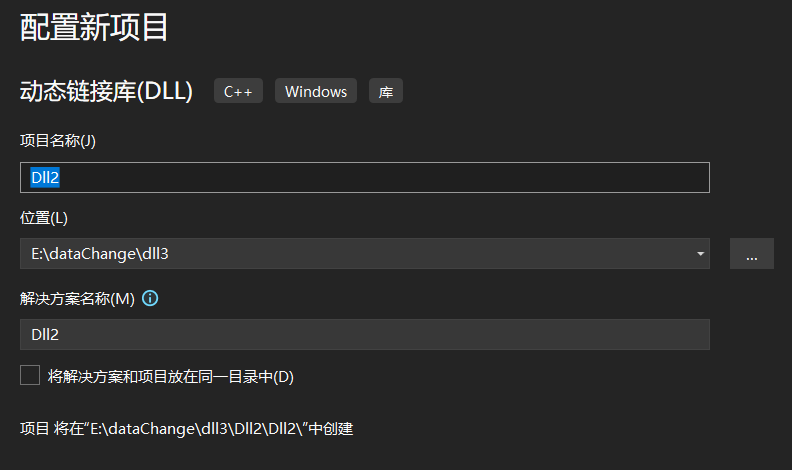
创建成功后的状态:
- 头文件有framework.h以及pch.h
- 源文件有dllmain.cpp以及pch.cpp
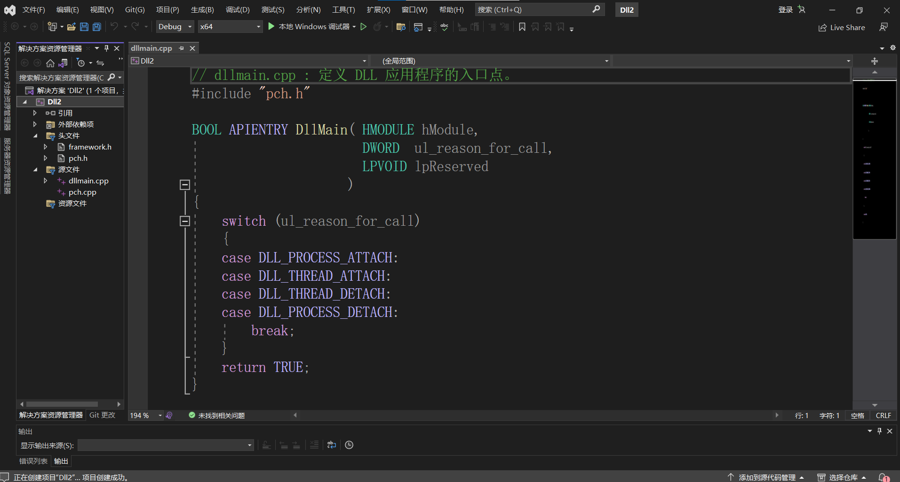

### 2.1 使用 __declspec(dllexport) 创建dll

1. 创建头文件Dll2.h
```
#pragma once
#include <iostream>

extern "C" __declspec(dllexport) void SayHello();
```
上面代码的功能是声明一个可被调用的函数“SayHello（）”，它的返回类型是void。

现在分析一下extern "C" __declspec(dllexport) void SayHello();这一句代码，其中extern "C"的作用是告诉编译器将被它修饰的代码按C语言的方式进行编译，这么做的意义在此不做讨论，感兴趣的话可自行查询。

然后分析__declspec(dllexport)，此修饰符告诉编译器和链接器被它修饰的函数或变量需要从DLL导出，以供其他应用程序使用；与其相对的还有一句代码是__declspec(dllimport),此修饰符的作用是告诉编译器和链接器被它修饰的函数或变量需要从DLL导入，它在后面也会被用到。

最后是函数void SayHello()，它就是需要被其他程序调用的函数。
创建后的效果图如下：
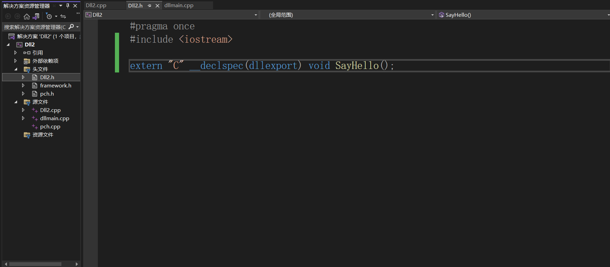

2. 创建Dll2.cpp
```
#include "pch.h"
#include "TestDLL.h"

void SayHello()
{
	std::cout << "Hello！你成功了！" << std::endl;
}
```

创建后的效果图如下：
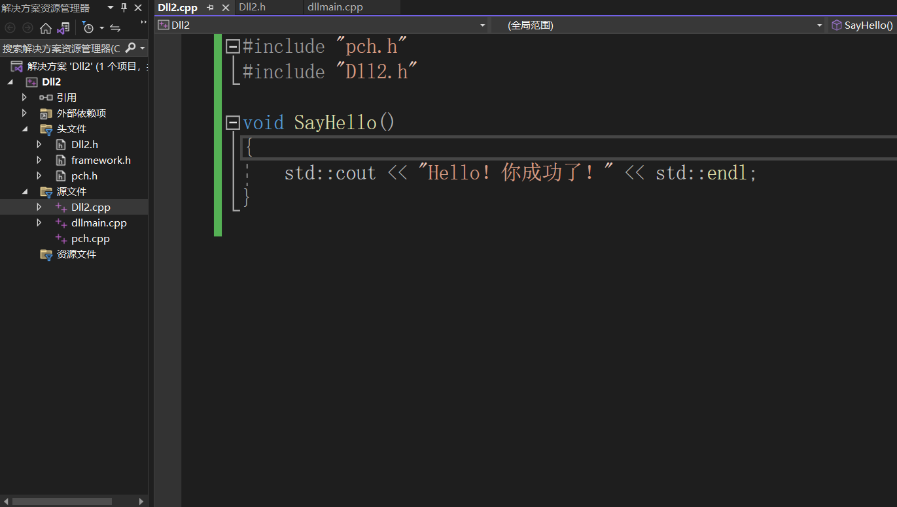

1. 编译
创建.h文件以及.cpp文件完成后，选择X86的编译器(X64编译器无法通过编译)

点击“本地Windows调试器”或者按F5编译。
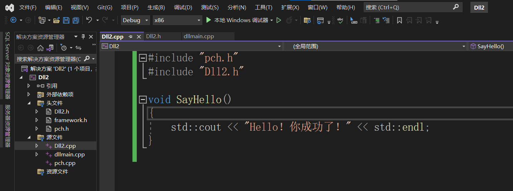

编译后会弹出不是有效Win32应用程序的窗口。因为我们创建的是.dll文件，不是.exe文件，所以这是正常的。
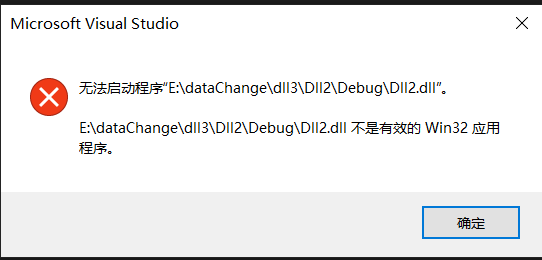

创建完成后的.dll文件在当前解决方案的Debug文件夹下
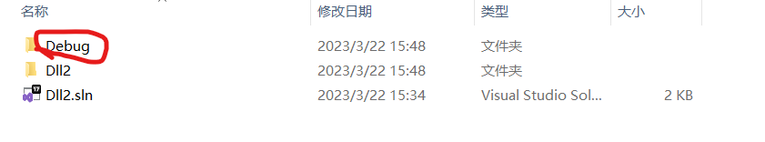
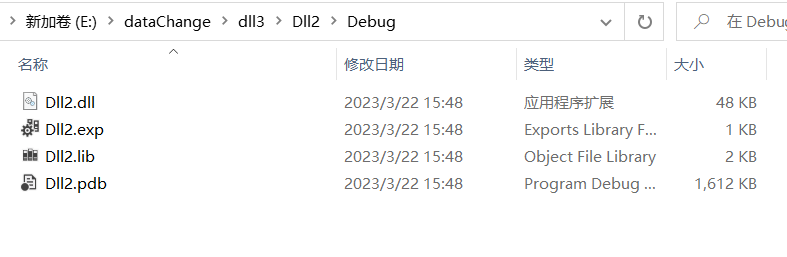

### 2.2 使用模块定义（.def）文件创建dll
使用def文件创建dll的话就不再需要__declspec(dllexport)，因此将代码写成最原始的样子：
```
int add(int a, int b){
    return a + b;
}

int subtract(int a, int b){
    return a - b;
}
```

1. 创建Dll2.cpp  
需要包含pch.h头文件
```
//Dll2.cpp
#include"pch.h"
int add(int a, int b) {
    return a + b;
}

int subtract(int a, int b) {
    return a - b;
}
```

遇到的问题：  
链接失败，找不到add与subtract  
将代码
```
#include"pch.h"

int add(int a, int b) 
```
include与int add之间的空行删除，变为
```
#include"pch.h"
int add(int a, int b) 
```
就能正常运行。  
**原因未知**


效果图：
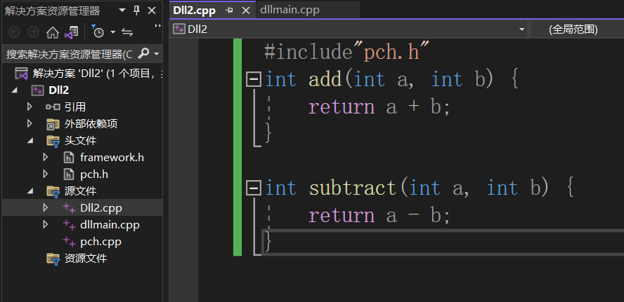

2. 创建Dll2.def

为工程创建一个后缀名为.def的文件，并添加进工程，编辑其内容为：
```
LIBRARY Dll2

EXPORTS
add
subtract
```
效果图：
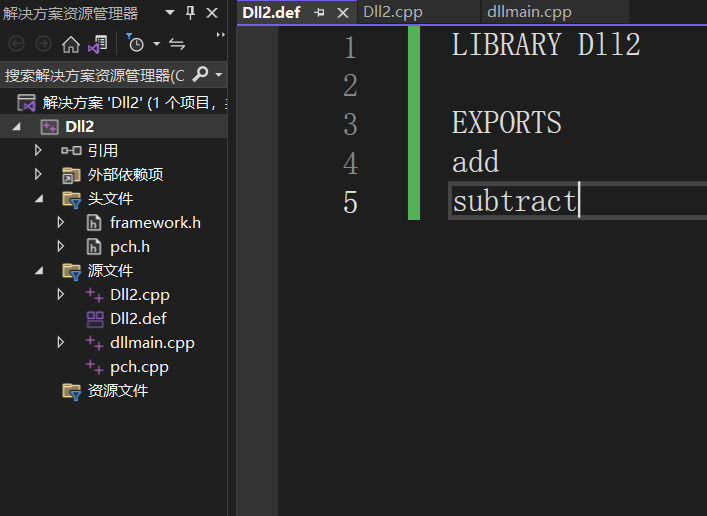
其中LIBRARY语句用于指定动态链接库的名称，该名称与生成的动态链接库名称一定要匹配。  
EXPORTS语句用于表明dll将要导出的函数，以及为这些导出函数指定的符号名。  
将该模块定义文件链接到工程中，方法为工程属性页面>链接器>输入>模块定义文件中写入“Dll2.def”，接着点击应用。  
效果图：
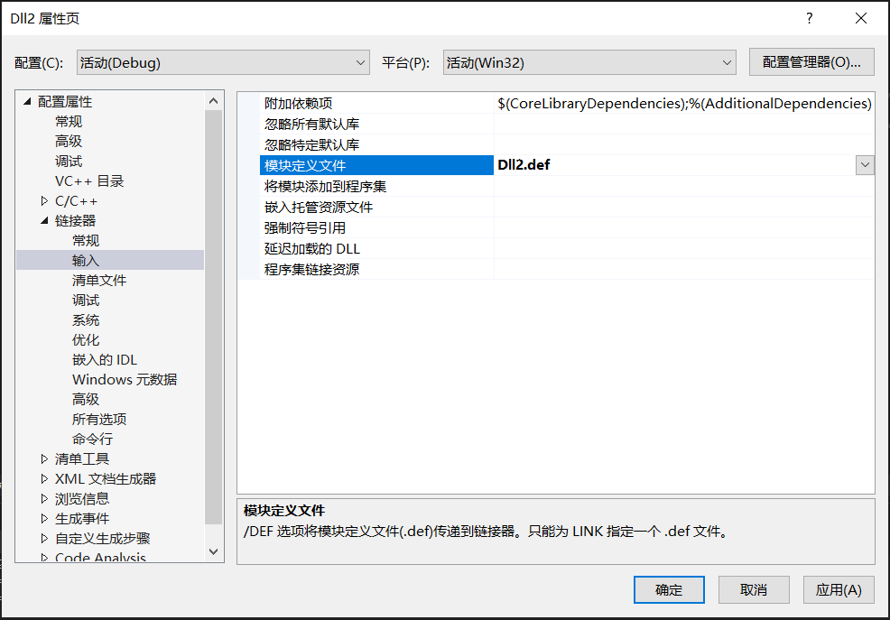

3. 编译步骤同上，注意选择X86的编译器


## 3.dll使用


