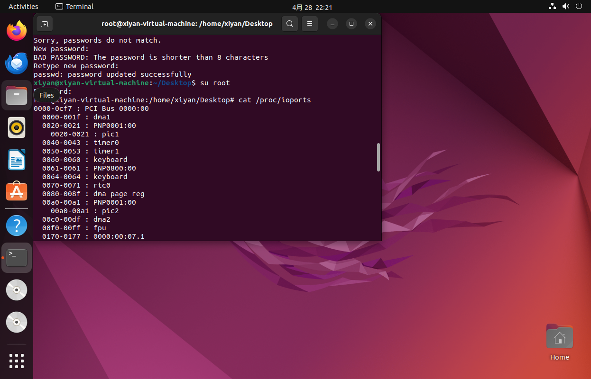

记录学习《linux内核完全注释v3.0》遇到的问题及解决方法。

ubuntu版本：ubuntu-22.04.4-desktop-amd64

# 1. 使用“cat /proc/ioports”命令无法显示地址

地址都为0  

  
获取root权限后，方可查询io接口地址。  
参考：1.[https://blog.csdn.net/qq_44721831/article/details/108893248](https://blog.csdn.net/qq_44721831/article/details/108893248)  
2.[Ubuntu获取root权限](https://blog.csdn.net/qq_44721831/article/details/108893248)

# 第三章 内核编程语言和环境
## 3.1 as86汇编器
Linux 0.1x版本使用两种汇编器（Assembler）：
- as86汇编器+ld86链接器 （Bruce Evans编写，用于Intel 8086、80386）
- GNU汇编器gas(as)+GNU ld链接器
来生成目标文件。