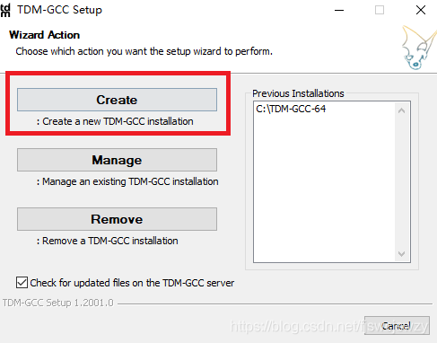
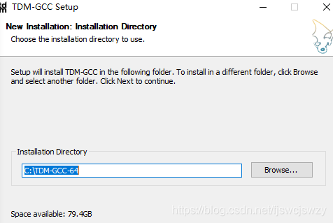
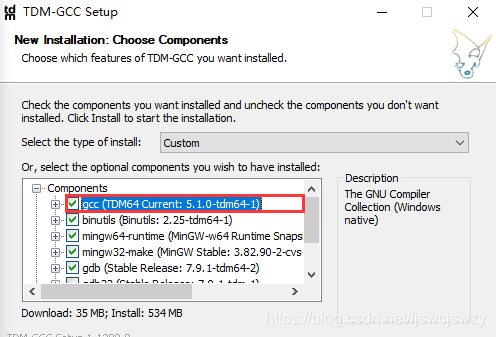
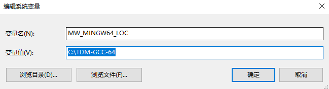
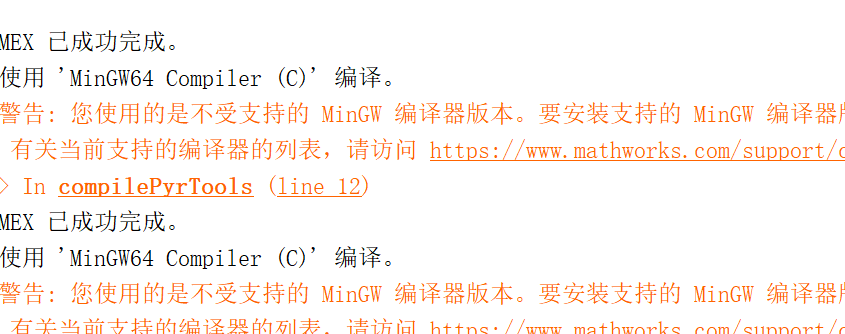

# matlab 配置mex环境，编译.cpp文件生成mexw64文件

- 需要下载配置wing64 c/c++编译器后，才能在matlab中使用mex命令生成mewx64文件

需下载软件：[TMD-GCC](https://jmeubank.github.io/tdm-gcc/articles/2020-03/9.2.0-release)

软件配置参考链接：[博客园-在Matlab2018b中配置MinGW-w64 C/C++ 编译器](https://www.cnblogs.com/tingtin/p/14666131.html)  

-----------------------------------------

## matlab2018b 编译出现问题

 - 在[https://jmeubank.github.io/tdm-gcc/articles/2020-03/9.2.0-release](https://jmeubank.github.io/tdm-gcc/articles/2020-03/9.2.0-release)上下载TDM-GCC(根据自己的实际情况下相应的版本)

## (1)下载完成后，有一个exe的文件

## (2)  双击exe文件

## (3)再输入安装目录，**注意：要安装到c盘根目录下 这里是默认安装到的c盘**

## (4) 一直下一步下一步

         gcc勾上

 

## (5)安装好之后，再配置环境变量
右键计算机选择属性——高级系统设置——高级——环境变量，选系统变量下的“新建”，变量名写“MW_MINGW64_LOC”，变量值写之前安装TDM-GCC时的安装目录，我的放在C盘了，所以就是“C:\TDM-GCC-64”，点击确定。

 在matlab 2018b 再次运行 
 - 命令： ' mex *.cpp '

