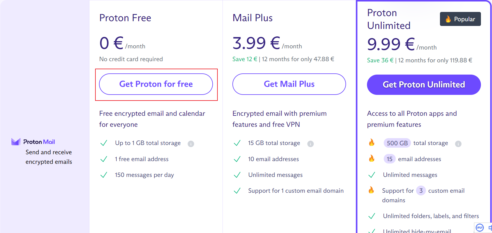

# 程序员论坛 推荐

- [程序员们平时都喜欢逛什么论坛呢？ - 程序员客栈的回答 - 知乎](https://www.zhihu.com/question/27145069/answer/672914885)  

# 文件相对路径写法
参考：博客园 <https://www.cnblogs.com/jgg54335/p/14787211.html>

# 创建简易免费邮箱 [Pronton Mail](https://proton.me/mail/pricing)
只需用户名、密码即可创建一个免费邮箱！！
选择免费创建。之后会有一个让你填密保手机或邮箱的操作，跳过即可。  

