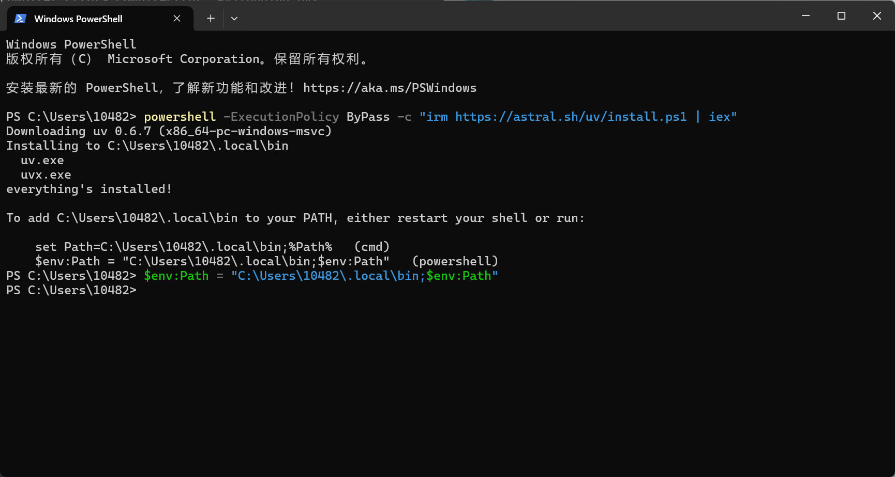

## 命令行添加环境变量
To add C:\Users\10482\.local\bin to your PATH, either restart your shell or run:  

        set Path=C:\Users\10482\.local\bin;%Path% (cmd)  
        $env: Path = "C:\Users\10482\.local\bin; $env:Path" (powershell)  

## [python使用（[faster-whisper 语音转文字、字幕](https://github.com/SYSTRAN/faster-whisper)）](./tips/faster_whisper.md)

## x86_64汇编语言浅析

[https://www.cnblogs.com/wsg1100/p/14290340.html](https://www.cnblogs.com/wsg1100/p/14290340.html)