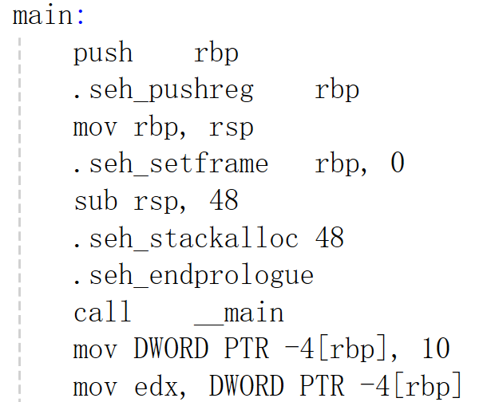

## 命令行添加环境变量
To add C:\Users\10482\.local\bin to your PATH, either restart your shell or run:  

        set Path=C:\Users\10482\.local\bin;%Path% (cmd)  
        $env: Path = "C:\Users\10482\.local\bin; $env:Path" (powershell)  

## [python使用（[faster-whisper 语音转文字、字幕](https://github.com/SYSTRAN/faster-whisper)）](./tips/faster_whisper.md)

## x86_64汇编语言浅析 & GCC-Inline-Assembly-HOWTO（C语言嵌入汇编）

[https://www.cnblogs.com/wsg1100/p/14290340.html](https://www.cnblogs.com/wsg1100/p/14290340.html) x86_64汇编语言浅析

[GCC-Inline-Assembly-HOWTO](https://www.ibiblio.org/gferg/ldp/GCC-Inline-Assembly-HOWTO.html)

[as汇编器手册](https://sourceware.org/binutils/docs/as/index.html)

[插入汇编成功的c程序代码(示例)](./tips/main.c) 汇编程序代码需要在一行内。使用`gcc -S main.c -o main.s` 或`gcc -S -masm=intel main.c -o main.s`编译C语言生成汇编语言

## 为什么x86_64汇编后的汇编代码中，在main标签中会有call __main 这个指令？？deepseek说是为了处理静态的全局变量，函数之类的。

## 虚拟机如何使用主机的VPN网络

[虚拟机通过网络代理使用主机的VPN网络](https://blog.csdn.net/qq_27462573/article/details/130484723)

## sourceforge 好的下载网站！！

[sourceforge 一个很棒的下载网站！！](https://sourceforge.net/projects/bochs/)

## FFT算法详解
https://blog.csdn.net/Flag_z/article/details/99163939

## ubuntu 16.04 安装使用boches遇到问题参考网址记录

[https://www.cnblogs.com/yongpan/p/9645684.html](https://www.cnblogs.com/yongpan/p/9645684.html)  

[https://blog.csdn.net/ww_bin/article/details/46461675](https://blog.csdn.net/ww_bin/article/details/46461675)

[https://blog.csdn.net/diaochuangsu1036/article/details/101883217?spm=1001.2101.3001.6650.2&utm_medium=distribute.pc_relevant.none-task-blog-2%7Edefault%7EBlogCommendFromBaidu%7ECtr-2-101883217-blog-123438536.235%5Ev43%5Epc_blog_bottom_relevance_base3&depth_1-utm_source=distribute.pc_relevant.none-task-blog-2%7Edefault%7EBlogCommendFromBaidu%7ECtr-2-101883217-blog-123438536.235%5Ev43%5Epc_blog_bottom_relevance_base3&utm_relevant_index=5](https://blog.csdn.net/diaochuangsu1036/article/details/101883217?spm=1001.2101.3001.6650.2&utm_medium=distribute.pc_relevant.none-task-blog-2%7Edefault%7EBlogCommendFromBaidu%7ECtr-2-101883217-blog-123438536.235%5Ev43%5Epc_blog_bottom_relevance_base3&depth_1-utm_source=distribute.pc_relevant.none-task-blog-2%7Edefault%7EBlogCommendFromBaidu%7ECtr-2-101883217-blog-123438536.235%5Ev43%5Epc_blog_bottom_relevance_base3&utm_relevant_index=5)

[https://blog.csdn.net/qq_44227057/article/details/123438536](https://blog.csdn.net/qq_44227057/article/details/123438536)

[https://blog.csdn.net/weixin_53064820/article/details/127575094](https://blog.csdn.net/weixin_53064820/article/details/127575094)

[https://blog.csdn.net/weixin_53064820/article/details/127575094](https://blog.csdn.net/weixin_53064820/article/details/127575094)

[https://www.x.org/wiki/Releases/Download/](https://www.x.org/wiki/Releases/Download/)

