# 压力之下，择要事为之

## 总结

### 工具一-着陆（专注）

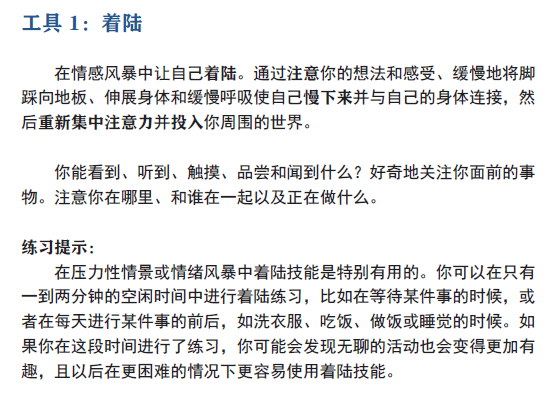  
[音频1-喝饮料觉察](https://terrance.who.int/mediacentre/audio/MSD/Doing_What_Matters_Chinese/WHO-AUDIO_Stress_Management_Awareness_of_Drinking_CHINESE_22OCT2020.mp3)    
[音频2-着陆练习1](http://terrance.who.int/mediacentre/audio/MSD/Doing_What_Matters_Chinese/WHO-AUDIO_Stress_Management_Grounding_Exercise_1__5_minutes_CHINESE_22OCT2020.mp3)  
[音频3-着陆练习2](http://terrance.who.int/mediacentre/audio/MSD/Doing_What_Matters_Chinese/WHO-AUDIO_Stress_Management_Grounding_Exercise_2_3_minutes_CHINESE_22OCT2020.mp3)  
[音频4-着陆练习3](http://terrance.who.int/mediacentre/audio/MSD/Doing_What_Matters_Chinese/WHO-AUDIO_Stress_Management_Grounding_Exercise_3_8_minutes_CHINESE_22OCT2020.mp3)  

### 工具二-解套（注意+命名）
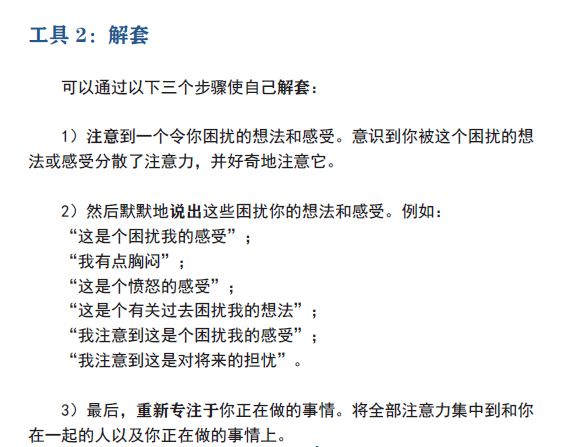  
[音频5-注意和命名](http://terrance.who.int/mediacentre/audio/MSD/Doing_What_Matters_Chinese/WHO-AUDIO_Stress_Management_Notice_and_Name_CHINESE_22OCT2020.mp3)  

### 工具三-践行自己的价值观（行动）
- 勇敢
- 坚持不懈
- 有原则
- 宽容

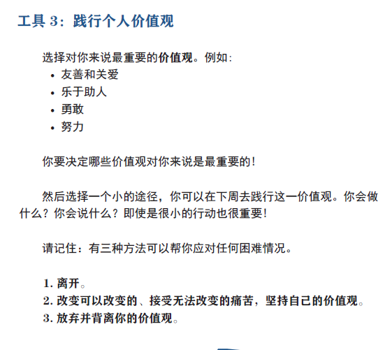  

### 工具四-对自己友善
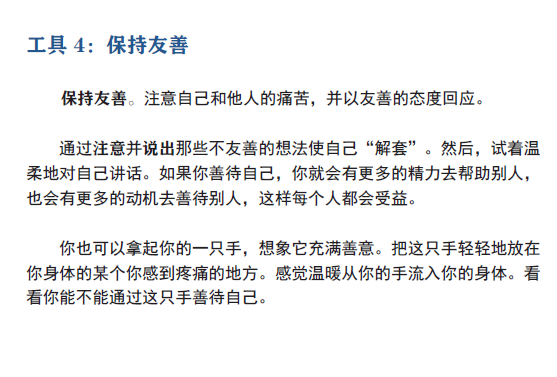  
[音频6-摆脱不友善想法](https://terrance.who.int/mediacentre/audio/MSD/Doing_What_Matters_Chinese/WHO-AUDIO_Stress_Management_Unhooking_from_Unkind_Thoughts_CHINESE_22OCT2020.mp3)  

### 工具五-留有空间
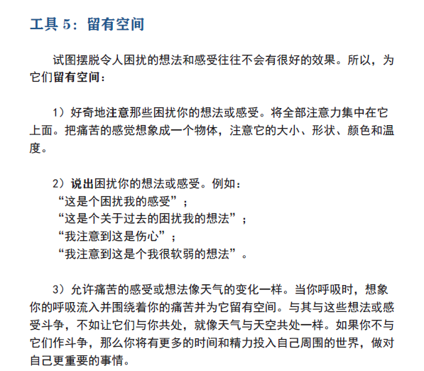  
[音频7-留有空间](https://terrance.who.int/mediacentre/audio/MSD/Doing_What_Matters_Chinese/WHO-AUDIO_Stress_Management_Making_Room_CHINESE_22OCT2020.mp3)  

[音频8-善待自己](https://terrance.who.int/mediacentre/audio/MSD/Doing_What_Matters_Chinese/WHO-AUDIO_Stress_Management_Being_kind_to_yourself_CHINESE_22OCT2020.mp3)

## 第一部分 着陆
   
- “解套”和“着陆”技能练习的目的是帮助你“投入”生活。 
- 练习本身并非为了使你摆脱愤怒、恐惧或悲伤的情绪。 

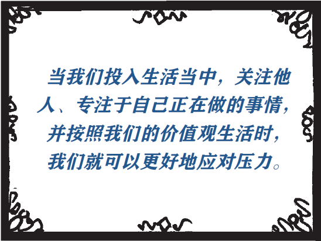

- 像学习任何新技能一样，它需要不断的练习  
- 一定要尽可能每天都坚持练习上述技能  

[音频1-喝饮料觉察](https://terrance.who.int/mediacentre/audio/MSD/Doing_What_Matters_Chinese/WHO-AUDIO_Stress_Management_Awareness_of_Drinking_CHINESE_22OCT2020.mp3)    
[音频2-着陆练习1](http://terrance.who.int/mediacentre/audio/MSD/Doing_What_Matters_Chinese/WHO-AUDIO_Stress_Management_Grounding_Exercise_1__5_minutes_CHINESE_22OCT2020.mp3)  
[音频3-着陆练习2](http://terrance.who.int/mediacentre/audio/MSD/Doing_What_Matters_Chinese/WHO-AUDIO_Stress_Management_Grounding_Exercise_2_3_minutes_CHINESE_22OCT2020.mp3)  
[音频4-着陆练习3](http://terrance.who.int/mediacentre/audio/MSD/Doing_What_Matters_Chinese/WHO-AUDIO_Stress_Management_Grounding_Exercise_3_8_minutes_CHINESE_22OCT2020.mp3)  

## 第二部分 解套

- 当我们陷入令我们困扰的想法和感受时，一般会倾向于“背离”，即远离我们的价值观  

1. 注意到让你困扰的想法和感受  
2. 将这些想法和感受说出来（默默地）  
3. 重新专注于你正在做的事情  

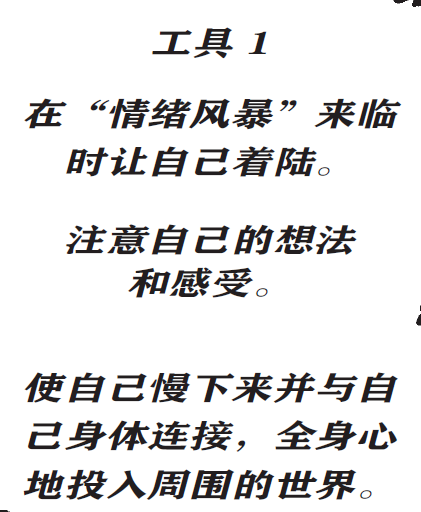  
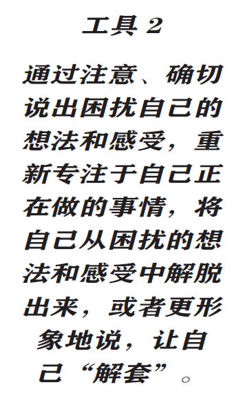  

[音频5-注意和命名](http://terrance.who.int/mediacentre/audio/MSD/Doing_What_Matters_Chinese/WHO-AUDIO_Stress_Management_Notice_and_Name_CHINESE_22OCT2020.mp3)  

## 第三部分 践行个人价值观-行动

> 三种方法帮你应对任何困难情况  
> 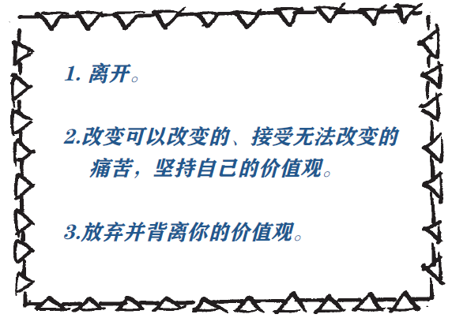

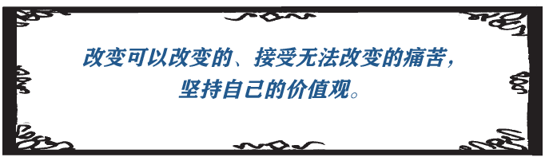

## 第四部分 保持友善

- 善待自己--对自己友善

[音频6-摆脱不友善想法](https://terrance.who.int/mediacentre/audio/MSD/Doing_What_Matters_Chinese/WHO-AUDIO_Stress_Management_Unhooking_from_Unkind_Thoughts_CHINESE_22OCT2020.mp3)  

## 第五部分 留有空间

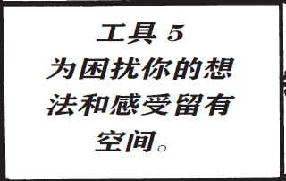

[音频7-留有空间](https://terrance.who.int/mediacentre/audio/MSD/Doing_What_Matters_Chinese/WHO-AUDIO_Stress_Management_Making_Room_CHINESE_22OCT2020.mp3)  

[音频8-善待自己](https://terrance.who.int/mediacentre/audio/MSD/Doing_What_Matters_Chinese/WHO-AUDIO_Stress_Management_Being_kind_to_yourself_CHINESE_22OCT2020.mp3)  

----

文本链接: [https://www.who.int/publications/i/item/9789240003927](https://www.who.int/publications/i/item/9789240003927 'WHO')  
[https://github.com/chen-xinglong/BooksAndFiles/raw/main/Doing%20What%20Matters%20in%20Times%20of%20Stress.pdf](https://github.com/chen-xinglong/BooksAndFiles/raw/main/Doing%20What%20Matters%20in%20Times%20of%20Stress.pdf)    
音频链接: [https://www.who.int/publications-detail/9789240003927](https://www.who.int/publications-detail/9789240003927 'WHO')  
